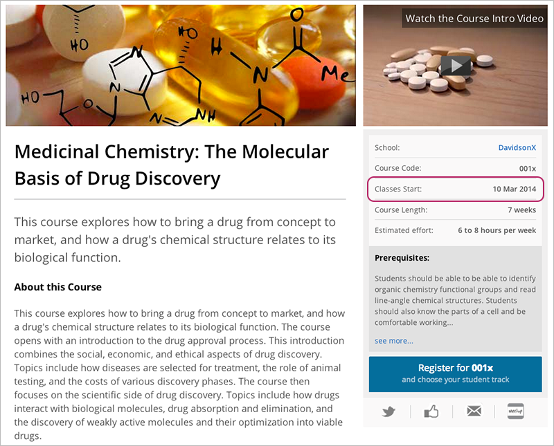
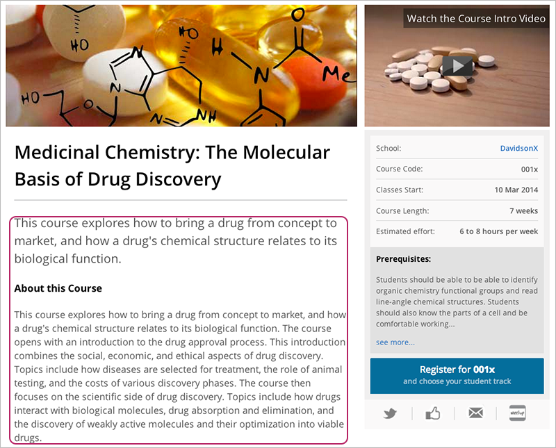
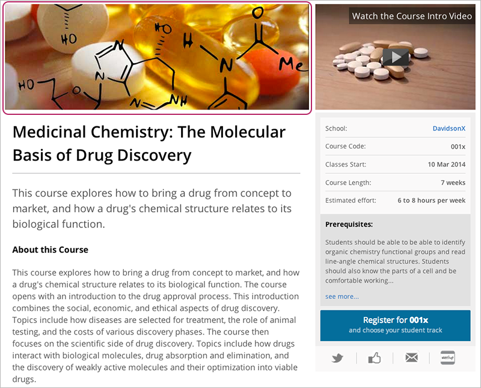

############################
edX Course About Page
############################

Your course about page is more than an overview; it’s also a registration page and amarketing page. This is where prospective students from all over the world decide whether to register, so it should inspire and inform, tell students why they should take it, what they will get out of it, and what’s required to succeed. This page can also be used as a template. Just replace the “Best Practices” column with your content. **Please be sure to follow the character and word limits given to you.**

This page can also be used as a template; simply replace the “Best Practices” column with your content. Please be sure to follow the character and word limits provided.

======================
To deliver assets:
======================

#. Export this document and complete with your content (File > Download as > choose file type)
#. Zip your final text template and attached images into single file OR attach this document and all image files in ONE email once you’ve gathered them all.
#. Email the file or files to your edX Program Manager
#. Post About video only to edx-ftp.mit.edu. Specifications are listed below, in the Video and Image Checklist.

*************************************
Required Assets
*************************************

The information below outlines best practices for preparing the assets required to complete the edX Course About Page, including:

* :ref:`Brief Description`
* :ref:`Certificate Signatories`
* :ref:`Certificate Track`
* :ref:`Course Dates`
* :ref:`Course Image`
* :ref:`Course Institute Name`
* :ref:`Course Level`
* :ref:`Course Number`
* :ref:`Course Staff`
* :ref:`Course Title`
* :ref:`Estimated Effort`
* :ref:`Full Description`
* :ref:`Instructor Signatures`
* :ref:`Intro Video`
* :ref:`Language(s)`
* :ref:`Length of Time`
* :ref:`Prerequisites`
* :ref:`Subject Field`
* :ref:`Video Still Image`

*************************************
Description and Best Practices
*************************************

.. _Course Number:

*************************************
Course Number
*************************************
The course number is your course's identification number. e.g. CS50x 

- Always end in a lower-case x.
- We strongly recommend 7 or fewer characters, including the x
- The number appears on the student dashboard before the course title. It does NOT have to match your on-campus number and should be easy for learners to say and remember
- A good course number references the subject matter, such as BIO1.1x for biology
- When a course is split into several modules, they can be denoted by adding .1, .2, etc. at the end of the course number before the x
- Course number should not contain a reference to your school, as that will already be displayed on the registration page
- The course number cannot contain any special html characters, accents, spaces, dashes, or underscores

.. _Course Institute Name:

*************************************
Course Institute Name
*************************************
This is how your university already appears on edx.org, and always ends in an x. 
For example: DelftX or MITx

.. _Course Title:

*************************************
Course Title
*************************************
- The course title should be short, descriptive, and clear. For example: Solar Energy, Introduction to Public Speaking, etc.
- The title cannot contain any special html characters or accents. Learners are more likely to notice and remember short titles so we recommend 50 characters or less. 
- If the course is a sequence, our convention is: Course Title - Part 1 and optionally followed by a subtitle. For example:  Introduction to Statistics - Part 1: Inference

.. _Course Dates:

*************************************
Course Dates
*************************************
- **Start date**: Courses should start on weekdays, preferably Tuesday, Wednesday, or Thursday, and not on major US holidays, for best access to edX staff
- **End date**: The end date is the last day the course is active (i.e. the day the last assignment is due)
- **Certificate date**: Indicate what date you’d like certificates to be issued to students. This date will appear on the certificate. The earliest this date can be is one day after the end date

.. _Length of Time:

*************************************
Length of Time
*************************************
- Number of weeks the course runs (not length of content)
- If the time between start/end dates is not exact, ex: 8.5 weeks, indicate whether the course should be listed as 8 weeks or 9 weeks.

.. _Estimated Effort:

*************************************
Estimated Effort
*************************************
This should be a realistic estimate, and can be a range (e.g. 4-6 hours per week).  Keep in mind that people often take courses in their limited free time, and the time commitment is a major factor in deciding to make a course.

.. _Prerequisites:

*************************************
Prerequisites
*************************************
Prerequisites should inform learners of the types of skills they should already have in order to successfully complete the course.

- Limited to 200 characters, including spaces
- Text longer than 200 characters will be truncated by a “Learn More” link and repeat at the bottom of the course description
- List concepts students should be familiar with and specify what level (basic, advanced or undergraduate, graduate)
- If there are no prerequisites, please list “None.”
- Again, students often select the courses they will take based upon the prerequisites and their ability to complete the coursework

.. _Language(s):

*************************************
Language(s)
*************************************
Specify language(s) for:

- **Course content**: Navigation and course content text
- **Videos**: language spoken in course videos
- **Video transcript**: Video caption language

.. _Brief Description: 

*************************************
Brief Description
*************************************
- Think of this as a tag line; a short, engaging description as studetns are browsing through course listings.
- Limited to 140 characters, including spaces
- This text also appears on the student deashboard

.. _Full Description:

*************************************
Full Description
*************************************
- The ideal course description is one or two paragraphs that give students just enough information to help them decide whether to register. It should **excite and inform**, tell them why they should take the course, and what they will get out of it
- If your course syllabus is ready, it is very helpful to students if you include a link to this file
- Limited to 400 words

.. _Course Level:

*************************************
Course Level
*************************************
- **Graduate**: Expects familiarity with concepts, vocabulary and skills explored in undergraduate courses
- **Undergraduate**: Expects familiarity with the general subject matter, but does not expect more than a general understanding of either concepts or vocabulary. The course may expect familiarity with other undergraduate course materials
- **Introductory**: Expects independent learning skills.  The course introduces students to the subject matter, vocabulary and skills needed to establish a foundation for further undergraduate exploration of the subject matter.  These types of courses often occur late in secondary education

.. _Course Staff:

*************************************
Course Staff
*************************************
Limited to the primary staff students will encounter in videos. Please include:
 - Course staff name(s) and title(s)
 - Short, one paragraph biography
 - High-res image(s), min 110 x 110 pixels, compressed to less than 200 KB

If there is more than one professor, please indicate:
 - How the names should appear on the course listings page (19 character limit, including spaces). Ex: “D. Malan, R. Bowden” or “Anant Agarwal” 
 - What order the instructors should be listed on About page
 - Which instructors and in what order the instructors should be listed on the certificate
 
.. _Certificate Signatories: 

*************************************
Certificate Signatories
*************************************
For each instructor who will appear on the certificate, please list their name, title, and affiliation, as you would like them appear on the certificate.
For example:
**Anant Agarwal
Professor, Department of Electrical Engineering and Computer Science
Massachusetts Institute of Technology**

For each instructor on certificate, attach a hi-res, 300 dpi, dark ink, scanned signature (png, gif, or jpg) for Verified certificates. Preference for black ink on clean, white paper.

.. _Certificate Track: 
 
*************************************
Certificate Track
*************************************
- Indicate if course is **Honor Code Certificate** or **Verified Certificate**
- If **Verified Certificate**, list three cost options (minimum $25 USD)

.. _Instructor Signatures:

*************************************
Instructor Signatures
*************************************
Attach a hi-res, 300 dpi, dark ink, scanned signature (png, gif, or jpg) for Verified certificates. Preference for black ink on clean, white paper

.. _Subject Field:

*************************************
Subject Field
*************************************

   - Art & Culture
   - Biology & Life Sciences
   - Business & Management
   - Chemistry
   - Communication
   - Computer Science
   - Economics & Finance
   - Electronics
   - Engineering
   - Environmental Studies
   - Food & Nutrition
   - Health & Safety
   - History
   - Humanities
   - Law
   - Literature
   - Math
   - Medicine
   - Music
   - Philosophy & Ethics
   - Physics
   - Science
   - Social Sciences
   - Statistics & Data Analysis

.. _Intro Video:

*************************************
Intro Video
*************************************
Consider the “About” video a **trailer** for your upcoming course.It should excite and entice potential students to register, and reveal some of the personality the instructors bring to the course. 
The About video should answer these key questions:

- Who is teaching the course?
- What university or college is the course affiliated with?
- What topics and concepts are covered in your course?
- Why should a learner register for your course?

The video should deliver your message as concisely as possible. The video should have a run time of less than 2 minutes. 
About videos should be heavily edited and use elements such as graphics, stock footage and/or music.

- File naming convention: UniversityXCourseIDAbout.mov
- Post to: edx-ftp.mit.edu

**Technical Specifications**

- Codec: H.264
- Container: .mp4
- Resolution: 1920x1080
- Frame Rate: 29.97 fps
- Aspect: 1.0
- Bitrate: 5Mbps VBR
- Audio Codec: AAC 44.1KHz/192 Kbps

 .. _Video Still Image:
 
*************************************
Video Still Image
*************************************
- Minimum size: 320 x 211 pixels
- This image appears prominently on the course registration page, right where the video will play, so chose an engaging image that represents the course
- File naming convention: Name_of_Video_Still_Image.jpg
 
 .. image:: ../Images/about-page-course-video.png
     :alt: Image of the video still image on the about page
 
 .. _Course Image:
 
*************************************
Course Image
*************************************
When you choose an image for your course, select an eye-catching, colorful picture that captures the content of your course and the feeling you want to create. For best results, work with a graphic designer.
 
- Minimum size: 660 pixels wide by 240 pixels high
- Choose an image that does not include text or headlines, and is clear as both a banner (660 x 240 px) and small thumbnail (262 x136 px)
- Choose an image that you have permission to use. This can be a stock photo (try Flickr creative commons, Stock Vault, Stock XCHNG, iStock Photo) or an image custom designed for your course
- Sequenced courses should each have a unique image
- Make sure that the picture is a high-resolution image, but compressed to no more than 200 KB

     