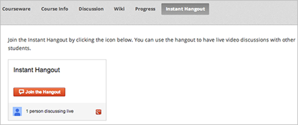
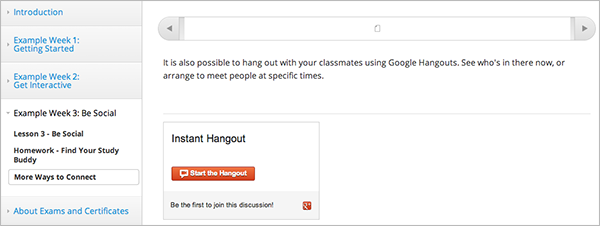
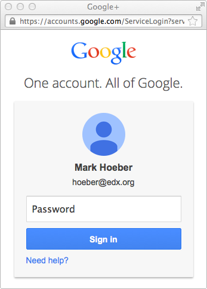
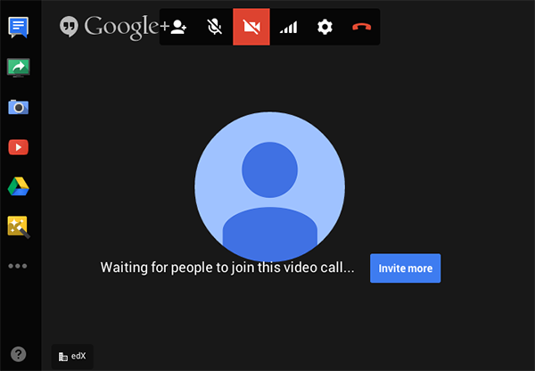

.. _Using an Instant Hangout in Your Course:

###########################################
Using an Instant Hangout in Your Course
###########################################

This chapter describes how you can use instant hangouts in your course. See:

* :ref:`Hangouts_Overview`
* :ref:`Instant Hangouts in Your Course`
* :ref:`The Student Experience`
* :ref:`Limitations`
* :ref:`Create the Instant Hangout`

.. _Hangouts_Overview:

*****************
Overview
*****************

You can add the ability for students to participate in instant hangouts directly from your course.

With instant hangouts, students can:

* Interact through live video and voice.
* Share screens and watch videos together.
* Collaborate on documents.

For a full list of instant hangout features, see the `Google hangouts page <http://www.google.com/+/learnmore/hangouts/>`_.

.. note:: Students who want to participate in instant hangouts must have a Google account.  You should note this in your course materials.

.. _Instant Hangouts in Your Course:

**********************************
Instant Hangouts in Your Course
**********************************

You can add one or more instant hangouts in your course. For example, you can add an instant hangout:

* In a static page, to provide students with a hangout for the entire course. See :ref:`Add Static Pages` for more information.

* In an HTML component, to provide a hangout for students working on that specific course unit. See :ref:`Working with HTML Components` for more information.

An instant hangout is specific to the page it is opened from.  So, for example, students who join a hangout from one course unit interact among themselves, while students who join a hangout from another unit interact together in a different hangout.

.. _The Student Experience:

*************************
The Student Experience
*************************

When you add the Instant Hangout to you course, students see the control to join the hangout. The following example shows the control in a static page when. The control shows that there is one other student already in the hangout.

To join the hangout, the student clicks **Join the Hangout**.

The following example shows the control in a course unit. The control shows that the student can start the hangout and be the first participant.

To start the hangout, the student clicks **Start the Hangout**.

If not already logged in, the student is prompted to log in to Google:

Students who do not have a Google account can create one from the log in page.

Once logged in to Google, the hangout opens in a separate browser window:

.. _Limitations:

****************
Limitations
****************

Currently, only ten students can join a single instant hangout. You should note this in your course materials.

Students in hangouts started from different pages in your course are counted separately. So you can have ten students participating in a hangout started from one unit, and ten other students in a hangout started from a different unit.

.. _Create the Instant Hangout:

**************************************************
Create the Instant Hangout
**************************************************

To create an instant hangout in your course:

#. Get the `instant hangout JavaScript file from GitHub <https://raw.github.com/google/instant-hangouts/master/instanthangouts-0.1.0.js>`_.

#. Copy the text of this file into a local JavaScript file.

   ..note:  Ensure you copy the raw GitHub file, not the formatted file. Any formatting will cause the JavaScript to not work correctly.

#. Upload the JavaScript file to your course. See :ref:`Add Files to a Course` for more information.

#. In either a static page or an HTML component, open the HTML editor.

#. Add the JavaScript file you uploaded in a 
    

6. Test the instant hangout in your course.

=============================
Updating the JavaScript File
=============================

Google will periodically update the instant hangouts JavaScript file.  You should watch the `instant hangouts repository <https://github.com/google/instant-hangouts/>`_ to get notified of any updates.

To use an updated JavaScript file in your course, it is recommended that you copy the JavaScript from the repository into a file of the same name you uploaded to your course.  Then upload that file to replace the previous file.

If you include version numbers in the file names of uplaoded files, you will have to edit any HTML components or static pages that include an instant hangout control with every update.
