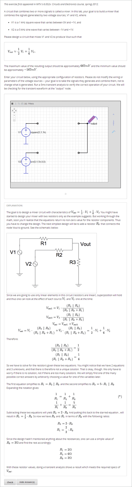
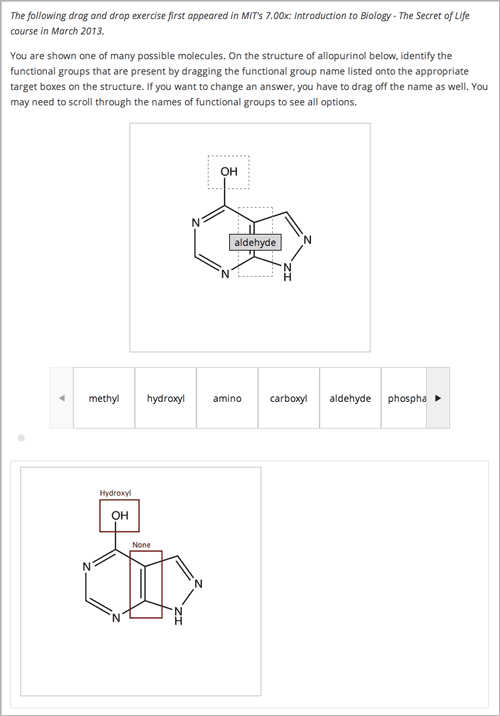
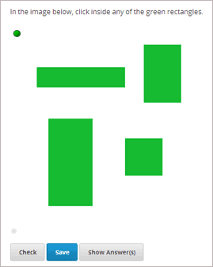
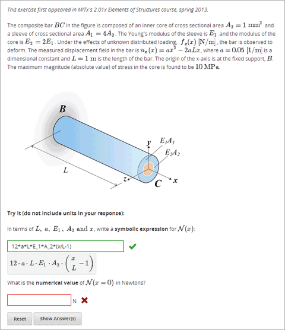
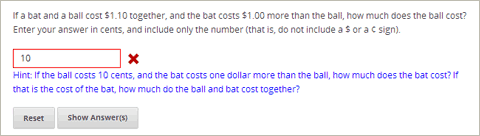
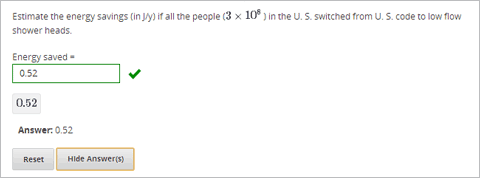

.. _Advanced Problems:

Advanced Problems
=================

Advanced problems are problems such as drag and drop, circuit schematic
builder, and math expression problems. Many of these problems appear on the
Advanced tab when you create a new Problem component. Studio provides
templates for these problems, but the problems open directly in the
**Advanced Editor** and have to be created in XML.

-  :ref:`Circuit Schematic Builder` In circuit schematic problems, students
   create and modify circuits on an interactive grid and submit
   computer-generated analyses of the circuits for grading.
-  :ref:`Custom JavaScript Display and Grading` With custom JavaScript display
   and grading problems, you can incorporate problem types that you've created
   in HTML into Studio via an IFrame.
-  :ref:`Custom Python Evaluated Input` Custom Python-evaluated input (also called "write-your-own-grader" problems evaluate students' responses using an embedded Python script that you create. These problems can be any type.
-  :ref:`Drag and Drop` Drag and drop problems require students to drag text
   or objects to a specific location on an image.
-  :ref:`Image Mapped Input` Image mapped input problems require students to
   click a specific location on an image.
-  :ref:`Math Expression Input` Math expression input problems require
   students to enter a mathematical expression as text, such as
   e=m\*c^2.
-  :ref:`Problem with Adaptive Hint` These problems can give students
   feedback or hints based on their responses. Problems with adaptive
   hints can be text input or multiple choice problems.
- :ref:`Problem Written in LaTeX` This problem type allows you to convert problems that you’ve already written in LaTeX into the edX format. Note that this problem type is still a prototype, however, and may not be supported in the future.

These problems are easy to access in Studio. To create them, click
**Problem** under **Add New Component**, click the **Advanced** tab, and
then click the name of the problem that you want to create.

.. _Circuit Schematic Builder:

Circuit Schematic Builder
-------------------------

In circuit schematic builder problems, students can arrange circuit
elements such as voltage sources, capacitors, resistors, and MOSFETs on
an interactive grid. They then submit a DC, AC, or transient analysis of
their circuit to the system for grading.

Create a Circuit Schematic Builder Problem
~~~~~~~~~~~~~~~~~~~~~~~~~~~~~~~~~~~~~~~~~~

#. In the unit where you want to create the problem, click **Problem**
   under **Add New Component**, and then click the **Advanced** tab.
#. Click **Circuit Schematic Builder**.
#. In the component that appears, click **Edit**.
#. In the component editor, replace the example code with your own code.
#. Click **Save**.

**Problem Code**

To create the problem in the picture, paste the following code into the Advanced Editor.

.. code-block:: xml

 <problem>
    
Make a voltage divider that splits the provided voltage evenly.

      <schematicresponse>
      

      <schematic height="500" width="600" parts="g,r" analyses="dc"
      initial_value="[["v",[168,144,0],{"value":"dc(1)","_json_":0},["1","0"]],["r",[296,120,0],{"r":"1","_json_":1},["1","output"]],["L",[296,168,3],{"label":"output","_json_":2},["output"]],["w",[296,216,168,216]],["w",[168,216,168,192]],["w",[168,144,168,120]],["w",[168,120,296,120]],["g",[168,216,0],{"_json_":7},["0"]],["view",-67.49999999999994,-78.49999999999994,1.6000000000000003,"50","10","1G",null,"100","1","1000"]]"
      />
      

        <answer type="loncapa/python">
      dc_value = "dc analysis not found"
      for response in submission[0]:
        if response[0] == 'dc':
            for node in response[1:]:
                dc_value = node['output']
      if dc_value == .5:
        correct = ['correct']
      else:
        correct = ['incorrect']
      </answer>
      </schematicresponse>
    <schematicresponse>
    
Make a high pass filter.

    

    <schematic height="500" width="600" parts="g,r,s,c" analyses="ac"
    submit_analyses="{"ac":[["NodeA",1,9]]}"
    initial_value="[["v",[160,152,0],{"name":"v1","value":"sin(0,1,1,0,0)","_json_":0},["1","0"]],["w",[160,200,240,200]],["g",[160,200,0],{"_json_":2},["0"]],["L",[240,152,3],{"label":"NodeA","_json_":3},["NodeA"]],["s",[240,152,0],{"color":"cyan","offset":"0","_json_":4},["NodeA"]],["view",64.55878906250004,54.114697265625054,2.5000000000000004,"50","10","1G",null,"100","1","1000"]]"/>
    

    <answer type="loncapa/python">
    ac_values = None
    for response in submission[0]:
      if response[0] == 'ac':
          for node in response[1:]:
              ac_values = node['NodeA']
    print "the ac analysis value:", ac_values
    if ac_values == None:
      correct = ['incorrect']
    elif ac_values[0][1] < ac_values[1][1]:
      correct = ['correct']
    else:
      correct = ['incorrect']
    </answer>
    </schematicresponse>
        <solution>
            

                
Explanation

                
A voltage divider that evenly divides the input voltage can be formed with two identically valued resistors, with the sampled voltage taken in between the two.

                

                
A simple high-pass filter without any further constaints can be formed by simply putting a resister in series with a capacitor. The actual values of the components do not really matter in order to meet the constraints of the problem.

                

            

        </solution>
 </problem>

.. _Custom JavaScript Display and Grading:

Custom JavaScript Display and Grading
-------------------------------------

Custom JavaScript display and grading problems (also called *custom JavaScript problems*
or *JS Input problems*) allow you to create a custom problem or tool that uses JavaScript
and then add the problem or tool directly into Studio. When you create a JS Input problem,
Studio embeds the problem in an inline frame (IFrame) so that your students can interact with
it in the LMS. You can grade your students’ work using JavaScript and some basic Python, and
the grading is integrated into the edX grading system.

The JS Input problem that you create must use HTML, JavaScript, and cascading style sheets
(CSS). You can use any application creation tool, such as the Google Web Toolkit (GWT), to
create your JS Input problem.

.. image:: ../Images/JavaScriptInputExample.png
 :alt: Image of a JavaScript Input problem

Create a Custom JavaScript Display and Grading Problem
~~~~~~~~~~~~~~~~~~~~~~~~~~~~~~~~~~~~~~~~~~~~~~~~~~~~~~

#. Create your JavaScript application, and then upload all files associated with
   that application to the **Files & Uploads** page.
#. In the unit where you want to create the problem, click **Problem**
   under **Add New Component**, and then click the **Advanced** tab.
#. Click **Custom JavaScript Display and Grading**.
#. In the component that appears, click **Edit**.
#. In the component editor, modify the example code according to your problem.

   - All problems have more than one element. Most problems conform to the same-origin
     policy (SOP), meaning that all elements have the same protocol, host, and port.
     For example, **http**://**store.company.com**:**81**/subdirectory_1/JSInputElement.html and
     **http**://**store.company.com**:**81**/subdirectory_2/JSInputElement.js have the same protocol
     (http), host (store.company.com), and port (81).

     If any elements of your problem use a different protocol, host, or port, you need to
     bypass the SOP. For example, **https**://**info.company.com**/JSInputElement2.html
     uses a different protocol, host, and port. To bypass the SOP, change
     **sop="false"** in line 8 of the example code to **sop="true"**. For more information, see the same-origin policy
     page on the `Mozilla Developer Network <https://developer.mozilla.org/en-US/docs/Web/JavaScript/Same_origin_policy_for_JavaScript>`_
     or on `Wikipedia <http://en.wikipedia.org/wiki/Same_origin_policy>`_.
#. If you want your problem to have a **Save** button, click the **Settings** tab, and then set
   **Maximum Attempts** to a number larger than zero.
#. Click **Save**.

Re-create the Example Problem
^^^^^^^^^^^^^^^^^^^^^^^^^^^^^

To re-create the example problem above, you'll need the following files.

   - webGLDemo.html
   - webGLDemo.js
   - webGLDemo.css
   - three.min.js

To download these files in a .zip archive, go to http://files.edx.org/JSInput.zip.

..note:: If you need to bypass the SOP, you'll also need the **jschannel.js** file, and your webGLDemo.html file will be slightly different. To download all these files in a .zip archive, go to http://files.edx.org/JSInput_BypassSOP.zip.

#. Download and unpackage the files in either the JSInput.zip file or the JSInput_BypassSOP.zip file.
#. On the **Files & Uploads** page, upload all the files from the .zip file.
#. Create a new custom JavaScript display and grading problem component.
#. On the **Settings** tab, set **Maximum Attempts** to a number larger than
   zero.
#. In the problem component editor, replace the example code with the code below.
#. Click **Save.**

JavaScript Input Problem Code
^^^^^^^^^^^^^^^^^^^^^^^^^^^^^

.. code-block:: xml

    <problem display_name="webGLDemo">
    In the image below, click the cone.

    
    <customresponse cfn="vglcfn">
        <jsinput
            gradefn="WebGLDemo.getGrade"
            get_statefn="WebGLDemo.getState"
            set_statefn="WebGLDemo.setState"
            width="400"
            height="400"
            html_file="/static/webGLDemo.html"
        />
    </customresponse>
    </problem>

.. note::    When you create this problem, keep the following in mind.

 - The webGLDemo.js file defines the three JavaScript functions (**WebGLDemo.getGrade**, **WebGLDemo.getState**, and **WebGLDemo.setState**).

 - The JavaScript input problem code uses **WebGLDemo.getGrade**, **WebGLDemo.getState**, and **WebGLDemo.setState** to grade, save, or restore a problem. These functions must be global in scope.

 - **WebGLDemo.getState** and **WebGLDemo.setState** are optional. You only have to define these functions if you want to conserve the state of the problem.

 - **Width** and **height** represent the dimensions of the IFrame that holds the application.

 - When the problem opens, the cone and the cube are both blue, or "unselected." When you click either shape once, the shape becomes yellow, or "selected." To unselect the shape, click it again. Continue clicking the shape to select and unselect it.

 - The response is graded as correct if the cone is selected (yellow) when the user clicks **Check**.

 - Clicking **Check** or **Save** registers the problem's current state.

.. _Custom Python Evaluated Input:

Custom Python-Evaluated Input ("Write-Your-Own-Grader")
-------------------------------------------------------

In custom Python-evaluated input (also called "write-your-own-grader problems" problems), the grader uses a Python script that you create and embed in the problem to evaluates a student's response or provide hints. These problems can be any type. Numerical input and text input problems are the most popular write-your-own-grader problems.

.. image:: ../Images/CustomPythonExample.png
 :alt: Image of a write your own grader problem

Custom Python-evaluated input problems can include the following:

* :ref:`Chemical Equation`
* :ref:`Custom JavaScript Display and Grading`
* :ref:`Custom Python Evaluated Input`
* :ref:`Gene Explorer`
* :ref:`Molecule Editor`
* :ref:`Protein Builder`

.. list-table::
   :widths: 20 80

   * - ``

  
Enter two integers that sum to 10. 

  <customresponse cfn="test_add_to_ten">
          <textline size="10"/> 
          <textline size="10/>
  </customresponse>

    </problem>

**Important**: Python honors indentation. Within the ``

  
Part 1: Enter two integers that sum to 10. 

  <customresponse cfn="test_add_to_ten">
          <textline size="10" correct_answer="3" label="Integer #1"/> 
          <textline size="10" correct_answer="7" label="Integer #2"/>
  </customresponse>

  
Part 2: Enter two integers that sum to 20. 

  <customresponse cfn="test_add" expect="20">
          <textline size="10" label="Integer #1"/> 
          <textline size="10" label="Integer #2"/>
  </customresponse>

  <solution>
      

          
Explanation

          
For part 1, any two numbers of the form <i>n</i> and <i>10-n</i>, where <i>n</i> is any integer, will work. One possible answer would be the pair 0 and 10.

          
For part 2, any pair <i>x</i> and <i>20-x</i> will work, where <i>x</i> is any real number with a finite decimal representation. Both inputs have to be entered either in standard decimal notation or in scientific exponential notation. One possible answer would be the pair 0.5 and 19.5. Another way to write this would be 5e-1 and 1.95e1.

      

  </solution>
  </problem>

**Templates**

The following template includes answers that appear when the student clicks **Show Answer**. 

.. code-block:: xml

  <problem>

  

  
Problem text

  <customresponse cfn="test_add" expect="20">
          <textline size="10" correct_answer="11" label="Integer #1"/> 
          <textline size="10" correct_answer="9" label="Integer #2"/>
  </customresponse>

      <solution>
          

            
Solution or Explanation Heading

            
Solution or explanation text

          

      </solution>
  </problem>

The following template does not return answers when the student clicks **Show Answer**. If your problem doesn't include answers for the student to see, make sure to set **Show Answer** to **Never** in the problem component.

.. code-block:: xml

  <problem>

  

  
Enter two real numbers that sum to 20: 

  <customresponse cfn="test_add" expect="20">
          <textline size="10"  label="Integer #1"/> 
          <textline size="10"  label="Integer #2"/>
  </customresponse>

      <solution>
          

            
Solution or Explanation Heading

            
Solution or explanation text

          

      </solution>
  </problem>

.. _Drag and Drop:

Drag and Drop
-------------

In drag and drop problems, students respond to a question by dragging
text or objects to a specific location on an image.

Create a Drag and Drop Problem
~~~~~~~~~~~~~~~~~~~~~~~~~~~~~~

To create a drag and drop problem, you'll need the following files:

* Allopurinol.gif
* AllopurinolAnswer.gif

To download both these files in a .zip archive, go to http://files.edx.org/DragAndDropProblemFiles.zip.

To create the molecule editor that appears in the image above, you'll upload the files for this problem, and then paste the code below into a Problem component.

#. Upload the Allopurinol.gif and AllopurinolAnswer.gif files to the **Files & Uploads** page.
#. In the unit where you want to create the problem, click **Problem** under **Add New Component**, and then click the **Advanced** tab.
#. Click **Drag and Drop**.
#. In the component that appears, click **Edit**.
#. In the component editor, replace the example code with the following code.
#. Click **Save**.

**Problem Code**:

.. code-block:: xml

  <problem>
    
 Allopurinol is a drug used to treat and prevent gout, a very painful form of arthritis. Once only a “rich man’s disease”, gout has become more and more common in recent decades – affecting about 3 million people in the United States alone. Deposits of needle-like crystals of uric acid in connective tissue or joint spaces cause the symptoms of swelling, stiffness and intense pain. Individuals with gout overproduce uric acid because they cannot eliminate it efficiently. Allopurinol treats and prevents gout by stopping the overproduction of uric acid through inhibition of an enzyme required for the synthesis of uric acid. 

    
 You are shown one of many possible molecules. On the structure of allopurinol below, identify the functional groups that are present by dragging the functional group name listed onto the appropriate target boxes on the structure. If you want to change an answer, you have to drag off the name as well. You may need to scroll through the names of functional groups to see all options. 

    <customresponse>
      <drag_and_drop_input no_labels="true" one_per_target="true" target_outline="true" img="/static/Allopurinol.gif">
        <draggable can_reuse="true" label="methyl" id="1"/>
        <draggable can_reuse="true" label="hydroxyl" id="2"/>
        <draggable can_reuse="true" label="amino" id="3"/>
        <draggable can_reuse="true" label="carboxyl" id="4"/>
        <draggable can_reuse="true" label="aldehyde" id="5"/>
        <draggable can_reuse="true" label="phosphate" id="6"/>
        <draggable can_reuse="true" label="sulfhydryl" id="7"/>
        <draggable can_reuse="true" label="phenyl" id="8"/>
        <draggable can_reuse="true" label="none" id="none"/>
        <target id="0" h="53" w="66" y="55.100006103515625" x="131.5"/>
        <target id="1" h="113" w="55" y="140.10000610351562" x="181.5"/>
      </drag_and_drop_input>
      <answer type="loncapa/python"> correct_answer = [ {'draggables': ['2'], 'targets': ['0' ], 'rule':'unordered_equal' }, {'draggables': ['none'], 'targets': ['1' ], 'rule':'unordered_equal' }] if draganddrop.grade(submission[0], correct_answer): correct = ['correct'] else: correct = ['incorrect'] </answer>
    </customresponse>
    <solution>
      
    </solution>
  </problem>

.. _Image Mapped Input:

Image Mapped Input
------------------

In an image mapped input problem, students click inside a defined area
in an image. You define this area by including coordinates in the body
of the problem.

Create an Image Mapped Input Problem
~~~~~~~~~~~~~~~~~~~~~~~~~~~~~~~~~~~~

To create a image mapped input problem:

#. In the unit where you want to create the problem, click **Problem**
   under **Add New Component**, and then click the **Advanced** tab.
#. Click **Image Mapped Input**.
#. In the component that appears, click **Edit**.
#. In the component editor, replace the example code with your own code.
#. Click **Save**.

**Problem Code**:

.. code-block:: xml

  <problem>
    
<b>Example Problem</b>

     <startouttext/>
      
In the image below, click the triangle.

      <endouttext/>
      <imageresponse>
      <imageinput src="/static/threeshapes.png" width="220" height="150" rectangle="(80,40)-(130,90)" />
      </imageresponse>
  </problem>

.. _Math Expression Input:

Math Expression Input
---------------------

In math expression input problems, students enter text that represents a mathematical expression into a field, and the LMS changes that text to a symbolic expression that appears below that field. 

Unlike numerical input problems, which only allow integers and a few select constants, math expression problems can include unknown variables and more complicated symbolic expressions. The grader uses a numerical sampling to determine whether the student's response matches the instructor-provided math expression, to a specified numerical tolerance. The instructor must specify the allowed variables in the expression as well as the range of values for each variable.

.. warning:: Math expression input problems cannot currently include negative numbers raised to fractional powers, such as (-1)^(1/2). Math expression input problems can include complex numbers raised to fractional powers, or positive non-complex numbers raised to fractional powers.

When you create a math expression input problem in Studio, you'll use `MathJax <http://www.mathjax.org>`_ to change your plain text into "beautiful math." For more information about how to use MathJax in Studio, see :ref:`MathJax in Studio`.

Create a Math Expression Input Problem
~~~~~~~~~~~~~~~~~~~~~~~~~~~~~~~~~~~~~~

To create a math expression input problem:

#. In the unit where you want to create the problem, click **Problem**
   under **Add New Component**, and then click the **Advanced** tab.
#. Click **Math Expression Input**.
#. In the component that appears, click **Edit**.
#. In the component editor, replace the example code with your own code.
#. Click **Save**.

**Problem Code**

.. code-block:: xml

  <problem>
    
Some problems may ask for a mathematical expression. Practice creating mathematical expressions by answering the questions below.

    
Write an expression for the product of R_1, R_2, and the inverse of R_3.

    <formularesponse type="ci" samples="R_1,R_2,R_3@1,2,3:3,4,5#10" answer="$VoVi">
      <responseparam type="tolerance" default="0.00001"/>
      <formulaequationinput size="40" label="Enter the equation"/>
    </formularesponse>

  

    
Let <i>x</i> be a variable, and let <i>n</i> be an arbitrary constant. What is the derivative of <i>xn</i>?

  
    <formularesponse type="ci" samples="x,n@1,2:3,4#10" answer="$derivative">
      <responseparam type="tolerance" default="0.00001"/>
      <formulaequationinput size="40"  label="Enter the equation"/>
    </formularesponse>

    <solution>
      

        
Explanation or Solution Header

        
Explanation or solution text

      

    </solution>
  </problem>

**Notes for Students**

When you answer a math expression input problem, follow these guidelines.

* Use standard arithmetic operation symbols.
* Indicate multiplication explicitly by using an asterisk (*).
* Use a caret (^) to raise to a power.
* Use an underscore (_) to indicate a subscript.
* Use parentheses to specify the order of operations.

The LMS automatically converts the following Greek letter names into the corresponding Greek characters when a student types them in the answer field:

.. list-table::
   :widths: 20 20 20 20
   :header-rows: 0

   * - alpha
     - beta
     - gamma
     - delta
   * - epsilon
     - varepsilon
     - zeta
     - eta
   * - theta
     - vartheta
     - iota
     - kappa
   * - lambda
     - mu
     - nu
     - xi
   * - pi
     - rho
     - sigma
     - tau
   * - upsilon
     - phi
     - varphi
     - chi
   * - psi
     - omega
     - 
     - 

note:: ``epsilon`` is the lunate version, whereas ``varepsilon`` looks like a backward 3.

.. _Problem with Adaptive Hint:

Problem with Adaptive Hint
--------------------------

A problem with an adaptive hint evaluates a student's response, then
gives the student feedback or a hint based on that response so that the
student is more likely to answer correctly on the next attempt. These
problems can be text input or multiple choice problems.

Create a Problem with an Adaptive Hint
~~~~~~~~~~~~~~~~~~~~~~~~~~~~~~~~~~~~~~

To create a problem with an adaptive hint:

#. In the unit where you want to create the problem, click **Problem**
   under **Add New Component**, and then click the **Advanced** tab.
#. Click **Problem with Adaptive Hint**.
#. In the component that appears, click **Edit**.
#. In the component editor, replace the example code with your own code.
#. Click **Save**.

.. _Problem Written in LaTeX:

Problem Written in LaTeX
------------------------

.. warning:: This problem type is still a prototype and may not be supported in the future. By default, the ability to create these problems is not enabled in Studio. You must change the advanced settings in your course before you can create problems with LaTeX. Use this problem type with caution.

If you have an problem that is already written in LaTeX, you can use
this problem type to easily convert your code into XML. After you paste
your code into the LaTeX editor, you'll only need to make a few minor
adjustments. 

.. note:: If you want to use LaTeX to typeset mathematical expressions
          in problems that you haven't yet written, use any of the other problem
          templates together with `MathJax <http://www.mathjax.org>`_. For more
          information about how to create mathematical expressions in Studio using
          MathJax, see *A Brief Introduction to MathJax in Studio*.

Create a Problem Written in LaTeX
~~~~~~~~~~~~~~~~~~~~~~~~~~~~~~~~~

To create a problem written in LaTeX:

#. Enable the policy key in your course.

   #. In Studio, click **Settings**, and then click **Advanced Settings**.
   #. On the **Advanced Settings** page, scroll down to the **use_latex_compiler** policy key.
   #. In the **Policy Value** field next to the **use_latex_compiler** policy key, change **false** to **true**.
   #. At the bottom of the page, click **Save Changes**.
   
#. In the unit where you want to create the problem, click **Problem**
   under **Add New Component**, and then click the **Advanced** tab.
#. Click **Problem Written in LaTeX**.
#. In the component editor that appears, click **Edit**.
#. In the lower left corner of the component editor, click **Launch
   LaTeX Source Compiler**.
#. Replace the example code with your own code. You can also upload a Latex file into the editor from your computer by clicking **Upload** in the bottom right corner.
#. In the lower left corner of the LaTeX source compiler, click **Save &
   Compile to edX XML**.