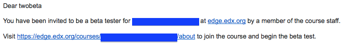

.. _Beta_Testing:

#############################
Beta Testing a Course
#############################

When a course is being designed in Studio, the course team can choose **View Live** to assess their progress in designing the course, test their work, find gaps and errors, and mimic the student experience. To gather information about the overall experience of taking a course, you can also conduct a beta test of the course. 

Beta testers have early access to the course. Beta testers are not members of the course team or staff: they don't have information about "how it's supposed to work". They use their own computers and internet connections to view videos, follow links, and complete problems. They interact with the course exactly as students will, but see the course materials before other enrolled students do. 

* :ref:`Beta_Process`
* :ref:`Qualities_Testers`
* :ref:`What_Test`
* :ref:`How_Testers_See_Course`
* :ref:`Add_Testers`
* :ref:`Add_Testers_Bulk`
* :ref:`Issue_Reporting_During_Course`

.. _Beta_Process:

******************************************
The Beta Testing Process
******************************************

During a beta test, you gather information about the experience of taking your course in an effort to improve its quality. The phases of the beta testing process, and some questions that you may find useful to consider as you prepare for each phase, follow.

#. **Planning**: What are your objectives for the test? What is the schedule for testing? 

#. **Recruitment**: How many testers do you need? How much time do you expect testers to spend? When do you need them to complete their feedback? 

#. **Provide access to your course**: Can testers access your entire course immediately, or are its sections and subsections available at different times? How will that affect the schedule?

#. **Collect feedback**: How do you want testers to provide feedback? Who checks for feedback, and how often?  

#. **Evaluate feedback**: How is feedback evaluated? Who decides what changes to make as a result, and on what schedule?

#. **Conclusion**: How do you acknowledge the efforts of your testers? What do you share with them about the results of their efforts? 

There is no one answer to any of these questions. They are included here as background on the role that beta testing can play in the preparation of your course. 

.. _Qualities_Testers:

***************************************
Qualities of Good Beta Testers
***************************************

A beta test is valuable in part because it is unscripted. Your beta testers are not following a predetermined series of steps, or using a particular computer environment, when they access your course. When you recruit beta testers, however, you may find these skills and characteristics to be helpful.

* Curiosity.

* Attention to detail for identifying problems and inconsistencies.

* Solid communication skills for reporting problems to course staff. 

Your beta testers should also have varying levels of knowledge about the course content:

* To recognize when material is wrong or missing, at least one tester should know the content well. 

* To identify material that is unclear, at least one tester should be less familiar with the content. 

Depending on the objectives you set for your beta test, you may want to consider recruiting testers who use assistive technologies, who have different native languages, or who have varying levels of familiarity with computer software.

=========================================
Using Course Staff as Beta Testers 
=========================================

Course staff can provide valuable feedback about your course. However, they are typically stakeholders in the success of your course and have a significant amount of knowledge about it. As a result, they can be too close to the course to interact with it in the same way as students will. They can also be either reluctant to provide feedback, or overly zealous.

If you do want a staff member to be a beta tester, a different, second email address must be used for this additional role. The privileges of the course staff role override those of a beta tester, so a second registration on the site, activation, and enrollment in the course are necessary using this second email address. The staff member must log in using the second email address (with the beta tester role) in order to experience the course as a student.

.. _What_Test:

*********************************
What to Test
*********************************

Beta testers should interact with everything in the course. 

* Click all links.

* Watch all videos.

* Download video transcripts and other files.

* Complete all problems. 

As they work, beta testers log issues and questions for the course team.

.. note:: Beta testers can make discussion posts and wiki contributions. You may want to ask your testers not to make posts or contributions about unreleased courseware, and alert your discussion administration team to watch for posts from the beta testers.

.. _How_Testers_See_Course:

******************************************
How Beta Testers See Course Content
******************************************

To beta test a course, you: 

* Define a number of days before section and subsection release days for testing to begin.

* Identify beta testers.

Designated beta testers see course content before students can. Beta testers access courseware: 

+-------------------------------------------+------+------+
|                                           | Yes  |  No  |
+===========================================+======+======+
| Before the Course Enrollment Date         |  X   |      |
+-------------------------------------------+------+------+
| Before the Course Start Date              |  X   |      |
+-------------------------------------------+------+------+
| Before the section Release Day            |  X   |      |
+-------------------------------------------+------+------+
| Before the subsection Release Day         |  X   |      |
+-------------------------------------------+------+------+
| Before the unit is Public                 |      |   X  |
+-------------------------------------------+------+------+
| Before a draft replaces a live unit       |      |   X  |
+-------------------------------------------+------+------+

The course team can continue to add content in Studio after the beta test begins. When new content is ready for testing, be sure to change the **Visibility** setting for any units that are Private to Public. See :ref:`Units` or :ref:`Publishing Your Course`.

================================
Define When the Beta Test Starts
================================

To define the start of the beta test, you use Studio to specify a number of days before the **Release Day** of each section and subsection in your course. 

#. In Studio, select **Settings** > **Advanced Settings**.

#. Scroll down to the ``days_early_for_beta`` **Policy Key**.

#. Set the **Policy Value** to a number of days before the **Release Day** for the section and subsection. 

#. Click **Save Changes**.

===========
Example
===========

.. Is this example helpful? how can we assess whether it is frightening/confusing to course team, or helpful?

Beta tester access to courseware for a course with ``days_early_for_beta`` = 20 and 2 sections:

+------------------------------------------------+--------------------------------------------------+
| Course Enrollment Date = 31 August             | 31 August; earlier if enrolled by course staff   |
+------------------------------------------------+--------------------------------------------------+
| Course Start Date = 15 September               | 26 August                                        |
+------------------------------------------------+--------------------------------------------------+
| section 1 Release Day = 15 September           | 26 August                                        | 
+------------------------------------------------+--------------------------------------------------+
| section 2 Release Day = 22 September           | 2 September                                      |
+------------------------------------------------+--------------------------------------------------+
| subsection 1 Release Day = 22 September        | 2 September                                      |
+------------------------------------------------+--------------------------------------------------+
| subsection 2 Release Day = 24 September        | 4 September                                      |
+------------------------------------------------+--------------------------------------------------+
| subsection 2, unit 1 Visibility = Public       | 4 September                                      |
+------------------------------------------------+--------------------------------------------------+
| subsection 2, unit 2 Visibility = Public;      | 4 September for Public version;                  |
| draft in progress                              | No access to draft                               |
+------------------------------------------------+--------------------------------------------------+
| subsection 2, unit 3 Visibility = Private      | No access                                        |
+------------------------------------------------+--------------------------------------------------+

In this example, the beta testers cannot access all of the courseware when the beta test starts on 26 August: they can access section 1 but not section 2. You may want to provide a schedule of section availability to your testers so that they can plan their time appropriately. Future release dates do not display to the beta testers in the courseware.

.. _Add_Testers:

*********************************
Add Individual Beta Testers 
*********************************

Before you can add beta testers:

* You need the email address or username of each beta tester. 

* Each beta tester must register and activate a user account for that email address and username. 

To add a single beta tester:

#. View the live version of your course.

#. Click **Instructor** then **Try New Beta Dashboard**.

#. Click **Membership**.

#. In the **Administration List Management** section, use the drop-down list to select **Beta Testers**.

#. Under the list of users who currently have that role, enter an email address or username and click **Add Beta Tester**.

  *  If the beta test starts before the course **Enrollment Start Date**, testers cannot enroll themselves in your course. You can enroll the beta testers prior to the **Enrollment Start Date**. See :ref:`Enrollment`.

  * If you add the beta testers after the defined start of the beta test, and they are enrolled in the course, they see your course on their dashboards when they log in. 

  * If you add beta testers before the test starts, or if they are not enrolled, they do not see your course on their dashboards. You may need to enroll them or send an email message to remind them when the test begins. 

To remove the Beta Tester role from users individually, find the user in the list of beta testers, and then click **Revoke access** to the right of that user's email address. 

.. _Add_Testers_Bulk:

*********************************
Add Multiple Beta Testers
*********************************

If you have a number of beta testers that you want to add, you can use a "batch add" option to add them all at once, rather than individually. With this feature, you can also send an email message to notify the beta testers that they have been added. 

To use this feature:

* You need the email address of each beta tester. 

* Each beta tester must register and activate a user account for that email address. 

To add multiple beta testers:

#. View the live version of your course.

#. Click **Instructor**, and then click **Try New Beta Dashboard**.

#. Click **Membership**. 

#. In the **Batch Beta Testers** section of the page, enter one or more addresses separated by commas or line feeds (the Enter key). You can also copy data from a CSV file of email addresses and paste it here. 

#. Optionally, check the **Notify users by email** checkbox to send an email message to the beta testers. The text of the message is:

6. Click **Add beta testers**.

  *  If the beta test starts before the course **Enrollment Start Date**, testers cannot enroll themselves in your course. You can enroll the beta testers prior to the **Enrollment Start Date**. See :ref:`Enrollment`.

  * If you add the beta testers after the defined start of the beta test, and they are enrolled in the course, they see your course on their dashboards when they log in. 

  * If you add beta testers before the test starts, or if they are not enrolled, they do not see your course on their dashboards. You may need to enroll them or send an email message to remind them when the test begins. 

To remove the Beta Tester role from one or more users, enter their email addresses in the **Batch Add Beta Testers** field and then click **Remove beta testers**. 

.. _Issue_Reporting_During_Course:

*********************************
Issue Reporting During a Course
*********************************

Despite the efforts of the course team and the beta testers, additional problems, questions, and issues can occur while a course is running. 

* Often, students report issues by asking questions in a discussion. Your discussion administration team can watch for posts that indicate problems.

* To let students know the best way to report problems, you can post information on the Course Info page or post it in a discussion. 

.. per Mark 19 Feb 14: eventually we want to provide more guidance for students:  course issues > use discussions, platform issues > submit issue to edx.

