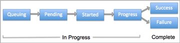
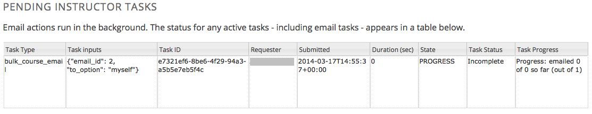
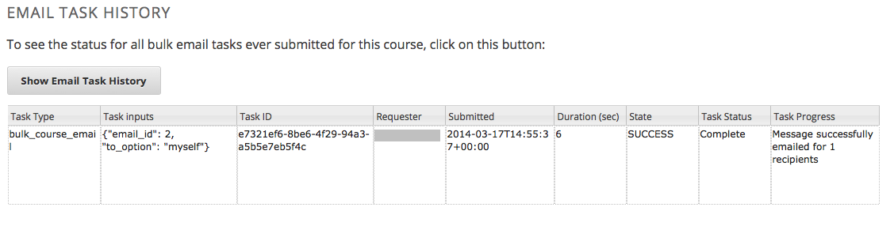

.. _Launch:

##############################
Course Launching Activities 
##############################

To launch a course, you prepare the course itself, the staff, and the
students. This chapter includes a :ref:`Course Launch Checklist` to use as a
model for your schedule of activities.

To help you communicate to the course staff or to all course participants
before the course launches and while it is running, you can send email messages
from the Instructor Dashboard. See :ref:`Bulk Email`. This chapter also
includes a set of :ref:`example messages to students<Example Messages to
Students>` that you can use as guidelines when you write your own email
messages.

.. _Course Launch Checklist:

****************************
Course Launch Checklist
****************************

As the start date for your course approaches, a checklist or timeline of
activities can help you make sure that your course, and your students, are
ready to begin. Suggestions for activities to complete before your course
starts follow.

**Verify Course Settings**

* Check the course start date and time in Studio. See :ref:`Set Important
  Dates for Your Course`.
* Review the grading policy, and set a grace period for homework assignment
  due dates. See :ref:`Establish a Grading Policy`.

**Review First Week Content**

* Verify that all units are present and published. See :ref:`Developing Course
  Units`.
* Check all assignments for completeness and verify their due dates. See
  :ref:`Working with Problem Components`.
* Verify that videos, transcripts, and download links are in place and
  working.
* Review feedback from the course team and beta testers to be sure that the
  content has been thoroughly reviewed and tested.

**Welcome Students**

* Two months before the course start date, prepare and send a welcome email
  message to currently enrolled students. See :ref:`Prelaunch Reminder` and :ref:`Send_Bulk_Email`.
* Compose a welcome message and add it to the **Course Info** page. See
  :ref:`Add a Course Update`.
* Verify that a syllabus and other references are available on the **Course
  Handouts** page. See :ref:`Add Course Handouts`.
* One month before the course start date, prepare and send a welcome email
  message to currently enrolled students.
* One week before the course start date, prepare and send a welcome email
  message to currently enrolled students.
* Add an "Introduce Yourself" post to a discussion topic. For a MOOC, you may
  want to manage the size of the thread by distributing student responses
  across multiple threads. For example, you can start different threads for
  introductions based on geographical location, such as "Introduce Yourself:
  Europe", "Introduce Yourself: North America", etc. See
  :ref:`Running_discussions`.
* On the course start date, prepare and send a launch email message to
  currently enrolled students. See :ref:`Launch Day Welcome`. 

**Prepare Staff**

* Define communication methods for all course contributors, including staff,
  instructors, and the discussion team. For example, set up a course-specific
  email address.
* Verify that all course contributors know how to record their work, report
  issues, and collaborate on tasks.
* Verify that the instructors and course staff selected for your course
  have the correct role assignments in the LMS. See :ref:`Course_Staffing`.
* Verify that discussion admins, discussion moderators, and community TAs have
  registered and activated their user accounts, enrolled in the course, and
  been assigned their roles on the Instructor Dashboard. See
  :ref:`Assigning_discussion_roles`.
* Define methods for managing discussions and guidance for discussion
  moderators, and distribute to the discussion team. See
  :ref:`Moderating_discussions` and :ref:`Guidance for Discussion Moderators`.

.. _Bulk Email:

*************************
Bulk Email 
*************************

With the bulk email feature, you can send email messages to course participants
directly from the Instructor Dashboard. Messages can use HTML styling, and can
include links to videos, social media pages for the course, and other material.
All course contributors who are assigned the course staff or instructor role
can use this feature to communicate with course participants before, during,
and after the course run. 

For templates that you can use when preparing your own messages, see
:ref:`Example Messages to Students`.

.. note:: The bulk email feature is currently in limited release, and is 
 enabled for new courses only. A gradual rollout of this feature is planned for
 2014.

===========================
Message Addressing
===========================

When you send an email message from the Instructor Dashboard, you choose its
recipients by selecting one of these predefined groups:

* **Myself**, to test out a message before sending it to a larger group.
* **Staff and Instructors**, to contact other members of the administrative
  team.
* **All (students, staff and instructors)**, to communicate with currently
  enrolled students and the administrative team. 

  Email messages are not sent to enrolled students in these circumstances:

  * Students can opt not to receive email messages through the **Email
    Settings** link, which is present for each course on the **Current
    Courses** dashboard. Email messages are not sent to these students.

  * Email is not sent to students who have not replied to an account activation
    email message.

Before you use the bulk email feature, consider that messages **cannot be
cancelled** after they are sent. If you plan to send a message to all course
participants, be sure to review each draft carefully, and send the message to
yourself first for thorough testing.

.. _Send_Bulk_Email:

======================================================
Send Email Messages to Course Participants
======================================================

To send an email message to course participants:

#. View the live version of your course.

#. Click **Instructor** then click **Email**.

#. Select who you want to send the message to from the **Send to** dropdown
   list. You can select:

  * **Myself**
  * **Staff and Instructors**
  * **All (students, staff and instructors)**

4. Enter a **Subject** for the message. A subject is required.

#. Enter the text for the message. Message text is required. 
   
   Messages can use HTML styling, including text formatting and links. The
   email message editor offers the same formatting options as the HTML
   component editor in Studio. See :ref:`Working with HTML Components`.

#. Click **Send Email**. You can perform other tasks on the Instructor
   Dashboard or navigate to other pages while you wait for your message to be
   sent.

After you send a message, a bulk email task is queued for processing.
Multiple courses use the same queue to complete these tasks, so it can take
some time for your message to be sent to all of its recipients. If your course
is a MOOC, consider limiting the number of messages that you send to all
course participants to no more than one per week.

.. _Email_queuing:

======================================================
Message Workflow States
======================================================

When you click **Send Email** for a message, the server begins to process a
bulk email task. The server assigns a series of different workflow states to
the task.
  

The workflow states for a bulk email task are:

* Queuing: The bulk email task is created and being queued for background
  processing.
* Pending: The task is queued and is waiting to run.
* Started: Background processing is in progress to create emailing subtasks.
* Progress: The emailing subtasks are in progress. 
* Success: All emailing subtasks are complete. Note that the bulk email task
  can be in this state even if some or all of its emailing subtasks failed.
* Failure: An error occurred and task processing did not complete successfully.

While the bulk email task is in progress, you can find out how far it has
gotten in the workflow by checking the **Pending Instructor Tasks** section on
the **Email** page.

             and when, in tabular format

When the bulk email task is complete, you can find its final state by checking
the Email Task History report. See :ref:`Email Task History Report`.

.. _Review Sent Messages:

********************************
Review Sent Messages
********************************

You can review a list of all of the messages that have been sent for the
course. For any listed message, you can review the subject, the username of the
person who sent it, the date and time sent, its selected recipients, and the
message text.

#. View the live version of your course.

#. Click **Instructor** then click **Email**. 

#. In the **Email Task History** section of the page, click **Sent Email
   History**. The list of sent messages displays.

   .. image:: ../Images/Bulk_email_list.png
    :alt: A tabular list of sent messages, with columns for subject, sent by,  
          time sent, and number sent

4. To review additional information for a message, click its subject. The
   message opens in a dialog box.
 
   .. image:: ../Images/Bulk_email_sent.png
    :alt: A dialog box with the subject, sent by, date and time sent, sent to, 
          and message for an email message, and an option to Copy Email 
          to Editor

5. Optionally, use the message as the basis for a new message: click **Copy
   Email to Editor**. The dialog box closes and you can edit the text, links,
   and formatting that were duplicated into the **Subject** and **Message**
   fields.

   When you create a message by copying a previously-sent message, be sure to
   review and test it thoroughly before you send it to all course participants.

.. _Email Task History Report:

********************************
Email Task History Report
********************************

The Email Task History report can help you keep track of who sent messages,
when, and to how many people. For each message sent, the report includes the
username of the requester, the date and time it was submitted, the duration and
state of the entire task, the task status, and the task progress.

You can use this history to investigate questions relating to bulk email
messages that have been sent, such as:

* How frequently students are sent course-related email messages.
* Whether a message was sent successfully.
* The change in the number of people who were sent course-related messages over
  time.

To produce the Email Task History report:

#. View the live version of your course.

#. Click **Instructor** then click **Email**. 

#. In the **Email Task History** section of the page, click **Show Email Task
   History**. A report like the following example displays on the Instructor
   Dashboard.

======================================
Review Email Task History
======================================

For tasks with a **State** of Success, the **Task Progress** column shows an
informational message. These messages can have a format such as "Message
successfully emailed for 13457 recipients (skipping 29) (out of 13486)". To
interpret this message, note that:

* The first number ("recipients") indicates the number of messages sent to the
  selected recipients.

* The second number ("skipping") indicates the number of enrolled and activated
  users who were not sent the message. This count is of students who have opted
  not to receive course email messages.

* The final number ("out of") indicates the number of users in the set of
  recipients you selected who were enrolled in the course (and had activated
  their user accounts) when you sent the email message. 

  Note that the **Total number of enrollees** shown on the **Course Info** page
  includes all currently enrolled students, regardless of account activation
  status, and as a result can be different than this number.

If the "recipients" and "out of" numbers are the same, the message reads
"Message successfully emailed for 13457 recipients" instead.

Other **Task Progress** messages for tasks with a **State** of Success indicate
that some or all of the emailing subtasks did not successfully send email:

* "Message emailed for {number succeeded} of {number attempted} recipients" 
* "Message failed to be emailed for any of {number attempted} recipients"
* "Unable to find any recipients to be emailed"
  
No **Task Progress** messages display for tasks that have a **State** of
Failure.

.. _Example Messages to Students:

*********************************
Example Messages to Students
*********************************

You can use these example messages, prepared for delivery before typical course
milestones, as models for your own course communications.

* :ref:`Prelaunch Reminder`
* :ref:`Launch Day Welcome`
* :ref:`Midcourse Encouragement`
* :ref:`Midcourse Events`
* :ref:`Technical Issue`
* :ref:`Course Farewell and Certificates`
* :ref:`New Course Run Announcement`

These messages are styled as email messages, but you could also post this
information in a course discussion topic or on the **Course Info** page.

.. important:: Revise these message templates carefully to include facts for your own course, meet the needs of your students, and reflect your own objectives and personality. Search for the "{" and "}" characters to locate prompts and replace them with course-specific values.

.. _Prelaunch Reminder: 

=======================
Pre-launch Reminder
=======================

Pre-launch reminders raise awareness of the course start date, publicize the
course, and generate excitement. In addition to the course start date and time,
the example that follows also lets students know that:

* UTC is used in edX courses. Alternatively, you could include information
  about your course or the edX platform that will contribute to your students'
  success.

* The course has a companion social media site. Alternatively, you might
  include information about planned meetups or other community-building
  opportunities.

You may want to send out more than one message before the course launches: use
this template as a starting point for crafting the different messages you want
to deliver. Replace values enclosed by {braces} with information that applies
to your course.

:: 

  Subject: {course number} Starts Soon!

  Hello {course name} student,

  We are excited that you are joining us for {course number} {course name},
  offered by {organization name} through edX. Class begins on {day}, {date} at
  {time} UTC (which is {time} {local time zone}). Note that edX courses use
  Coordinated Universal Time (UTC) for due dates and release times.

  In case you haven't already found it, {course number} has its own official
  Facebook page {add link}. You can find videos and photos posted there before
  the course even begins.

  If this is your first edX course, consider registering for edx101 {add link},
  the edX Demo course. This course gives you an opportunity to explore the edX
  platform and learn how to answer problems and track your progress, before
  {course number} begins.

  Your {course number} course staff

.. _Launch Day Welcome:

=======================
Launch Day Welcome
=======================

On your course start date, you can send an email message that both welcomes
students and gives them specific actions to accomplish. This example directs
students to two of the course pages to encourage exploration and discovery, and
personally introduces the course team leader. Search for the values enclosed by
{braces} in this template and replace them with information for your course.

:: 

  Subject: {course number} Starts Today!

  Hello everyone!

  At this time, edX course {course number} is available from your Dashboard
  {add link}, and the staff would like to officially welcome you to the course!
  You'll find materials for the first week on the Courseware page,
  including both video lectures and problem sets.

  Please take some time to go to the Course Info page to read the handouts
  and get familiar with course policies and philosophy.

  I will be your course lead and I hope you will all have a great time learning
  {subject}! It may be challenging, it may be frustrating, but it will be
  rewarding and you will learn a ton.

  On behalf of the staff, welcome, good luck, and have fun!

  {name} and the {course number} staff

.. _Midcourse Encouragement:

==========================
Mid-Course Encouragement
==========================

While your course is running, you can send messages to promote community,
remind students of upcoming due dates, and address any recurring issues.

This example gives students guidance on how to keep up with the course schedule
and encourages contributions to the discussions. You may want to send out more
than one message while the course is running. You can use this template as a
starting point for your own messages; search for the values enclosed by
{braces} and replace them with information for your course.

:: 

  Subject: {course name} Announcements

  Dear students,

  We hope that you are learning a lot in {course number}! Remember that problem
  set {number} is due on {date} at {time} UTC. You can always check the
  schedule {add link} on the Course Info page to plan ahead.

  The contributions to the course discussions have been amazing. You'll also
  see on the Course Info page that we have made several of you community
  TAs to thank you for your thoughtful contributions. Keep those conversations
  going!

  We have a few additional announcements.

  * Week {number} on {subject} is now available on the Courseware page.

  * Problem set {number} is also available. It is due on {date} at {time} UTC. 

  * Remember that the due dates for problem sets and exams are in UTC (the GMT
    time zone). See the current UTC time here {add link}. Please convert the
    times given to your own time zone!

  Wishing you continued success in the course,

  {name} and the {course number} staff

.. _Midcourse Events:

=======================
Mid-Course Event
=======================

Before an exam or other significant course event, messages can provide
practical information about the exam, communicate expectations regarding
conduct, and also encourage students to continue working toward course
completion. This example lets students know:

* How long they have to complete the exam, and when they can see answers to
  questions.

* How to communicate any errors or other issues found during the exam to the
  course staff.

* Whether the course discussions will be open or closed during the exam. (In
  the example that follows, the discussions will remain **open**.)

* What constitutes an honor code violation.

* What technical limitations, if any, are imposed by external tools such as
  graders.

Be sure to search for the values enclosed by {braces} and replace them with
information for your course.

:: 

  Subject: {course number} Exam Info

  Hello {course name} student,

  Great job working through week {number}! As you know, the {course number}
  exam is next week. If you missed a problem set, you can still earn a
  certificate. Each problem set is worth only {number}% of the overall grade,
  but this exam is worth {number}%.

  Please read this important information about the exam before you begin taking
  it.

  * The exam starts on {date} at {time} UTC and must be finished by {date} at
    {time} UTC. Plan your schedule accordingly.

  * Be sure that you know what time the UTC deadline is in your time zone. See
    the current UTC time {add link}. No extensions will be given.

  * The exam is not timed. You can start, stop, and come back to it until the
    deadline.

  * Each exam question allows only one answer submission. If you accidentally
    click "Check", that problem cannot be reset for you.

  * The exam covers everything (video lectures, reading, and problem sets) from
    weeks {number}-{number}. If you missed any of these materials, you will
    want to review them before you take the exam.

  * You can use the textbook and the Internet to clarify your knowledge of exam
    topics, as long as you are not deliberately looking up answers to exam
    questions.

  * Course discussions will remain open during the exam, but anyone who posts
    an answer to an exam question will be violating the honor code and risk
    being removed from the class, forfeiting the certificate.

  * If you need to alert the staff to an issue with the exam while the exam is
    open, add a post to the General discussion topic and include [EXAM] in
    the subject line.

  * Check the Course Info page periodically. It is the fastest way the
    staff has to communicate any delays, corrections, or changes.

  Good luck!

  {name} and the {course number} staff

.. _Technical Issue:

=========================================
Technical Issue
=========================================

In the event of an unanticipated system failure, a message can both alert
students to the problem and reassure them that the issue is either resolved or
being addressed. The message can also provide information about any changes
made to the course as a result.

Technical issues can arise during a course for many different reasons, so this
example is likely to need revision to apply to an issue that you encounter.
Keep in mind that to reassure the students who are affected by the problem, the
message should have a positive tone, and calmly and briefly identify the
problem, the status of its solution, and any after effects.

::

  Dear students,

  We've encountered a technical problem with {video, assignment, etc. name}.
  {We are working to resolve it now. / This issue has been fixed.}

  As a result of this issue, we have {extended the deadline for / rescored}
  this assignment so that it will not affect your grade.

  Thanks for your patience, and we look forward to continuing the course with
  you.

  {name} and the {course number} staff

.. _Course Farewell and Certificates:

==============================================
Course Farewell and Certificates
==============================================

In the last few days before your course ends, a message can direct students to
a course survey, answer questions about certificates, and provide information
about future access to course materials. Be sure to replace values enclosed by
{braces} with information for your course.

:: 

  Subject: {course number} Final Remarks

  Dear students,

  Thank you for making {course number} so much fun these last few months! We
  had a great time getting to know you through the course discussions. We
  appreciate the effort that you put into this course, and we hope that you
  enjoyed learning {subject} through edX. With or without a certificate, you
  should be proud of your accomplishments.

  * Please take a few minutes to answer the exit survey, now available under
    Courseware. We will use your responses to improve the course in the future.

  * If you qualify for a certificate (overall score {number}% or higher), the
    edX dashboard will include a link to your certificate in the near future.
    While you may see the link in a few days, it can take up to two weeks edX
    to generate all of the course certificates.

  * As a registered student, you will have access to the lecture videos even
    after the course ends. The problem sets and exams will be removed from the
    course when it is archived.

  * The {course number} discussions close on {date} at {time} UTC. You will not
    be able to add to the discussions after that time, but you will be able to
    continue viewing all of the conversations that took place during the
    course.

  We hope that you share what you learned in {course number} with your
  colleagues, friends, and family.

  Good luck on the final exam and beyond!

  {name} and the {course number} staff

.. _New Course Run Announcement:

===============================
New Course Run Announcement
===============================

When you prepare a course for a new run, you can use the bulk email feature in
its previous run (or runs) to inform an engaged and knowledgeable audience:
your former students. Announcing a new run to students of an earlier run gives
you the opportunity to highlight key aspects of the course, such as the quality
and variety of its discussions, or the global interest and relevance of the
subject, as demonstrated by past enrollment. You can also reveal new features
or content that have been added to the new course run. By emphasizing the
value of the course, you get people thinking and talking about their
experiences, build excitement, and encourage re-enrollment.

This message template offers students who did not complete the course, or who
did not previously choose the verified certificate track, the opportunity to do
so. It also invites students to share the course with colleagues and and
friends. 

When preparing a message from this template, search for values enclosed by
{braces} and replace them with information that applies to your course.

::

  Subject: Announcing a new run of {course name}

  Hello {course number} leaners,

  The next run of {course number} {course name} begins on {date}! We are glad
  to share this news with you, the students who made the earlier run{s} of
  {course number} so succesful.

  {Success story from the previous run.} 

  {New content or features for the upcoming run.}

  Perhaps you want to share the {course name} experience with a friend or
  colleague, earn an ID-verified certificate of achievement, or work through
  course content that you weren't able to complete before. When {course number}
  is offered in {time frame}, we welcome you to join the community of learners
  again.

  To learn more and to register, visit the {course name} page {add link}.

  We hope to see you in the course,

  The {course number} Staff