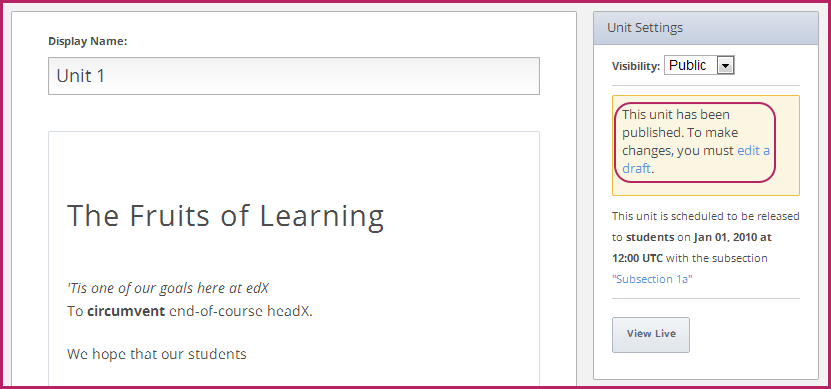
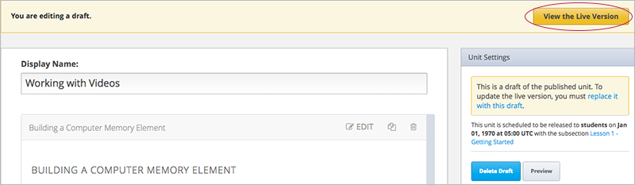

.. _Publishing Your Course:

###########################
Publishing Your Course
###########################

When you have set up your course, established a grading system, and organized your course content,
you are ready to publish your course and make it available to students.

Understanding the content your students can view, and knowing how to change what students can view, is complex.
Read the following sections carefully:

* :ref:`Understanding Content Students Can View`
* :ref:`Release Dates`
* :ref:`Public and Private Units`
* :ref:`Modifying Public Units`

.. _Understanding Content Students Can View:

******************************************
Understanding Content Students Can View
******************************************

When you create a course on Studio, students cannot see any of your course content until the course start date has passed. 
After the course start date has passed, whether a student can see your course materials depends on two settings that you can control: release dates and visibility.

* The **Release Date**. Sections and subsections have release dates. If the current date
  of a section or subsection is before the release date, the content of that course element is
  not yet published, and not visible to students. 
  
  For a student to view a subsection, both it and its containing section must
  have a release date that is earlier than the current date. It is possible to
  have a section that is released, but a subsection within that section that is
  not released. In this case, students cannot view that subsection.
  
  Course staff can see sections and subsections before the release date in the LMS.
  
* The unit must be **Public**.  All units have a **Visibility** setting that is **Public** or **Private**.
  When you create a unit, it is **Private** by default. 
  
  Students cannot view a **Private** unit, even if the containing section and subsection are released.
  
  Students cannot view a **Public** unit if the containing section and subsection are *not* released.
  
  Course staff *cannot* see Private units in the LMS.
  
In summary, for students to see content, the unit must be **Public**, and the containing section and
subsection must be released. If all these criteria are not met, students do not see that unit.

Continue reading this chapter for more details.

.. _Release Dates:

*******************
Release Dates
*******************

Release dates specify the dates when content is available to students. 
Release dates are set at the section and subsection levels. 

Neither a section nor its contents are visible to students until the release date passes. 
However, course staff can see content in the LMS regardless of its release date.

.. note:: 
  For courses created before January 14, 2014, when you create a new section or subsection, the default release date is January 1, 1970. This means that public units are immediately published, and you must change this date to the future to prevent students from viewing the content.  

  For courses created after January 14, 2014, the default release date is January 1, 2030. In this case, you must adjust the release date to the day you want students to be able to view the content.

========================================
Set the Release Date for a Section
========================================

You can set release date and time for each section.
Before the release date and time, students are not able to view any content in that section. 

To set a release date for a section:

#. In the **Will Release:** field next to the section title, click **Edit**.
#. Enter the release date in MM/DD/YYYY format, and the UTC time.
#. Click **Save**.

========================================
Set the Release Date for a Subsection
========================================

Subsections inherit the release date of the section they are in, but you can
change this date so that different subsections are released at different times.

Note that if the release date for a subsection falls before the release date for
the section that contains it, students will not be able to see the subsection
until the release date for the *section* has passed. Section release dates
override subsection release dates.

To set the release date for a subsection:

#. Open the subsection.
#. Locate the **Subsection Settings** box in the top right corner.
#. Enter the release date in MM/DD/YYYY format, and the UTC time.

================================================
Synch the Release Date for a Subsection
================================================

You or other course staff could inadvertantly set the release date for a subsection 
earlier than the release date for the containing section. In this situation, the subsection is 
not released until the section is released.

To help you keep your course and release dates organized, Studio flags subsections with earlier release dates
than their containing section.  In this situation, when you open the subsection, in the Subsection Settings,
you see the following message:

``The date above differs from the release date of <Section Name> - <Section release date and time>. Sync to <Section Name>.``

Click **Sync to <Section Name>** to have the subsection inherit the later section release date.

.. _Public and Private Units:

*************************
Public and Private Units
*************************

Units are released at the release date of the subsection they are in.

In addition, unites have a **Visibility** setting that you can set to **Public** or
**Private**. 

When you create a unit, it is Private by default. 
A Private unit is never visible to students, even if it is contained by a subsection that has been released.

When you change the visibility setting of a unit from Private to Public, you publish the unit and its contents. 
You must set the Visibility to Public for students to be able to see the unit.

Course staff cannot see Private units in the LMS.

.. _Modifying Public Units:

*************************
Modifying Public Units
*************************

To make revisions to a unit that has been published, you create and edit a draft of that unit. 

.. Warning:: 
 There are additional implications to modifying a public unit that has graded
 problem components students may have already completed.  See :ref:`Modifying a
 Released Problem` for more information.

To create a draft, go to the unit's page, and then click **edit a draft** in the right pane.

When you edit a draft of a unit, you can view the unit's contents in two ways.

* To view the already-published content as it appears in the live course, click **View the Live Version** in the upper-right corner of the page.
* To view the unpublished content as you're working on it, click **Preview**.

When you're ready to publish the draft of your revised content, 
click **replace it with this draft** in the right pane. 

If you decide you don't want to keep the revised content, click **Delete Draft**.

.. image:: ../Images/Viz_Revise_ReplaceorDelete.png
  :alt: Image of a unit settings panel with the replace it with this draft link circled

.. Warning:: Historical versions of units are not stored by Studio. After you replace the live version with a new draft, you cannot revert the unit to the previous version. 

  
  