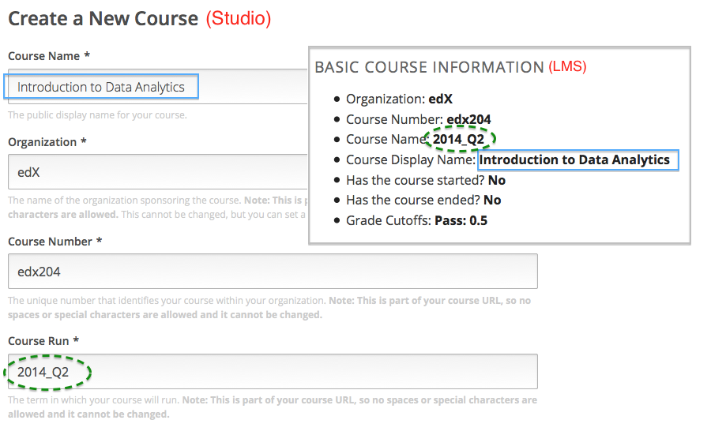

.. _Course Data:

############################
Course Data
############################

After you create a course, you can access information about it from the
Instructor Dashboard. You can find:

* Identifying information for the course.

* Whether the course has started or ended.

* The defined grade cutoff for passing or failing.

Additional data about the course and its students is available from other pages
in the Instructor Dashboard, and from edX Insights. You also access Insights
from the Instructor Dashboard: click the link in the banner at the top of each
page. For more information, see `Using edX Insights`_.

*************************************************
Review Course Data
*************************************************

To view course data:

#. View the live version of your course.

#. Click **Instructor**, then click **Course Info** if necessary. 

   The **Basic Course Information** section of the page that opens lists
   information about the course.

    .. image:: ../Images/Instructor_Dash_Course_Info.png
     :alt: The basic course information section of the Instructor Dashboard 

*************************************************
Sources in Studio of the Basic Course Information
*************************************************

The course data that displays on the Instructor Dashboard is defined in
Studio, or derived from data that you define in Studio.

* **Organization**: Specified in Studio when you create the course. Becomes
  part of the course URL, and cannot be changed.

* **Course Number**: Specified in Studio when you create the course. Becomes
  part of the course URL, and cannot be changed.

* **Course Name**: Specified in Studio when you create the course. Becomes
  part of the course URL, and cannot be changed. In Studio, this field is
  labeled **Course Run**.

* **Course Display Name**: Specified in Studio when you create the course. In
  Studio, this field is labeled **Course Name**. 

  This name can be changed in Studio (not recommended if your course is live):
  From the **Settings** menu select **Advanced Settings**. The value for the
  **Course Display Name** policy key defines the course name that appears in the
  LMS only.

  The illustration that follows shows the information collected by Studio for
  a new course side-by-side with the same information in the **Basic Course
  Information** section of the Instructor Dashboard.

* **Has the course started**: Derived from the **Course Start Date** and the
  current date. This date can be changed in Studio (not recommended if your
  course is live): select **Settings** > **Schedule & Details**.

* **Has the course ended**: Derived from the **Course End Date** and the
  current date. This date can be changed in Studio (not recommended if your
  course is live): select **Settings** > **Schedule & Details**.

* **Grade Cutoffs**: Specified in Studio when you define the cutoff for a
  failing grade. Students who earn exactly the cutoff value pass the course.
  Grading can be changed in Studio (not recommended if your course is live):
  select **Settings** > **Grading**.

.. _Using edX Insights: http://edx-insights.readthedocs.org/en/latest/