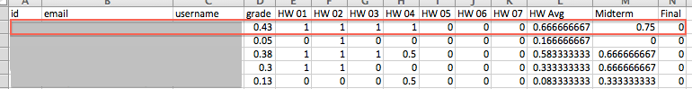
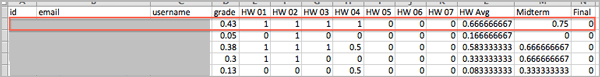
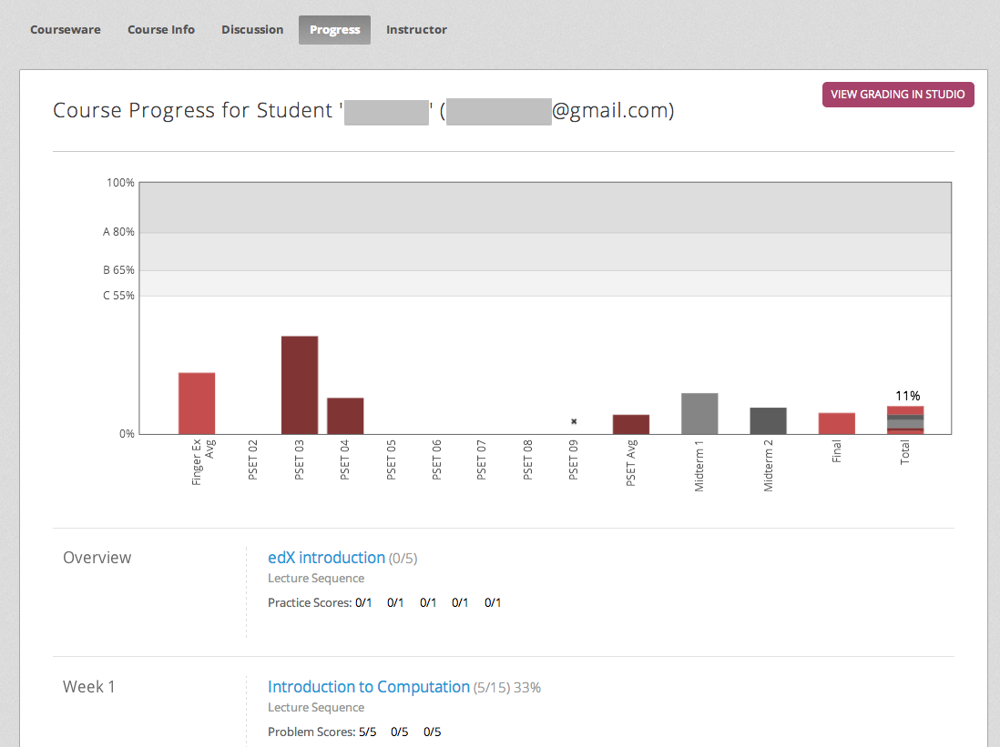
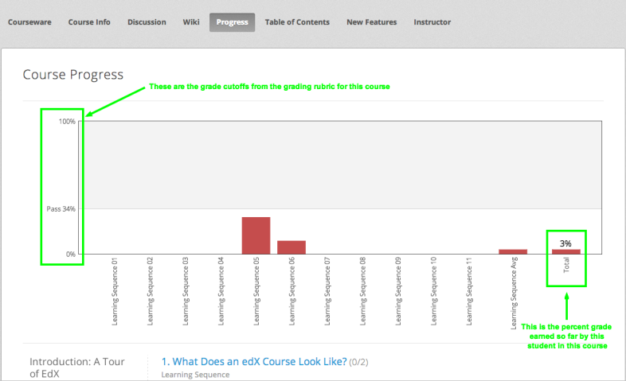

.. _Grades:

############################
Student Grades and Grading
############################

You can review information about how grading is configured for your course, and
access student grades, at any time after you create the course. You can also
make adjustments to student grading for a problem, for a single student or all
students. For information about the grading data that you can access and the
changes you can make, see the following topics:

* :ref:`Review_grades`

* :ref:`Access_grades`

* :ref:`gradebook`

* :ref:`check_student_progress`

* :ref:`Adjust_grades`

To review student answers to the problems in your course, you can check the
answer submitted by a specified student for a selected problem, download
course-wide answer data, or review a graph of all answer data for a selected
problem. See :ref:`Review_Answers`.

For information about how you establish a grading policy and work with the
Problem components in your course, see :ref:`Establish a Grading Policy` or
:ref:`Working with Problem Components`.

.. _Review_grades:

********************************************************
Review How Grading Is Configured for Your Course
********************************************************

You can review the assignment types that are graded and their respective
weights on the Instructor Dashboard.

You establish a grading policy for your course when you create it in Studio.
While the course is running, you can view an XML representation of the
assignment types in your course and how they are weighted to determine
students' grades.

..  DOC-290: research this statement before including anything like it: Below the list of graded assignment types and their weights, each *public* subsection and unit that contains an assignment is listed.

#. View the live version of your course.

#. Click **Instructor**, then click **Data Download** > **Grading
   Configuration**.

   A list of the assignment types in your course displays. In this example,
   Homework is weighted as 0.3 (30%) of the grade.

   .. image:: ../Images/Grading_Configuration.png
     :alt: XML of course assignment types and weights for grading

   In Studio, you define this information by selecting **Settings** >
   **Grading**. For more information, see :ref:`Configure the Assignment
   Types`.

   .. image:: ../Images/Grading_Configuration_Studio.png
     :alt: Studio example of homework assignment type and grading weight

.. important:: Any changes that you make to the course grading policy, to 
 graded subsections, or to graded components after the course begins will
 affect the student experience in the course and analysis of its data.
 Unavoidable changes should be announced to students, on the **Course Info**
 page for example, and carefully tracked for researchers.

.. _Access_grades:

********************************************************
Generate Grades for Enrolled Students (All Courses)
********************************************************

For any course, you can generate grades and then download a file with the
results for each enrolled student. 

When you initiate calculations to grade student work, a process starts on the
edX servers. The complexity of your grading configuration and the number of
students enrolled in your course affect how long this process takes. You can
download a report of the calculated grades in a CSV (comma-separated values)
file when the grading process is complete.

For courses with fewer than 200 students enrolled, you also have the option to
review student grades on the Instructor Dashboard. See :ref:`gradebook`.

To generate the grade report for the students who are currently enrolled in
your course:

#. View the live version of your course.

#. Click **Instructor**, then click **Data Download**.

#. To start the grading process, click **Generate Grade Report**.

  A status message indicates that the grading process is in progress. This
  process can take some time to complete, but you can navigate away from this
  page and do other work while it runs.

4. To track the progress of the grading process, reload the page in your
   browser and scroll down to the **Pending Instructor Tasks** section.

==========================================
Download Grades for Enrolled Students
==========================================

After you request a grade report for your students, the result is a time-
stamped CSV file that includes columns to identify each student: id, email, and
username. It also includes a column for every assignment that is included in
your grading configuration: each homework, lab, midterm, final, and any other
assignment type you added to your course.

.. important:: Because this file contains confidential, personally 
 identifiable data which may be subject to the Family Educational Rights and
 Privacy Act (FERPA), be sure to follow your institution's data stewardship
 policies when you open or save this file.

To download a file of student grades:

#. View the live version of your course.

#. Click **Instructor**, then click **Data Download**.

#. To open or save a grade report file, click the
   ``{course_id}_grade_report_{date}.csv`` file name at the bottom of the page.

.. note:: To prevent the accidental distribution of student data, you can only 
 download these files by clicking the links on this page. Do not copy these
 links for reuse elsewhere, as they expire within 5 minutes. The links on this
 page also expire if the page is open for more than 5 minutes: if necessary,
 refresh the page to generate new links.

.. _Interpret the Grade Report:

=====================================
Interpret the Grade Report
=====================================

Grade reports provide a snapshot of cumulative course scores, by assignment, of
every currently enrolled student.

You can open ``{course_id}_grade_report_{date}.csv`` files in a spreadsheet
application to sort, graph, and compare data.

        students on several homework assignments and the midterm

The CSV file contains one row of data for each student, and columns that
provide the following information.

* Student identifiers, including an internal **id**, **email** address, and
  **username**.

* The overall **grade**, with the total score a student has currently attained
  in the course. This value is expressed as a decimal: a student with a grade
  of 0.65 has earned 65% of the credit in the course, and a student with a
  grade of 1 has earned 100%.

* Each **{assignment type} {number}** defined in your grading configuration,
  with the score a student attained for that specific assignment. For example,
  column HW 03 shows the scores for the third homework assignment.

* An **{assignment type} Avg** with each student's current average score for
  that assignment type: for example, HW Avg.

.. note:: The grade reports do not include information about individual 
 questions within the assignments, or include student answer distributions.

.. _gradebook:

********************************************************
Review Grades for Enrolled Students (Small Courses)
********************************************************

For courses with enrollments of up to 200 students, you can review a gradebook
on the Instructor Dashboard. 

#. View the live version of your course.

#. Click **Instructor**, then click **Student Admin**. For courses with fewer
   than 200 students enrolled, this tab includes a **Student Gradebook**
   section.

#. Click **View Gradebook**. Grades are calculated and the gradebook displays.

   .. image:: ../Images/Student_Gradebook.png
     :alt: Course gradebook with rows for students and columns for assignment
         types

The gradebook includes the following features.

* You can click the student username in each row to review that student's
  **Course Progress** page. See :ref:`check_student_progress`.

* There is a column for each **{assignment type} {number}** defined in your
  grading configuration, with the scores your student attained for that
  specific assignment.

  The gradebook does not have a scroll bar, but it is draggable: to see columns
  that are hidden at one side of the grade book, click the gradebook and then
  drag left or right to reveal those columns.

* For assignment types that include more than one assignment, an **{assignment
  type} Avg** column displays each student's current average score for that
  assignment type.

* The **Total** column presents the total score a student has currently
  attained in the course. This value is expressed as a whole number: a student
  with a grade of 65 has earned 65% of the credit in the course, and a student
  with a grade of 100 has earned 100%.

* To filter the data that displays you can use the **Search students** option.
  This option is case-sensitive and limits the rows shown in the gradebook to
  usernames that match your entry.

.. _check_student_progress:

****************************************
Check the Progress of a Single Student
****************************************

To check a single student's progress, you can locate the specific row on the
grade report or review the student's **Progress** page. The **Progress** page
includes a chart that plots the score the student has earned for every graded
assignment and the total grade as of the current date. Below the chart, each
assignment and the score attained are listed.

To review a student's **Progress** page, you supply an email address or
username. You can check the progress for students who are either enrolled in,
or who have unenrolled from, the course.

Students can view a similar chart and assignment list (of their own progress
only) when they are logged in to the course. See :ref:`A Students View`.

To view the **Progress** page for a student:

#. View the live version of your course.

#. Click **Instructor**, then click **Student Admin**.

#. In the Student-Specific Grade Inspection section, enter the student's email
   address or username.

#. Click **Student Progress Page**.

   The **Progress** page for the student displays a chart with the grade for
   each homework, lab, midterm, final, and any other assignment types in your
   course, and the total grade earned for the course to date.

   .. image:: ../Images/Student_Progress.png
    :alt: Progress page chart for a student: includes a column graph with the 
          score acheived for each assignment 

   To learn more about a particular assignment, move the cursor onto the value
   in the chart. A brief description displays.

   .. image:: ../Images/Student_Progress_mouseover.png
    :alt: Progress page with a tooltip for the X that was graphed for the last
          homework assignment, which indicates that the lowest homework score
          is dropped

   Below the chart, subsections are listed on the left and the units that
   contain assignments are listed on the right. The student's individual
   problem scores display.

   .. image:: ../Images/Student_Progress_list.png
    :alt: Bottom portion of a Progress page for the same student with the 
          score acheived for each problem in the first course subsection 

=============================================
Interpret the Student Progress Page
=============================================

The chart of a student's scores on the **Progress** page and the rows of data
on the grade report present assignment scores in a similar order. However, the
total, cumulative score earned for the course is placed in a different position
on the **Progress** page.

In this example grade report, the indicated student has a current grade of 0.43
(43%).

       a rectangle

* On each of the first four homework assignments the student scored 1 (100%),
  but currently has a 0 (0%) on each of the remaining three assignments.

  Notice, however, that the student's current average score for homework
  assignments is listed as 0.666666667 (67%): in this course, the homework
  assignment with the lowest score is dropped, so this average is over six
  assignments rather than all seven.

* The student has a score of 0.75 (75%) on the midterm, and a score of 0 (0%)
  on the final.

On the student's **Progress** page, you see the same information graphically
represented; however, the student's "total" of 43% is on the far right.

       a column graph with the grade acheived for each assignment 

The chart on the **Progress** page includes y-axis labels for the grade ranges
defined for the course. In this example, Pass is set to 60%, so at the end of
the course students with a grade of 0.60 or higher can receive certificates.

.. note:: Student scores on the **Progress** page are a snapshot of the 
 current state of the problem score database. They can, at times, be out of
 sync with actual problem scores. For example, asynchronicities can occur if
 the weight of a live problem was changed during an assignment, and not all
 students have resubmitted their answers for that problem.

.. _A Students View:

=============================================
A Student's View of Course Progress
=============================================

Students can check their progress by clicking **Progress** in the course
navigation bar. The student's progress through the graded part of the course
displays at the top of this page, above the subsection scores. Progress is
visualized as a chart with entries for all the assignments, total percentage
earned in the course so far, and percent needed for each grade cutoff. Here is
an example of a student's progress through edX101.
 

       highlighted
 
The student can see from this page that edX101 was graded as a Pass/Fail course
with a cutoff of 34% and that the grading rubric contained one assignment type,
called Learning Sequence, consisting of 11 assignments total. Furthermore, this
particular student has only submitted correct responses to two assignments, and
that her current total percent grade in the course is 6%. By hovering over each
progress bar, the student can get further statistics of how much each
assignment was counted as.
 
Further down on the **Progress** page is a list of all the subsections in the
course, with the scores recorded for the student for all problems in the
course. Here is the **Progress** page for the student in the example above:
 
.. image:: ../Images/StudentView_Problems.png
   :width: 800
   :alt: Image of a student's Course Progress page with problems highlighted
 
Note that point scores from graded sections are called "Problem Scores",
while point scores from ungraded sections are called "Practice Scores".

.. _Adjust_grades:

***********************************
Adjust Grades
***********************************

If you modify a problem or its settings after students have attempted to answer
it, student grades can be affected. For information about making changes to
problems in Studio, see :ref:`Modifying a Released Problem`.

To recalculate the grades of affected students when a correction or other
change is unavoidable, you can make the following adjustments.

* Rescore the submitted answer to reevaluate student work on the problem. You
  can rescore a problem for a single student or for all of the students
  enrolled in the course. See :ref:`rescore`.

* Reset the number of times a student has attempted to answer the problem to
  zero so that the student can try again. You can reset the number of attempts
  for a single student or for all of the students enrolled in the course. See
  :ref:`reset_attempts`.

* Delete a student's database history, or "state", completely for the problem.
  You can only delete student state for one student at a time. For example, you
  realize that a problem needs to be rewritten after only a few of your
  students have answered it. To resolve this situation, you rewrite the problem
  and then delete student state for the affected students only so that they can
  try again. See :ref:`delete_state`.

To make adjustments to student grades, you need the unique location identifier
of the modified problem. See :ref:`find_URL`.

.. _find_URL:

==================================================
Find the Unique Location Identifier for a Problem
==================================================

When you create each of the problems for a course, edX assigns a unique
location to it. To make grading adjustments for a problem, or to view data
about it, you need to specify the problem location.

To find the unique location identifier for a problem:

#. View the live version of your course.

#. Click **Courseware** and navigate to the unit that contains the problem.

#. Display the problem and then click **Staff Debug Info**.

   Information about the problem displays, including its **location**. 

   .. image:: ../Images/Problem_URL.png
    :alt: The Staff Debug view of a problem with the location identifier 
          indicated

4. To copy the location of the problem, select the entire location, right
   click, and choose **Copy**.

To close the Staff Debug viewer, click on the browser page outside of the
viewer.

.. _rescore:

===================================================
Rescore Student Submissions for a Problem
===================================================

Each problem that you define for your course includes a correct answer, and may
also include a tolerance or acceptable alternatives. If you decide to make a
change to these values, you can rescore any responses that were already
submitted. For a specified problem, you can rescore the work submitted by a
single student, or rescore the submissions made by every enrolled student.

.. note:: You can only rescore problems that have a correct answer entered in 
 edX Studio. This procedure cannot be used to rescore problems that are scored
 by an external grader.

Rescore a Submission for an Individual Student
-----------------------------------------------

To rescore a problem for a single student, you need that student's username or
email address.

#. View the live version of your course.

#. Click **Courseware** and navigate to the component that contains the problem
   you want to rescore.

#. Display the problem, then click **Staff Debug Info**. The Staff Debug viewer
   opens.

#. In the **Username** field, enter the student's email address or username,
   then click **Rescore Student Submission**. A message indicates a successful
   adjustment.

#. To close the Staff Debug viewer, click on the browser page outside of the
   viewer.

Rescore Submissions for All Students
------------------------------------

To specify the problem you want to rescore, you need its location identifier.
See :ref:`find_URL`. To rescore a problem:

#. View the live version of your course.

#. Click **Instructor**, then click **Student Admin**. 

#. In the **Course-Specific Grade Adjustment** section of the page, enter the
   unique problem location, and then click **Rescore ALL students' problem
   submissions**.

#. When you see a dialog box that notifies you that the rescore process is in
   progress, click **OK**.

   This process can take some time to complete for all enrolled students. The
   process runs in the background, so you can navigate away from this page and
   do other work while it runs.

6. To view the results of the rescore process, click either **Show Background
   Task History for Student** or **Show Background Task History for Problem**.

   A table displays the status of the rescore process for each student or problem.

.. note:: You can use a similar procedure to rescore the submission for a 
 problem by a single student. You work in the **Student-Specific Grade
 Adjustment** section of the page to enter both the student’s email address or
 username and the unique problem identifier, and then click **Rescore Student
 Submission**.

.. _reset_attempts:

===================================================
Reset Student Attempts for a Problem
===================================================

When you create a problem, you can limit the number of times that a student can
try to answer that problem correctly. If unexpected issues occur for a problem,
you can reset the value for one particular student's attempts back to zero so
that the student can begin work over again. If the unexpected behavior affects
all of the students in your course, you can reset the number of attempts for
all students to zero.

Reset Attempts for an Individual Student
---------------------------------------------

To reset the number of attempts for a single student, you need that student's
username or email address.

#. View the live version of your course.

#. Click **Courseware** and navigate to the component that contains the problem
   you want to reset.

#. Display the problem, then click **Staff Debug Info**. The Staff Debug viewer
   opens.

#. In the **Username** field, enter the student's email address or username,
   then click **Reset Student Attempts**. A message indicates a successful
   adjustment.

#. To close the Staff Debug viewer, click on the browser page outside of the
   viewer.

Reset Attempts for All Students
------------------------------------

To reset the number of attempts that all enrolled students have for a problem,
you need the unique identifier of the problem. See :ref:`find_URL`. To reset
attempts for all students:

#. View the live version of your course.

#. Click **Instructor**, then click **Student Admin**. 

#. To reset the number of attempts for all enrolled students, you work in the
   **Course-Specific Grade Adjustment** section of the page. Enter the unique
   problem location, then click **Reset ALL students' attempts**.

#. A dialog opens to indicate that the reset process is in progress. Click
   **OK**.

   This process can take some time to complete. The process runs in the
   background, so you can navigate away from this page and do other work while
   it runs.

5. To view the results of the reset process, click either **Show Background
   Task History for Student** or **Show Background Task History for Problem**.

   A table displays the status of the reset process for each student or
   problem.

.. note:: You can use a similar procedure to reset problem attempts for a 
 single student. You work in the **Student-Specific Grade Adjustment** section
 of the page to enter both the student’s email address or username and the
 unique problem identifier, and then click **Reset Student Attempts**.

.. _delete_state:

=============================================
Delete Student State for a Problem
=============================================

To delete a student's entire history for a problem from the database, you need
that student's username or email address. 

.. important:: Student state is deleted permanently by this process. This 
 action cannot be undone.

You can use either the Staff Debug viewer or the Instructor Dashboard to delete
student state.

To use the Staff Debug viewer:

#. View the live version of your course.

#. Click **Courseware** and navigate to the component that contains the
   problem.

#. Display the problem, then click **Staff Debug Info**. The Staff Debug viewer
   opens.

#. In the **Username** field, enter the student's email address or username,
   then click **Delete Student State**. A message indicates a successful
   adjustment.

#. To close the Staff Debug viewer, click on the browser page outside of the
   viewer.

To use the Instructor Dashboard, you need the unique identifier of the problem.
See :ref:`find_URL`.

#. Click **Instructor**, then click **Student Admin**. 

#. In the **Student-Specific Grade Adjustment** section of the page, enter both
   the student’s email address or username and the unique problem identifier,
   and then click **Delete Student State for Problem**.
