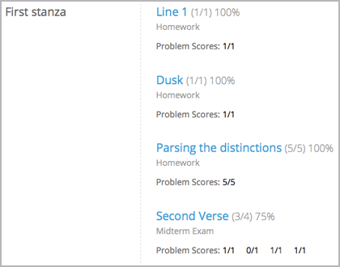
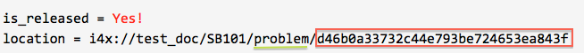
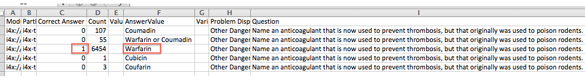
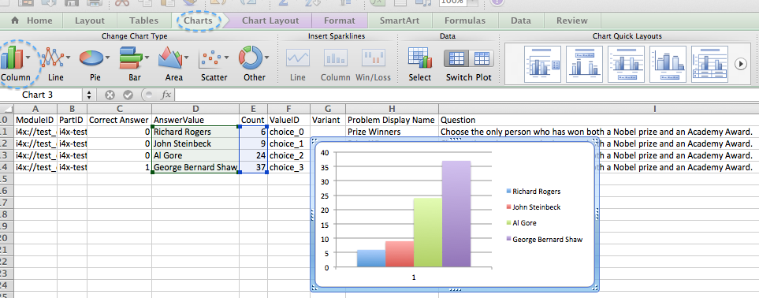

.. _Grades:

############################
Grade and Answer Data
############################

You can review information about how grading is configured for your course, and access student grades, at any time after you create the course. You can also make adjustments to how a problem is graded, for a single student or all students. For information about the grading data that you can access and the changes you can make, see the following topics:

* :ref:`Review_grades`

* :ref:`Access_grades`

* :ref:`Adjust_grades`

To review student answers to the problems in your course, you can download data for course problems or review a graph for a selected problem. See :ref:`Review_Answers`.

For information about how you establish a grading policy and work with the Problem components in your course, see :ref:`Establish a Grading Policy` or :ref:`Working with Problem Components`.

.. important:: If you make changes to your grading policy after a course starts, students can see the effect of your changes on their **Progress** pages. Be sure to announce any changes on your Course Info page.

.. _Review_grades:

********************************************************
Review How Grading Is Configured for Your Course
********************************************************

You can review the assignment types that are graded and their respective weights on the Instructor Dashboard.

You establish a grading policy for your course when you create it in Studio. While the course is running, you can view an XML representation of the assignment types in your course and how they are weighted to determine students' grades.

#. View the live version of your course.

#. Click **Instructor** > **Try New Beta Dashboard**.

#. Click **Data Download** > **Grading Configuration**.

   A list of the assignment types in your course displays. In this example, Homework is weighted as 0.3 (30%) of the grade. 

..  DOC-290: research this statement before including anything like it: Below the list of graded assignment types and their weights, each *public* subsection and unit that contains an assignment is listed.

   .. image:: ../Images/Grading_Configuration.png
     :alt: XML of course assignment types and weights for grading

   In Studio, you define this information by selecting **Settings** > **Grading**. For more information, see :ref:`Configure the Assignment Types`.

   .. image:: ../Images/Grading_Configuration_Studio.png
     :alt: Studio example of homework assignment type and grading weight

.. _Access_grades:

********************************************************
Access Student Grades
********************************************************

You can generate and review your students' grades at any time during your course. You can generate grades for all currently enrolled students, or check the progress of a single student (who can be enrolled or unenrolled).

=========================================================
Generate Grades for Enrolled Students
=========================================================

When you initiate calculations to grade student work, a process starts on the edX servers. The complexity of your grading configuration and the number of students enrolled in your course affect how long this process takes. You can download the calculated grades in a CSV (comma-separated values) file when the grading process is complete. You cannot view student grades on the Instructor Dashboard. 

To generate grades for the students who are currently enrolled in your course:

#. View the live version of your course.

#. Click **Instructor** > **Try New Beta Dashboard**.

#. Click **Data Download**.

#. To start the grading process, click **Generate Grade Report**.

  A status message indicates that the grading process is in progress. This process can take some time to complete, but you can navigate away from this page and do other work while it runs.

5. To track the progress of the grading process, reload the page in your browser and scroll down to the **Pending Instructor Tasks** section. 

==========================================
Download Grades for Enrolled Students
==========================================

After you request a grade report for your students, the result is a time-stamped CSV file that includes columns to identify each student: id, email, and username. It also includes a column for every assignment that is included in your grading configuration: each homework, lab, midterm, final, and any other assignment type you added to your course. 

.. important:: Because this file contains confidential, personally identifiable data which may be subject to the Family Educational Rights and Privacy Act (FERPA), be sure to follow your institution's data stewardship policies when you open or save this file.

To download a file of student grades:

#. View the live version of your course.

#. Click **Instructor** > **Try New Beta Dashboard**.

#. Click **Data Download**.

#. To open or save a grade report file, click the ``{course_id}_grade_report_{date}.csv`` file name at the bottom of the page.

.. note:: To prevent the accidental distribution of student data, you can only download these files by clicking the links on this page. Do not copy these links for reuse elsewhere, as they expire within 5 minutes. The links on this page also expire if the page is open for more than 5 minutes: if necessary, refresh the page to generate new links. 

.. _Interpret the Grade Report:

=====================================
Interpret the Grade Report
=====================================

Grade reports provide a snapshot of cumulative course scores, by assignment, of every currently enrolled student. 

You can open ``{course_id}_grade_report_{date}.csv`` files in a spreadsheet application to sort, graph, and compare data.

.. image:: ../Images/Grade_Report.png
  :alt: A course grade report, opened in Excel, showing the grades acheived by students on several homework assignments and the midterm

The CSV file contains one row of data for each student, and columns that provide the following information.

* Student identifiers, including an internal ``id``, ``email`` address, and ``username``.

* ``grade``, with the total score a student has currently attained in the course. This value is expressed as a decimal: a student with a grade of 0.65 has earned 65% of the credit in the course, and a student with a grade of 1 has earned 100%. 

* Each ``{assignment type} {number}`` defined in your grading configuration, with the score a student attained for that specific assignment. For example, column HW 03 shows the scores for the third homework assignment.

* An ``{assignment type} Avg`` with each student's current average score for that assignment type: for example, HW Avg.

.. note:: The grade reports do not include information about individual questions within the assignments, or include student answer distributions.

=========================================================
Check the Progress of a Single Student
=========================================================

To check a single student's progress, you can locate the specific row on the grade report or review the student's **Progress** page. The **Progress** page includes a chart that plots the score the student has earned for every graded assignment and the total grade as of the current date. Below the chart, each assignment and the score attained are listed.

To review a student's **Progress** page, you supply an email address or username. You can check the progress for students who are either enrolled in, or who have unenrolled from, the course.

Students can view a similar chart and assignment list (of their own progress only) when they are logged in to the course.

To view the **Progress** page for a student:

#. View the live version of your course.

#. Click **Instructor** > **Try New Beta Dashboard**.

#. Click **Student Admin**.

#. In the Student-Specific Grade Inspection section, enter the student's email address or username.

#. Click **Student Progress Page**.

   The **Progress** page for the student displays a chart with the grade for each homework, lab, midterm, final, and any other assignment types in your course, and the total grade earned for the course to date. 

   .. image:: ../Images/Student_Progress.png
     :alt: Progress page chart for a student: includes a column graph with the score acheived for each assignment 

   To learn more about a particular assignment, move the cursor onto the value in the chart. A brief description displays. 

   .. image:: ../Images/Student_Progress_mouseover.png
     :alt: Progress page with a tooltip for the X that was graphed for the last homework assignment, which indicates that the lowest homework score is dropped

   Below the chart, subsections are listed on the left and the units that contain assignments are listed on the right. The student's individual problem scores display.

=============================================
Interpret the Student Progress Page
=============================================

The chart of a student's scores on the **Progress** page and the rows of data on the grade report present assignment scores in a similar order. However, the total, cumulative score earned for the course is placed in a different position on the **Progress** page.

In this example grade report, the indicated student has a current grade of 0.43 (43%). 

.. image:: ../Images/Grade_Report_example.png
  :alt: A course grade report with a single student's information indicated by a rectangle

* On each of the first four homework assignments the student scored 1 (100%), but currently has a 0 (0%) on each of the remaining three assignments. 

  Notice, however, that the student's current average score for homework assignments is listed as 0.666666667 (67%): in this course, the homework assignment with the lowest score is dropped, so this average is over six assignments rather than all seven. 

* The student has a score of 0.75 (75%) on the midterm, and a score of 0 (0%) on the final. 

On the student's **Progress** page, you see the same information graphically represented; however, the student's "total" of 43% is on the far right.

.. image:: ../Images/Student_Progress.png
   :alt: Progress page for a student also included on the grade report: includes a column graph with the grade acheived for each assignment 

The chart on the **Progress** page includes y-axis labels for the grade ranges defined for the course. In this example, Pass is set to 60%, so at the end of the course students with a grade of 0.60 or higher can receive certificates.

===========================================================
Check a Student's Answer Submission and Submission History
===========================================================

For a single student and problem, you can review the exact response submitted, the number of attempts made, and the date and time of the submission. You identify the student by supplying a username. 

To review a response submitted by a student:

#. View the live version of your course.

#. Click **Courseware** and navigate to the component that contains the problem you want to review.

#. Display the problem and then click **Submission History** below the problem.

#. Enter the username for the student whose work you want to review, then click **View History** at the end of the page.

  Information about the response or responses provided by the student displays. 

To close the Submission History Viewer, click on the browser page outside of the viewer.

.. _Adjust_grades:

***********************************
Adjust Grades
***********************************

You can adjust grades for one student at a time, or for all of the enrolled students in the course. For example, your course beta testers can evaluate numerous different correct and incorrect responses to verify that your course is set up as you intend. Students can also report errors while a course is running. 

When an error is discovered or corrected, or if you decide that you must modify a problem after students or beta testers have attempted to answer it, you can either:

* Rescore the submitted answers to reevaluate the work.

* Reset the number of attempts made to answer the question correctly so that students can try again.

To make these adjustments, you need to specify a problem by supplying the unique identifier from its URL.

.. _find_URL:

==================================================
Find the Unique Identifier for a Problem
==================================================

When you create each of the problems for a course, edX assigns a unique identifier. To make grading adjustments for a problem, or to view data about it, you need to specify this identifier.

To find the unique identifier in the URL for a problem:

#. View the live version of your course.

#. Click **Courseware** and navigate to the component that contains the problem you want to review.

#. Display the problem, and click **Staff Debug Info**.

   Information about the problem displays, including its location or URL. This URL ends with the type of module, which is typically "problem", and the unique identifier. 

4. To copy the identifier for the problem, select it, right click, and choose **Copy**.

.. note:: If the URL does not include "problem/" before the identifier, you will need to specify that module identifier as well. Select and copy both the module identifier and the problem identifier.

To close the Staff Debug viewer, click on the browser page outside of the viewer.

===================================================
Rescore Student Submissions
===================================================

Each problem that you define for your course includes a correct answer, and may also include a tolerance or acceptable alternatives. If you decide to make a change to these values, you can rescore any responses that were already submitted. For a specified problem, you can rescore the work submitted by a single student, or rescore the submissions made by every enrolled student. 

**Note**: You can only rescore problems that have a correct answer entered in edX Studio. Problems that are scored by an external grader cannot be rescored with this procedure.

To specify the problem you want to rescore, you need its unique identifier. See :ref:`find_URL`.

To rescore a problem:

#. View the live version of your course.

#. Click **Instructor** > **Try New Beta Dashboard**.

#. Click **Student Admin**. 

#. Rescore the problem, either for an individual student or for all students.

   To rescore a problem for one student, you work in the **Student-Specific Grade Adjustment** section of the page. Enter the student's email address or username and the unique problem identifier, and then click **Rescore Student Submission**.

   To rescore a problem for all enrolled students, you work in the **Course-Specific Grade Adjustment** section of the page. Enter the unique problem identifier, and then click **Rescore ALL students' problem submissions**. 

5. When you see a dialog box that notifies you that the rescore process is in progress, click **OK**. 

   This process does not take long for a single student, but can take some time to complete for all enrolled students. The process runs in the background, so you can navigate away from this page and do other work while it runs.

6. To view the results of the rescore process, click either **Show Background Task History for Student** or **Show Background Task History for Problem**.

   A table displays the status of the rescore process for each student or problem.

===================================================
Reset Student Attempts
===================================================

When you create a problem, you can limit the number of times that a student can try to answer that problem correctly. If unexpected issues occur for a problem, you can reset the value for one particular student's attempts back to zero so that the student can begin work over again. If the unexpected behavior affects all of the students in your course, you can reset the number of attempts for all students to zero. 

For information about modifying a released problem, including other workarounds, see :ref:`Modifying a Released Problem`.

**Note**: To reset the number of attempts for a problem, you need its unique identifier. See :ref:`find_URL`.

To reset student attempts for a problem:

#. View the live version of your course.

#. Click **Instructor** > **Try New Beta Dashboard**.

#. Click **Student Admin**. 

#. To reset the number of attempts for one student, you work in the Student-Specific Grade Adjustment section of the page. Enter the student's email address or username and the unique problem identifier, then click **Reset Student Attempts**.

#. To reset the number of attempts for all enrolled students, you work in the Course-Specific Grade Adjustment section of the page. Enter the unique problem identifier then click **Reset ALL students' attempts**. 

#. A dialog opens to indicate that the reset process is in progress. Click **OK**. 

   This process does not take long for a single student, but can take some time to complete for all enrolled students. The process runs in the background, so you can navigate away from this page and do other work while it runs.

7. To view the results of the reset process, click either **Show Background Task History for Student** or **Show Background Task History for Problem**.

   A table displays the status of the reset process for each student or problem.

.. _Review_Answers:

****************************************
Student Answer Distribution
****************************************

For certain types of problems in your course, you can download a CSV file with data about the distribution of student answers. Student answer distribution data is included in the file for problems of these types: 

* Checkboxes (``<choiceresponse>``)
* Dropdown (``<optionresponse>``)
* Multiple choice (``<multiplechoiceresponse>``)
* Numerical input (``<numericalresponse>``)
* Text input (``<stringresponse>``)
* Math expression input (``<formularesponse>``)

The file includes a row for each problem-answer combination selected by your students. For example, for a problem that has a total of five possible answers the file includes up to five rows, one for each answer selected by at least one student. For problems that use rerandomization (the **Randomization** setting in Studio), there is one row for each problem-variant-answer combination selected by your students.

The CSV file contains the following columns:

.. list-table::
   :widths: 20 60
   :header-rows: 1

   * - Column
     - Description
   * - ModuleID
     - The internal identifier for the Problem component.
   * - PartID
     - For a Problem component that contains multiple problems, the internal identifier for each individual problem. For a Problem component that contains a single problem, the internal identifier of that problem. 
   * - Correct Answer
     - 0 if this **AnswerValue** is incorrect, or 1 if this **AnswerValue** is correct.
   * - Count
     - The number of times that students entered or selected this answer as their most recent submission for the problem or problem variant. For problems with the number of **Attempts** set to a value greater than 1, this means that each student contributes a maximum of 1 to this count, even if the same answer is provided in multiple attempts.
   * - ValueID
     - The internal identifier of the answer choice for checkboxes and multiple choice problems. Blank for dropdown, numerical input, text input, and math expression input problems.
   * - AnswerValue
     - The text label of the answer choice for checkboxes, dropdown, and multiple choice problems. The value entered by the student for numerical input, text input, and math expression input problems. 
   * - Variant
     - For problems that use the **Randomization** setting in Studio, contains the unique identifier for a variant of the problem. Blank for problems that do not use the **Randomization** setting, or that use the **Never** option for this setting.
   * - Problem Display Name
     - The **Display Name** defined for the problem.
   * - Question
     - The label for accessibility that appears above the answer choices or the text entry field for the problem. In Studio's Simple Editor, this text is surrounded by two pairs of angle brackets (>>Question<<). Blank for questions that do not have an accessibility label defined.

Entries are sorted by the value in each column, starting with the ModuleID on the left and continuing through the columns to the right.

.. _Download_Answer_Distributions:

===================================================
Download the Student Answer Distribution Report
===================================================

An automated process runs periodically on the edX servers to update the CSV file of student answer data. A link to the most recently updated version of the CSV file is available on the Instructor Dashboard. 

To download the most recent file of student answer data:

#. View the live version of your course.

#. Click **Instructor** > **Try New Beta Dashboard**.

#. Click **Data Download**.

#. At the bottom of the page, click the ``{course_id}_answer_distribution.csv`` file name. You may have to scroll down to find this file.

==========================================================================
Frequently Asked Questions about the Student Answer Distribution Report
==========================================================================

Answers to questions about the student answer distribution report follow.   

**My course doesn't have a student answer distribution report. How can I generate it?**

Student answer distribution reports are generated automatically, and refreshed several times each day. The ``{course_id}_answer_distribution.csv`` file displays after all of the ``{course_id}_grade_report_{date}.csv`` files. Be sure to scroll to the end of the list of available reports. 

**Why are some problems missing from this report? The ones that are missing do have the problem types listed under** :ref:`Review_Answers`.

This report includes only problems that at least one student has answered since early March 2014. For those problems, this report only includes activity that occurred after October 2013. 

**Why don't I see an AnswerValue for some of my problems?**

For checkboxes and multiple choice problems, the answer choices actually selected by a student after early March 2014 display as described in the previous answer. Answer choices selected by at least one student after October 2013, but not selected since early March 2014, are included on the report but do not include an **AnswerValue**. The **ValueID** does display the internal identifiers, such as choice_1 and choice_2, for those answers. 

**Why don't I see a Question for some of my problems?**

The value in the **Question** column is the accessibility label for the problem. For more information about how to set up labels for problems, see :ref:`Create Exercises`.

Also, for problems that use the **Randomization** setting in Studio, if a particular answer has not been selected since early March 2014, the **Question** is blank for that answer.

**My students are saying that they answered a question, but it isn't showing up in the report. How can that be?**

Only questions that have a **Maximum Attempts** setting of 1 or higher are included on the report.

**I made a correction to a problem after it was released. How can I tell which students tried to answer it before I made the change?**

Problem **Count** values reflect the entire problem history. If you change a problem after it is released, it may not be possible for you to determine which answers were given before and after you made the change.

**Why is the same answer showing up in two different rows when I view the report in a spreadsheet?**

Some spreadsheet applications can alter the data in the CSV report for display purposes. For example, for different student answers of "0.5" and ".5" Excel correctly includes the two different lines from the CSV, but displays the **AnswerValue** on both of them as "0.5". If you notice answers that appear to be the same on separate lines with separate counts, you can review the actual, unaltered data by opening the CSV file in a text editor.

**Why are there strange characters in the report when I view it in a spreadsheet?**

The CSV file is UTF-8 encoded, but not all spreadsheet applications interpret and render UTF-8 encoded characters correctly. For example, a student answer distribution report with answer values in French displays differently in Microsoft Excel for Mac than in OpenOffice Calc. 

  Answer Values in Microsoft Excel for Mac:

   .. image:: ../Images/student_answer_excel.png
     :alt: A spreadsheet that replaces accented French characters with underscores

  Answer Values in OpenOffice Calc:

   .. image:: ../Images/student_answer_calc.png
     :alt: A spreadsheet that displays accented French characters correctly

If you notice characters that do not display as expected in a spreadsheet, try a different spreadsheet application such as LibreOffice or Apache OpenOffice to open the CSV file. 

==========================================================================
Interpret the Student Answer Distribution Report
==========================================================================

You can use the Student Answer Distribution report to review student responses to assignments, which can then help you evaluate the structure and completeness of your courseware and problem components.

As an example, you define a text input question in Studio to have a single correct answer, "Warfarin". When you produce the Student Answer Distribution report, you verify that this answer was in fact marked correct: there is a 1 in the **Correct Answer** column for this **AnswerValue**. 

However, as you view the report you notice other student answers that you did not set up to be marked as correct in Studio, but that you might (or might not) also consider to be correct, such as "Warfarin or Coumadin". The **Correct Answer** column shows that the other answers were marked incorrect (0), but for future iterations of your course you may want to revise the question or update the problem to evaluate additional variations of the answer as correct.

Many spreadsheet applications offer data visualization options, such as charts or graphs. Charts can help make your students' common misconceptions  easier to identify. 

In this example, the Student Answer Distribution report is open in Microsoft Excel. To create a chart that shows how many of your students chose various answers to a multiple choice question, you move the **AnswerValue** and **Count** columns next to each other. After you click and drag to select the report cells that contain the data you want to chart, you click the Charts toolbar and then click the type of chart you want.

.. note:: Refer to the help for the spreadsheet application that you use for information on using these options. You may have to make changes to your spreadsheet, such as reordering columns. Save a copy of the file you originally downloaded as a backup before you begin. 

You can adjust your course content based on common student mistakes. While most students in this example selected the correct answer, the number of incorrect answer(s) can guide future changes to the courseware. 

===================================================
View a Histogram of Scores for a Single Problem
===================================================

You can view a chart of the score distribution for a specified problem. 

.. note:: To view the score distribution for a problem, you need its unique identifier. You can display a histogram for problems that have the  ``/problem/`` prefix in the unique identifier. See :ref:`find_URL`.

To display the distribution of scores for a problem:

#. View the live version of your course.

#. Click **Instructor** > **Try New Beta Dashboard**.

#. Click **Analytics**. 

#. In the Score Distribution section, select a problem by using its unique identifier. 

   The **Analytics** page updates to display a histogram of scores for that
   problem.

   .. image:: ../Images/score_histogram.png
     :alt: Graph of the number of students who received different scores for a
         selected problem

..  **Question**: (sent to Olga 31 Jan 14) this is a tough UI to use: how do they correlate the codes in this drop-down with actual constructed problems? the copy-and-paste UI on the Student Admin page actually works a little better imo. LMS-2522

===================================================
Interpret a Score Histogram
===================================================

The histogram of scores for a selected problem provides the following
information.

   .. image:: ../Images/score_histogram_callouts.png
     :alt: Histogram with indicators for the number of students scored value and
         the x-axis numbers that indicate plotted scores

* The x-axis indicates the number of points that students can receive for the
  problem, unweighted. Although decimal values are marked on the x-axis, each
  score is a whole number. The whole number value at the left of a plotted bar
  is the score that applies to it.

* The y-axis indicates the number of students who have answered and checked the
  problem.

* Above the graph, a number of **students scored** displays. This number
  indicates the total number of database records that exist for the problem: it
  includes not only students who have answered and checked the problem to
  receive a score, but also students who have opened the problem but not yet
  completed it.

* An automated process runs approximately weekly on the edX servers to update
  score histograms. This process runs less frequently than the process that
  updates the student answer distribution report: at certain times during a
  course the number of students shown in a score histogram can be quite
  different than the **Count** for the same problem in a student answer
  distribution report.
