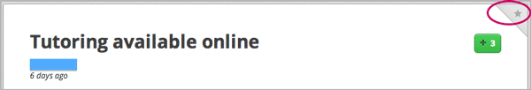
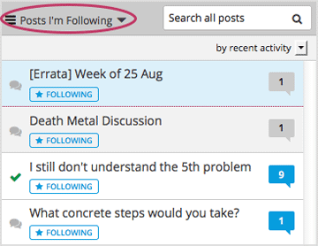
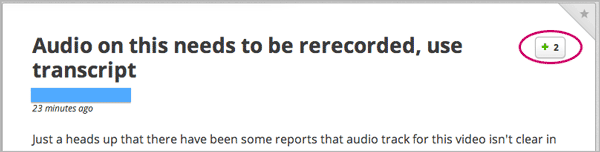
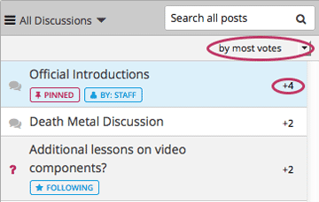
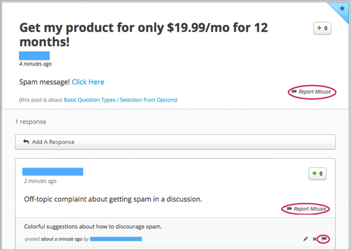

.. _Discussions for Students and Staff:

###############################################
Participating in Course Discussions
###############################################

Course discussions give you the opportunity to start conversations with other
students, ask questions of the course team, and participate in the course
community. If you have not previously participated in an online discussion
forum, see the introductory :ref:`"anatomy"<Anatomy of edX Course Discussions>`
section.

This chapter also describes features of edX discussions that can make your
participation more effective. These include ways to:

* :ref:`Find Posts`

* :ref:`Add a Post`

* :ref:`Keep Up with New Activity`

* :ref:`Follow Posts`

* :ref:`Vote for Posts or Responses`

* :ref:`Report Discussion Misuse`

.. _Anatomy of edX Course Discussions:

**********************************
Anatomy of edX Course Discussions 
**********************************

====================================
Posts, Responses, and Comments
====================================

::

  Post: "Please introduce yourself."
    - Reponse: "My name is Lee and I teach secondary school maths in Canberra,
      Australia."
    - Reponse: "Hello everyone, I am Sumei from Hong Kong, China."
      - Comment: "Hi Sumei, I am taking this course in Hong Kong too. Maybe we
        should make a study group!"
      - Comment: "I'd like to join the Hong Kong study group too, I think it
        will help me keep up with the homework."
    - Response: "Hi from Johannesburg! I am taking the course to prepare for my
      matric exams."

This example shows the different ways that you can contribute to a discussion.
The *post* initiates the conversation, *responses* are replies to the post, and
*comments* expand on specific responses. Before you add a post, response, or
comment, take a moment to consider which of these options best suits the
contribution that you want to make. This helps keep course discussions
organized and easy to follow.

====================================
Discussion Topics
====================================

Most edX courses include opportunities to discuss specific video lectures,
reading assignments, questions, or other course content. Each of these content-
specific discussion opportunities is called a *topic*. When these discussion
topics are included in a course, they typically appear below the content they apply to.

.. image:: /Images/Discussion_content_specific.png
 :alt: A discussion topic that appears below a video in the course, identified by a "Show Discussion" link

Most courses also include one or more topics for discussions about course-wide
areas of interest, such as "Frequently Asked Questions" or "Troubleshooting".
You access these topics on the **Discussion** page of the course.

.. image:: /Images/Discussion_course_wide.png
 :alt: Discussion topics are listed on the Discussion page when you click the drop-down list at the left side of the page

When you visit the **Discussion** page, you can read and add to any of the
discussion topics. 

* Course-wide topics do not have other topics indented below them.

* Content-specific topics are indented under an identifying category name. 

Notice that while you can access content-specific topics both on the
**Discussion** page and while you are navigating through course content on the
**Courseware** page, you can only access the course-wide topics on the
**Discussion** page.

Before you add a post, look through the topics. When add your post to the most
appropriate topic, others with the same interest can find, read, and respond to
it more easily.

.. _Find Posts:

******************************
Find Posts
******************************

Finding out whether someone else has already started a conversation about the
same subject that interests you, and then reading and contributing to that
exchange instead of starting a new one, helps make the time that everyone
spends with the course discussion more productive. You can search for something
specific, or you can browse through the posts in a single discussion topic.

=======================
Search the Discussions
=======================

To search for text, click **Discussion** and enter a phrase, a word, or part of
a word in the **Search all posts** field above the list of posts. When you
press Enter, the search tries to find:

* A match or close match to your text in any post, response, or comment. The
  display updates to show a list of the posts that have a match at any level of
  interaction.

* A similar value in any post, response, or comment (if no exact matches are
  found). A "No results found for {text}. Showing results for {similar}"
  message displays above the posts that have similar text at any interaction
  level.

* Any usernames that are an exact match to your text. A "Show posts by
  {username}" option displays above any posts that have an exact match at any
  interaction level. Click the username in the message to read that user's
  posts, responses, and comments.

==============================================
Review Posts About a Single Topic
==============================================

To review posts about a particular part of the course or type of issue, click
**Discussion** at the top of the page and then select a topic from the drop-
down list. (**All Discussions** is selected by default.) Only posts about the
topic you select appear in the list of posts.

.. add something about endorsed responses(?)

.. _Add a Post:

************************************
Add a Post, Response, or Comment
************************************

.. this section is likely to be more interesting and valuable when we add the discussion vs. question differentiation

================================
Add a Post
================================

To make sure that other students and the course team can find and respond to
your posts, try to add your posts to the most appropriate topic.

Add a Post to a Content-Specific Discussion Topic
**************************************************

#. Click **Courseware**.

#. Open the part of the course that includes the discussion topic that you want
   to add to.

#. To read what others have already contributed to the conversation, click
   **Show Discussion**.

   You can scroll through the posts that have already been added: the title and
   the first sentence or two of each post appear. To read the entire post, view
   the responses to it, and see any comments, click **Expand discussion**.
  
4. To add a post, click **New Post**.

.. image:: /Images/Discussion_content_specific_post.png
  :alt: Adding a post about specific course content

5. Enter a short, descriptive identifier for your post in the **Title** field.
   The title is the part of your post that others see when they are browsing on
   the **Discussion** page or scrolling through one of the content-specific
   topics.

#. Enter the complete text. Options for formatting the text and for adding
   links or images are available: click the buttons above the text field.

Add a Post to a Course-Wide Discussion Topic
**************************************************

You can also use this procedure to add a post to any of the content-specific
discussion topics.

#. Click the **Discussion** page.

#. Click **New Post**.

#. Select the most appropriate discussion topic for your post.

.. image:: /Images/Discussion_course_wide_post.png
  :alt: Selecting the topic for a new post on the Discussion page 

4. Supply a short, descriptive **Title**. The title is the part of your post
   that others see when they are browsing on the **Discussion** page or
   scrolling through one of the content-specific topics.

#. Enter the complete text. Options for formatting the text and for adding
   links or images are available: click the buttons above the text field.

===========================
Add a Response or Comment
===========================

To participate in an ongoing discussion, you reply to the initial post by
adding a response, or expand on a particular response by adding a comment.

The same options for formatting the text and for adding links or images are
available for responses and comments as for posts.

Add a Response or Comment to a Content-Specific Discussion Topic
****************************************************************

#. Click **Courseware**.

#. Open the part of the course with the discussion topic where you want to make
   your contribution.

#. Click **Show Discussion**.

#. Scroll to the post where you want to add your thoughts.

#. Click **Expand discussion**.

#. Add a response or comment.   

   To add a response to the post, click **Add A Response** below the post. When
   your response is complete, click **Submit**.

   To add a comment to a response, click in the **Add a comment** field below
   the response. When your comment is complete, click **Submit**.

Add a Response or Comment to a Course-Wide Discussion Topic
************************************************************

You can also use this procedure to add a response or comment to any of the
content-specific discussion topics.

#. Click the **Discussion** page.

#. Find the post that you want to contribute to. To help you decide where to
   add your thoughts, review the current responses and their comments.

#. Add a response or comment.   

   To add a response to the post, click **Add A Response** below the post. When
   your response is complete, click **Submit**.

   To add a comment to a response, click in the **Add a comment** field below
   the response. When your comment is complete, click **Submit**.   

.. images to come

.. _Keep Up with New Activity:

****************************************
Keep Up with New Activity
****************************************

==============================
Read New or Updated Posts
==============================

The list of posts on the **Discussion** page provides visual cues to help you
identify posts that are new, or that have responses or comments that you have
not read yet, and to distinguish them from exchanges that you have already read
completely.

* Posts that you have not read yet have a blue dialog "bubble".

* Posts with responses or comments that you have not read yet have a white
  dialog "bubble".
 
* Exchanges that you have read completely have a gray dialog "bubble" and
  background.

 .. image:: ../Images/Discussion_colorcoding.png
  :alt: The list of posts with posts showing differently colored backgrounds and bubble icons

These color-coded dialog bubbles appear when you sort the list of posts by
recent activity or by most activity. If you sort the list of posts by most
votes instead, the number of votes that the post has received appears in place
of the bubble icon. See :ref:`Vote for Posts or Responses`.

==============================
Receive Daily Digests
==============================

You have the option to receive an email message each day that summarizes
discussion activity for the posts you are following. To receive this daily
digest, click **Discussion** and then select the **Receive updates** checkbox.

.. _Follow Posts:

************************************
Follow Posts
************************************

If you find a post particularly interesting and want to return to it in the
future, you can follow it: view that post and click the star icon in its top
right corner.

Each post that you follow appears with a "Following" badge in the list of
posts.

To list only the posts that you are following, regardless of the discussion
topic they apply to, click the drop-down Discussion list and select
**Posts I'm Following**.

.. _Vote for Posts or Responses:

************************************
Vote for Posts or Responses
************************************

If you like a post or one of its responses, you can vote for it: view the
post or response and click the **+** at top right.

You can sort the list of posts so that the posts with the most votes appear at
the top: click the drop-down list of sorting options and select **by most
votes**.

The number of votes that each post has received displays in the list of posts.
(Votes for responses are not included in the number.)

.. _Report Discussion Misuse:

************************************
Report Discussion Misuse
************************************

You can flag any post, response, or comment for a discussion moderator to
review: view the post or response and then click **Report Misuse**. For a
comment, click the flag.

.. Future: DOC-121 As a course author, I need a template of discussion guidelines to give to students