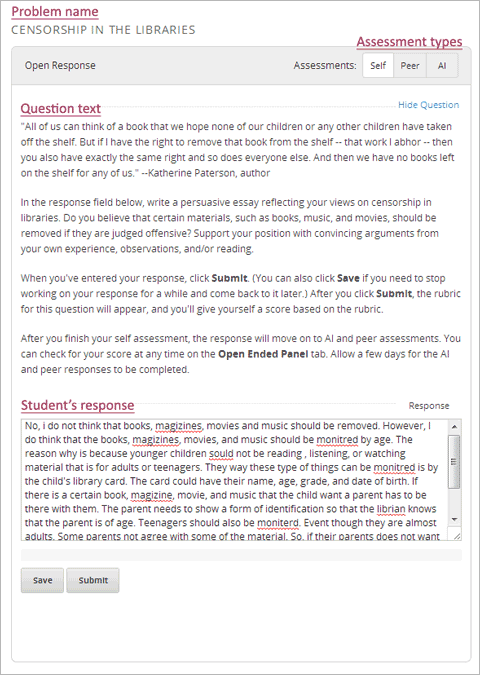
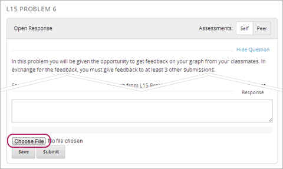
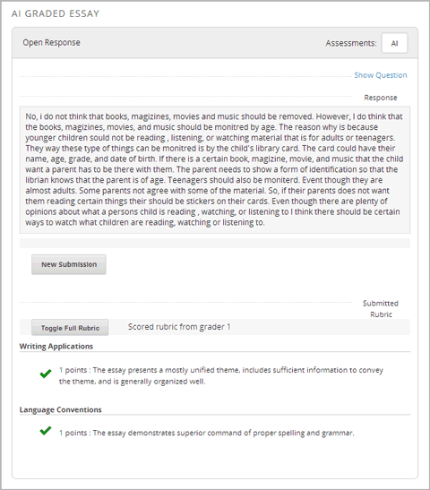
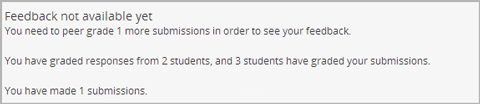

.. _ORA for Students:

Open Response Assessments for Students
======================================

.. _ORA Introduction:

Introduction to Open Response Assessments
-----------------------------------------

.. note::

    Modify this section according to your course. For example, you
    can delete sentences such as "For more information, see :ref:`ORA Peer Assessment`"
    and "For more information, see :ref:`ORA AI Assessment`" if your ORA problem doesn't
    contain peer assessments or AI assessments and you want to delete these sections from
    this document.

Open response assessments allow you to submit a short written answer,
an essay, or a file such as an image or computer code file.

When you come to an open response assessment problem, you see the name of the
problem, the assessment types, the text of the question, the field where you'll
enter your response, and the **Save** and **Submit** buttons.

If an open response assessment asks you to submit a file, you'll also see a button
that you'll click to upload your file.

The *assessment types* can include *self assessment*, *peer assessment*, and *artificial intelligence (AI) assessment*. The
assessment types run in the order in which they appear in the problem.

- In a self assessment, you assess your response according a rubric that the
  instructor has created. For more information, see :ref:`ORA Self Assessment`.

- In a peer assessment, you grade
  responses that your peers have submitted while several of your peers
  grade your response. For more information, see
  :ref:`ORA Peer Assessment`.

- In an AI assessment, a computer algorithm grades your response. For more information,
  see :ref:`ORA AI Assessment`.

An open response assessment problem doesn't have to use all assessment types. For example, one problem
may use self assessment and AI assessment, while another problem may use self assessment
and peer assessment, and another problem may use only peer assessment.

You'll answer open response assessment problems in much the same way that you answer other
problems. For more information about how to submit responses, see :ref:`ORA Submit a Response`.

When you submit a response to an open response assessment, the next step
depends on the type of assessment that the problem uses. For more information,
see :ref:`ORA Self Assessment`, :ref:`ORA Peer Assessment`, and :ref:`ORA AI Assessment`.

After you submit your response, your score will be available shortly - sometimes within a few
minutes. For information about how to access your score after your response has been graded,
see :ref:`ORA Access Scores Students`.

If you want to experiment with open response assessments, you can try out the open
assessment problems in the `EdX Demo <https://courses.edx.org/courses/edX/DemoX/Demo_Course/info>`_
course. To get started, go
to the `Self-Assessed Essay <https://courses.edx.org/courses/edX/DemoX/Demo_Course/courseware/graded_interactions/machine_grading/2>`_
unit, and then enter a response in the **Response** field under the
question. You can enter your own response, or you can use one of the sample
responses in the `Sample Answers <https://courses.edx.org/courses/edX/DemoX/Demo_Course/courseware/graded_interactions/machine_grading/6/>`_
unit.

.. _ORA Submit a Response:

Submit a Response
-----------------

Submitting a response is slightly different if you're submitting a written response
or uploading a file.

#. Enter the response that you want to submit.

   - If you're submitting a written response, type your response in the
     **Response** field.

   - If you're uploading a file, click **Choose File** under the **Response**
     field. In the dialog box that opens, select the file that you want to upload,
     and then click **Open**.

#. Click **Submit**, and then click **OK** in the dialog box to continue.

   .. note:: If you want to save your response and work on it again later, click **Save**.
             An "Answer saved, but not yet submitted" message appears directly under the **Save** and
             **Submit** buttons.

After you submit your response, the assessment types start running in the order in which they
appear in the problem. For more information,
see :ref:`ORA Self Assessment`, :ref:`ORA Peer Assessment`, or :ref:`ORA AI Assessment`.

.. _ORA Self Assessment:

Self Assessment
---------------

.. note::

    You can delete this section if your ORA problem doesn't use self assessments.

In a self assessment, the rubric for the problem appears below your response immediately
after you submit the response. You then assess your response based on the rubric.

Perform a Self Assessment
~~~~~~~~~~~~~~~~~~~~~~~~~

#. Submit a response to a self-assessed ORA problem.

#. When the rubric appears, compare your response with the rubric, and select the
   option that you think is appropriate for each category.

   .. image:: ../Images/Rubric1.png

#. Click **Submit assessment**.

   Your response appears, and you can see the scores that you gave
   yourself.

.. _ORA Peer Assessment:

Peer Assessment
---------------

.. note::

    You can delete this section if your ORA problem doesn't use peer assessments.

In a peer assessment, several students in the course grade your response while you grade
other students' responses. You have to grade a number of your peers' responses before
you receive your score. (After you grade the minimum number of responses required to
receive your score, you can grade as many additional responses as you want.)

After you submit your response for grading, the following
message appears under your response.

    **Your response has been submitted. Please check back later for your grade.**

.. warning:: In peer assessments, the **due date** is the date by which you must not only submit your own response, but finish grading the required number of your peers' responses.

Peer Grading Interface
~~~~~~~~~~~~~~~~~~~~~~

The area where you'll grade responses is the *peer
grading interface*. Each course that has peer assessments has at least
one peer grading interface. There may be just one peer grading interface
for the whole course, or each individual problem may have its own
separate peer grading interface.

.. image:: ../Images/PGI_FromOEC_2Problems.png

Perform a Peer Assessment
~~~~~~~~~~~~~~~~~~~~~~~~~

.. warning:: In peer assessments, the **due date** is the date by which you must not only submit your own response, but finish grading the required number of your peers' responses.

Performing a peer assessment has several steps. You can find detailed instructions for each step
below.

#. :ref:`Access Responses`, either in the body of the
   course or from the **Open Ended Console** page.
#. :ref:`Learn to Grade` (this process is called
   *calibration*).
#. :ref:`Grade Responses` from other students.

.. _Access Responses:

Step 1: Access responses from other students
^^^^^^^^^^^^^^^^^^^^^^^^^^^^^^^^^^^^^^^^^^^^

.. note::

    Modify the content in this section according to
    your course. For example, if your students can only grade by using the **Open
    Ended Console** page, change the introductory sentence below, and delete the
    second and third bullets.

**Note** *You can only grade a response if you've submitted a response to the
question, an instructor has already graded at least 20 responses, and
there are more essays from other students left to grade. If you haven't submitted
a response or no responses are available for grading, you see a yellow message in the
interface.*

   .. image:: ../Images/PAStudent_NoSubmissions.png

There are several ways to access other students' responses, depending on
the way that the course is set up.

-  Through the **Open Ended Console** page. This option is always
   available for every course. To access the **Open Ended Console** page,
   click the **Assessment Panel** tab at the top of any page in the course.
   When you see the list of problems that have responses available to grade,
   click the name of the problem that you want to open it.

   .. image:: ../Images/PGI_FromOEC_2Problems.png

-  Through the courseware, in a specific unit. This option is only available if the
   instructor has included a peer grading interface for the problem in the body of
   the course. To access responses in the courseware, go to the unit that contains
   the open response assessment problem. Scroll down past the response that you
   submitted until you see the peer grading interface that appears below the problem.

   .. image:: ../Images/PGI_InUnitComposite.png

-  Through the courseware, in a separate section. This option may not be available
   for your course. If it is, you'll see the section for peer grading in the
   course accordion on the left side of your screen. For example, MIT's 6.00x:
   Introduction to Computer Science and Programming course has a separate section
   that holds all the course peer grading interfaces. To access peer grading for
   a problem, you click the problem name.

   .. image:: ../Images/PGI_Multiple-600x.png

.. _Learn to Grade:

Step 2: Learn to grade
^^^^^^^^^^^^^^^^^^^^^^

Before you grade your peers' responses, you must learn to grade
the same way that an instructor would. In this process, called
*calibration*, you'll grade several responses that an instructor has already
graded. If your grading is similar to the instructor's, you can begin grading
other students' responses to the question.

#. Click the name of the problem. When the **Learning to grade** page
   opens, click **Start learning to grade**.

#. When the problem opens, compare the student's response with the
   rubric. Select the options that best apply to the response, and then
   click **Submit**.

#. Review the **How did I do?** message that you receive, and then click
   **Continue**.

   .. image:: ../Images/PG_Calibration_Correct.png

   .. image:: ../Images/PG_Calibration_Incorrect.png

   When you click **Continue**, the next student response appears for
   you to grade, and you see a yellow **Calibration essay saved** message in
   the top left corner of the page.

#. Continue to grade responses. After you grade the required number of
   responses correctly, you receive a **Ready to grade!** message. You
   can then start to grade responses for other students.

.. _Grade Responses:

Step 3: Grade responses
^^^^^^^^^^^^^^^^^^^^^^^

When you grade a peer assessment response, you can not only select
options in the rubric, but also provide additional feedback for the
student who submitted the response.

#. When the response opens, select the options in the rubric that you
   feel best apply to the response, as you did in the calibration process.

   If you have concerns about the response, you can select other
   options to flag the response for instructor review. You don't have to fill
   out the rubric before you select these options.

   -  If you aren't sure how to grade the response, select the **I am unsure about
      the scores I have given above** check box.
   -  If the response is offensive, or if you suspect that it contains plagiarized
      material, select the **This submission has explicit, offensive, or (I suspect)
      plagiarized content** check box.

#. Under **Written Feedback**, write a comment about the score that you
   gave the response.

#. Click **Submit**. You see a **Successfully saved your feedback**
   message at the top of the screen, and the next response opens.

#. Continue to grade until you've graded the required number of
   responses (usually 3). When you've graded enough responses, you
   receive the following message.

   .. image:: ../Images/DoneGrading.png

   When you see this message, you can access the score for your own
   response. For more information, see :ref:`ORA Access Scores Students`.

If you want to grade additional responses at any time, you can go back
to the **Peer Grading** page and click the name of the problem that you want
to continue grading.

.. note:: When a response opens for you to grade, it leaves the current "grading pool"
          that other instructors or students are grading from, which prevents other
          instructors or students from
          grading the response while you are working on it. If you do not submit a score
          for this response within 30 minutes, the response returns to the grading pool
          (so that it again becomes available for others to grade), even if you still have
          the response open on your screen.

          If the response returns to the grading pool (because the 30 minutes have passed),
          but the response is still open on your screen, you can still submit feedback for
          that response. If another instructor or student grades the response after it returns to the
          grading pool but before you submit your feedback, the response receives two grades.

          If you click your browser's **Back** button to return to the problem list before you
          click **Submit** to submit your feedback for a response, the response stays outside
          the grading pool until 30 minutes have passed. When the response returns to the
          grading pool, you can grade it.

.. _ORA AI Assessment:

Artificial Intelligence (AI) Assessment
---------------------------------------

.. note::

    You can delete this section if your ORA problem doesn't use AI assessments.

In an AI assessment, an instructor grades a sample set of student responses to the
open response assessment problem. A machine learning algorithm then creates a model
based on the instructor's scores and grades the remaining students' responses.

After you submit your response to an AI assessment, the following message appears under your
response.

    **Your response has been submitted. Please check back later for your grade.**

Depending on the time that it takes for the instructor to grade a sample set of
responses, you may receive your grade within minutes, or you may have to wait
a few days. You won't receive a notification when your score is ready, so keep
checking back.

For more information about accessing your scores, see :ref:`ORA Access Scores Students`.

.. _ORA Access Scores Students:

Access Scores and Feedback
--------------------------

.. note::

    Modify the text in this section to apply to your course.

For *self assessments*, the score that you give yourself appears as soon as you submit
the score.

For *peer assessments* and *AI assessments*, you'll access your scores through the **Open Ended Console** page.

#. In the EdX Demo course, click the **Assessment Panel** tab at the top
   of the page.

#. On the **Open Ended Console** page, click **Problems You Have
   Submitted**.

#. On the **Open Ended Problems** page, check the **Status** column to
   see whether your responses have been graded. The status for each problem is
   either **Waiting to be Graded** or **Finished**.

#. If **Finished** appears in the **Status** column for the problem you want,
   click the name of the problem to see your score for that problem. When you
   click the name of the problem, the problem opens in the courseware.

For both AI and peer assessments, the score appears below your response
in an abbreviated version of the rubric.

For peer assessments, you can
also see the written feedback that your response received from different
graders.

.. image:: ../Images/PeerScoredResponse.png

If you want to see the full rubric for either an AI or peer assessment,
click **Toggle Full Rubric**.

.. note:: For a peer assessment, if you haven't yet graded enough
          problems to see your score, you receive a message that lets you know how
          many problems you still need to grade.

For more information about grading peer assessments, see :ref:`ORA Peer Assessment`.

Resubmitting a Response
-----------------------

.. note::

    You can delete this section if you don't allow students to submit multiple responses.

Some open response assessments allow multiple attempts. For these
problems, a **New Submission** button appears below your original
response.

If you want to answer the question again, click **New Submission** to
clear your former response, and click **OK** in the dialog box that
appears. You can then enter a new response for the problem.
