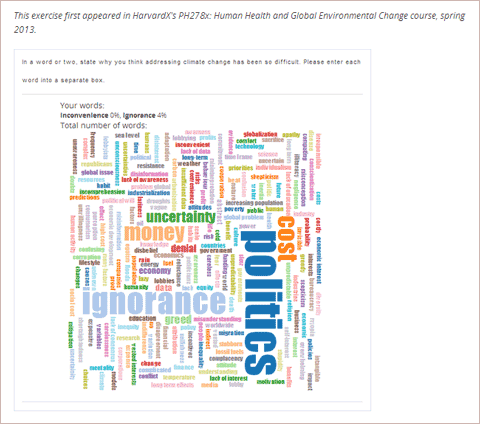
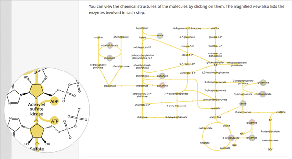
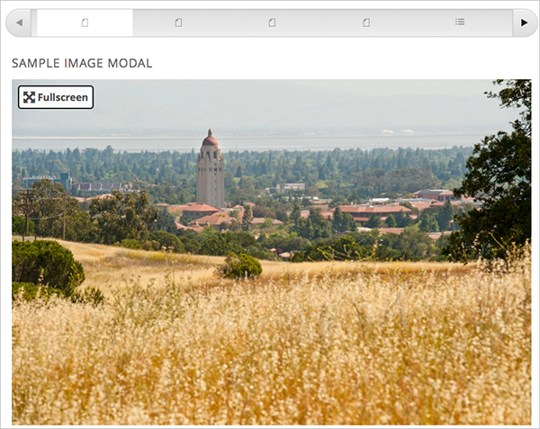
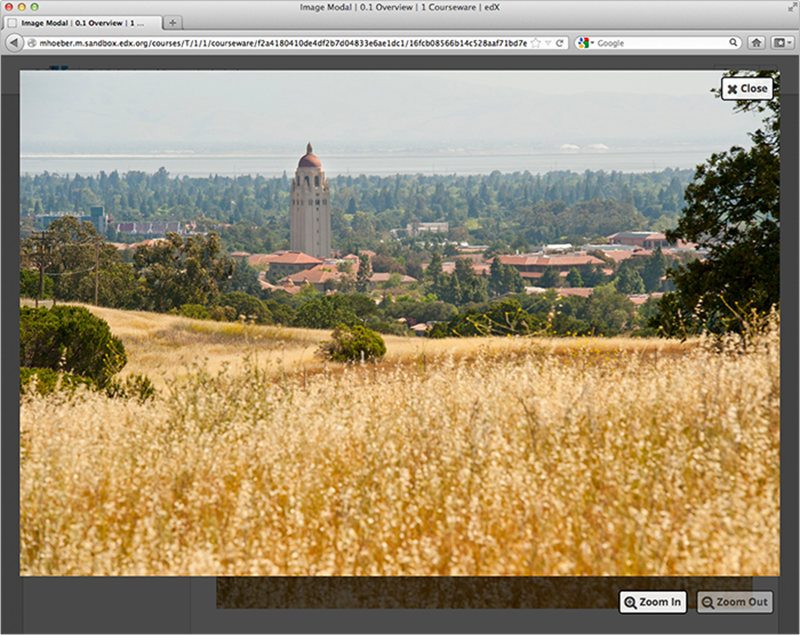
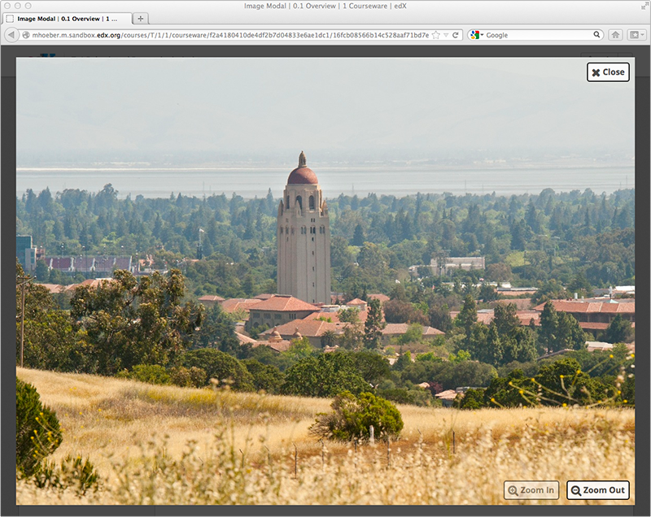

.. _Tools:

#############################
Working with Tools
#############################

***************************
Overview of Tools in Studio
***************************

In addition to text, images, and different types of problems, Studio allows you
to add customized learning tools such as word clouds to your course.

- :ref:`LTI Component`: LTI components allow you to add an external learning application
  or textbook to Studio.
- :ref:`Word Cloud`: Word clouds arrange text that students enter - for example, in
  response to a question - into a colorful graphic that students can see.
- :ref:`Zooming image`: Zooming images allow you to enlarge sections of an image so
  that students can see the section in detail.
- :ref:`Full Screen Image`: The Full Screen Image tool allows a student to enlarge an image in the whole browser window. This is useful when the image contains a large amount of detail and text that is easier to view in context when enlarged.

.. _LTI Component:

**************
LTI Components
**************

You may have discovered or developed an external learning application
that you want to add to your online course. Or, you may have a digital
copy of your textbook that uses a format other than PDF. You can add
external learning applications or textbooks to Studio by using a
Learning Tools Interoperability (LTI) component. The LTI component is
based on the `IMS Global Learning Tools
Interoperability <http://www.imsglobal.org/LTI/v1p1p1/ltiIMGv1p1p1.html>`_
version 1.1.1 specifications.

You can use an LTI component in two ways.

-  You can add external LTI content that is displayed only, such as
   textbook content that doesn’t require a student response.
-  You can add external LTI content that requires a student response. An
   external provider will grade student responses.

Before you create an LTI component from an external LTI provider in a
unit, you need the following information.

-  The **LTI ID**. This is a value that you create to refer to the external LTI
   provider. You should create an LTI ID that you can remember easily.

   The LTI ID can contain uppercase and lowercase alphanumeric
   characters, as well as underscore characters (_). It can contain any
   number of characters. For example, you may create an LTI ID that is
   as simple as **test_lti_id**, or your LTI ID may be a string of
   numbers and letters such as  **id_21441** or
   **book_lti_provider_from_new_york**.
-  The **client key**. This value is a sequence of characters that you
   obtain from the LTI provider. The client key is used for
   authentication and can contain any number of characters. For example,
   your client key may be **b289378-f88d-2929-ctools.umich.edu**.
-  The **client secret**. This value is a sequence of characters that
   you obtain from the LTI provider. The client secret is used for
   authentication and can contain any number of characters. For example,
   your client secret may be something as simple as **secret**, or it
   may be a string of numbers and letters such as **23746387264** or
   **yt4984yr8**.
-  The **launch URL** (if the LTI component requires a student response
   that will be graded). You obtain the launch URL from the LTI
   provider. The launch URL is the URL that Studio sends to the external
   LTI provider so that the provider can send back students’ grades.

Create an LTI Component
-----------------------

.. note:: You cannot view an LTI component in Preview mode. To view an LTI component that you've created, you must first publish the unit, and then click **View Live** to see the unit in Live mode. For more information about publishing a unit, see :ref:`Publishing Your Course`.

Creating an LTI component in your course has three steps.

#. Add LTI to the **advanced_modules** policy key.
#. Register the LTI provider.
#. Create the LTI component in an individual unit.

Step 1. Add LTI to the Advanced Modules Policy Key
~~~~~~~~~~~~~~~~~~~~~~~~~~~~~~~~~~~~~~~~~~~~~~~~~~~

#. On the **Settings** menu, click **Advanced Settings**.
#. On the **Advanced Settings** page, locate the **Manual Policy
   Definition** section, and then locate the **advanced_modules**
   policy key (this key is at the top of the list).

   .. image:: Images/AdvancedModulesEmpty.gif
    :alt: Image of the advanced_modules key in the Advanced Settings page

#. Under **Policy Value**, place your cursor between the brackets, and
   then enter **“lti”**. Make sure to include the quotation marks, but
   not the period.

   .. image:: Images/LTI_Policy_Key.gif
    :alt: Image of the advanced_modules key in the Advanced Settings page, with the LTI value added

   **Note** If the **Policy Value** field already contains text, place your
   cursor directly after the closing quotation mark for the final item, and
   then enter a comma followed by **“lti”** (make sure that you include the
   quotation marks).

#. At the bottom of the page, click **Save Changes**.

The page refreshes automatically. At the top of the page,
you see a notification that your changes have been saved.

Step 2. Register the External LTI Provider
~~~~~~~~~~~~~~~~~~~~~~~~~~~~~~~~~~~~~~~~~~~

To regiser the external LTI provider, you’ll add the LIT ID, the client
key, and the client secret in the **lti_passports** policy key.

#. On the **Advanced Settings** page, locate the **lti_passports**
   policy key.

#. Under **Policy Value**, place your cursor between the brackets, and
   then enter the LTI ID, client key, and client secret in the following
   format (make sure to include the quotation marks and the colons).

   ::

      “lti_id:client_key:client_secret”

   For example, the value in the **lti_passports** field may be the following.

   ::

      “test_lti_id:b289378-f88d-2929-ctools.umich.edu:secret”

   If you have multiple LTI providers, separate the values with a comma.
   Make sure to surround each entry with quotation marks.

   ::

      "test_lti_id:b289378-f88d-2929-ctools.umich.edu:secret",
      "id_21441:b289378-f88d-2929-ctools.school.edu:23746387264",
      "book_lti_provider_from_new_york:b289378-f88d-2929-ctools.company.com:yt4984yr8"

#. At the bottom of the page, click **Save Changes**.

The page refreshes automatically. At the top of the page,
you see a notification that your changes have been saved, and you can
see your entries in the **lti_passports** policy key.

Step 3. Add the LTI Component to a Unit
~~~~~~~~~~~~~~~~~~~~~~~~~~~~~~~~~~~~~~~~

#. In the unit where you want to create the problem, click **Advanced**
   under **Add New Component**, and then click **LTI**.
#. In the component that appears, click **Edit**.
#. In the component editor, set the options that you want. See the table
   below for a description of each option.
#. Click **Save**.

  .. list-table::
     :widths: 10 80
     :header-rows: 1

     * - `Setting`
       - Description
     * - `Display Name`
       - Specifies the name of the problem. This name appears above the problem and in
         the course ribbon at the top of the page in the courseware.
     * - `custom_parameters`
       - Enables you to add one or more custom parameters. For example, if you've added an
         e-book, a custom parameter may include the page that your e-book should open to.
         You could also use a custom parameter to set the background color of the LTI component.

         Every custom parameter has a key and a value. You must add the key and value in the following format.

         ::

            key=value

         For example, a custom parameter may resemble the following.

         ::

            bgcolor=red

            page=144

         To add a custom parameter, click **Add**.
     * - `graded`
       - Indicates whether the grade for the problem counts towards student's total grade. By
         default, this value is set to **False**.
     * - `has_score`
       - Specifies whether the problem has a numerical score. By default, this value
         is set to **False**.
     * - `launch_url`
       - Lists the URL that Studio sends to the external LTI provider so that the provider
         can send back students' grades. This setting is only used if **graded** is set to
         **True**.
     * - `lti_id`
       - Specifies the LTI ID for the external LTI provider. This value must be the same
         LTI ID that you entered on the **Advanced Settings** page.
     * - `open_in_a_new_page`
       - Indicates whether the problem opens in a new page. If you set this value to **True**,
         the student clicks a link that opens the LTI content in a new window. If you set
         this value to **False**, the LTI content opens in an IFrame in the current page.
     * - `weight`
       - Specifies the number of points possible for the problem. By default, if an
         external LTI provider grades the problem, the problem is worth 1 point, and
         a student’s score can be any value between 0 and 1.

         For more information about problem weights and computing point scores, see :ref:`Problem Weight`.

.. _Word Cloud:

**********
Word Cloud
**********

In a word cloud exercise, students enter words into a field in response
to a question or prompt. The words all the students have entered then
appear instantly as a colorful graphic, with the most popular responses
appearing largest. The graphic becomes larger as more students answer.
Students can both see the way their peers have answered and contribute
their thoughts to the group.

For example, the following word cloud was created from students'
responses to a question in a HarvardX course.

Create a Word Cloud Exercise
----------------------------

To create a word cloud exercise:

#. Add the Word Cloud advanced component. To do this, add the
   "word_cloud" key value to the **Advanced Settings** page. (For more
   information, see the instructions in :ref:`Specialized Problems`.)
#. In the unit where you want to create the problem, click **Advanced**
   under **Add New Component**.
#. In the list of problem types, click **Word Cloud**.
#. In the component that appears, click **Edit**.
#. In the component editor, specify the settings that you want. You can
   leave the default value for everything except **Display Name**.

   -  **Display Name**: The name that appears in the course ribbon and
      as a heading above the problem.
   -  **Inputs**: The number of text boxes into which students can enter
      words, phrases, or sentences.
   -  **Maximum Words**: The maximum number of words that the word cloud
      displays. If students enter 300 different words but the maximum is
      set to 250, only the 250 most commonly entered words appear in the
      word cloud.
   -  **Show Percents**: The number of times that students have entered
      a given word as a percentage of all words entered appears near
      that word.

#. Click **Save**.

For more information, see `Xml Format of "Word Cloud" Module
<https://edx.readthedocs.org/en/latest/course_data_formats/word_cloud/word_cloud.html#>`_.

.. _Zooming Image:

******************
Zooming Image Tool
******************

You may want to present information to your students as an image. If your image is very large or very detailed, students may not be able to see all the information in the image. You can use the zooming image tool to enlarge areas of your image as the student moves the mouse over the image, as in the example below.

Components of a Zooming Image Tool
----------------------------------

To create a zooming image tool, you need the following files.

* The image that you want students to see when they access the unit.
* The image that appears in the magnified area when a student clicks the regular image. This image may be larger than the regular image.
* The **jquery.loupeAndLightbox.js** file. Every zooming image tool uses this JavaScript file. You can download this file on the `GitHub loupeAndLightbox <https://github.com/mdbiscan/loupeAndLightbox>`_ page. You won't make any changes to this file.

Create a Zooming Image Tool
---------------------------

#. Upload your regular-sized image file, your small image file, and the **jquery.loupeAndLightbox.js** file to the **Files & Uploads** page. For more information about how to do this, see :ref:`Add Files to a Course`.

#. Under **Add New Component**, click **html**, and then click **Zooming Image**.

#. In the new component that appears, click **Edit**.

#. In the component editor, replace the default problem text with your own text.

#. Switch to the **HTML** tab.

#. Replace the following placeholders with your own content.

   * Replace the following file name and path with the name and path of the image that you want to appear magnified when the user hovers over the regular image.

     **https://studio.edx.org/c4x/edX/DemoX/asset/pathways_detail_01.png**

     For example, your file name and path may be **/static/Image1.jpg**.

   * Replace the following file name and path with the name and path of the image that you want to appear when the page opens.
     
     **https://studio.edx.org/c4x/edX/DemoX/asset/pathways_overview_01.png**

     For example, your file name and path may be **/static/Image2.jpg**.

   * Replace the following name and file path with the name and path of the JavaScript file for your course.

     **https://studio.edx.org/c4x/edX/DemoX/asset/jquery.loupeAndLightbox.js**

     Because you uploaded the **jquery.loupeAndLightbox.js** file to the **Files & Uploads** page, your file name and path is **/static/jquery.loupeAndLightbox.js**.

   * (Optional) If you want the magnified area to be larger or smaller, change the **width** and **height** values from 350 to larger or smaller numbers. For example, you can change both numbers to 450. Or, if you want a horizontal oval instead of a circle, you can change the **width** value to a number such as 500 and the **height** value to a number such as 150.

   The HTML in your zooming image tool may resemble the following.

   .. image:: Images/ZoomingImage_Modified.gif
     :alt: Example HTML for a zooming image tool

#. Click **Save** to save the HTML component.

.. _Full Screen Image:

******************
Full Screen Image
******************

Some large images are difficult for students to view in the courseware.  The full screen image tool allows students to enlarge the image, so they can see all the detail in context.

The Student View of an Full Screen Image
-----------------------------------------
The student sees the full screen image in a unit page. When the student hovers the mouse pointer over the image, the **FULL SCREEN** button is shown:

When the student clicks **FULL SCREEN**, the image opens and expands in the full browser window.  The buttons **Close**, **Zoom In**, and **Zoom Out** are shown:

The student can then zoom in on the image, and drag the image to view the desired part of it:

Create a Full Screen Image
---------------------------

#. Upload your image file to the **Files & Uploads** page. For more information about how to do this, see :ref:`Add Files to a Course`.

#. Under **Add New Component**, click **html**, and then click **Full Screen Image**.

#. In the new component that appears, click **Edit**.

#. In the component editor, replace the default title, remove the instructional paragraph, and add text as needed.

#. Switch to the **HTML** tab.

#. Replace the following placeholders with your own content.

   * Replace the value of the <a> element's href attribute with the path to your image. Do not change the value of the class attribute. For example:

     **<a href="/static/Image1.jpg" class="modal-content">**

   * Replace the value of the  element's src attribute with the path to your image. For example:
     
     ****

   * Ensure that the value of the href and src attributes are the same, and that you do not change the class attribute. You sample code should look like the following:

   .. code-block:: xml

     <h2>Sample Image Modal</h2>
     

   .. note:: You can use this same HTML code in any HTML component, not just those components you created as full screen images.

#. Click **Save** to save the HTML component.
