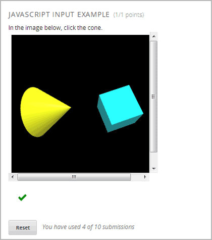

.. _The Custom JavaScript Display and Grading Example Template:

###########################################################
The Custom JavaScript Display and Grading Example Template
###########################################################

As referred to in `course staff documentation <http://edx.readthedocs.org/projects/ca/en/latest/problems_tools/advanced_problems.html#custom-javascript-display-and-grading>`_, there is a built-in template in edX Studio that uses a sample JavaScript application.

This sample application has students select two different shapes, a cone and a
cube. The correct state is when the cone is selected and the cube is not
selected:

You can `download files for that application <http://files.edx.org/JSInput.zip>`_. 
You must upload these files in Studio to use them in a problem.

The following information steps through this example to demonstrate how to apply
the guidelines in `Custom JavaScript Display and Grading`.

****************************
Example getState() Function
****************************

In the example, the ``state`` variable is initialized for the cylinder and cube
in the ``WebGLDemo.js`` file:

.. code-block:: javascript

    var state = {
        'selectedObjects': {
            'cylinder': false,
            'cube': false
        }
    }

User interactions toggle the ``state`` values of the cylinder and cube between
``true`` and ``false``.

The ``getState()`` function in the sample application returns the state as a
JSON string:

.. code-block:: javascript

    function getState() {
        return JSON.stringify(state);
     }

******************************
Example setState() Function
******************************

In the example, when a student clicks **Check**, the ``state`` variable is saved
so that the student can later return to the application and find it in the same
state:

.. code-block:: javascript

    function setState() {
        stateStr = arguments.length === 1 ? arguments[0] : arguments[1];
        state = JSON.parse(stateStr);
        updateMaterials();
    }

The ``updateMaterials()`` function called by ``setState()`` updates the state of
the cylinder and cone with the user's current selections:

.. code-block:: javascript

    function updateMaterials() {
        if (state.selectedObjects.cylinder) {
            cylinder.material = selectedMaterial;
        }
        else {
            cylinder.material = unselectedMaterial;
        }

        if (state.selectedObjects.cube) {
            cube.material = selectedMaterial;
        }
        else {
            cube.material = unselectedMaterial;
        }
    }

******************************
Example getGrade() function
******************************

In the example, when a student clicks **Check**, the ``getGrade()`` function in
returns the selected objects:

.. code-block:: javascript

    function getGrade() {
        return JSON.stringify(state['selectedObjects']);
    }

The returned JSON string is then used by the Python code defined in the problem
to determine if correct objects were selected or not, and to return a result.

*******************************
Grade the Student Response
*******************************

The following is the Python function ``vglcfn`` in the sample application:

.. code-block:: python

    

The ``ans`` parameter contains the JSON string returned by ``getGrade()``. The
value is converted to a Python Unicode structure in the variable ``par``.

In the function's first option, object(s) the student selected are stored in the
``answer`` variable.  If the student selected the cylinder and not the cube, the
``answer`` variable contains only ``cylinder``, and the function returns
``True``, which signifies a correct answer.  Otherwise, it returns ``False`` and
the answer is incorrect.

In the function's second option, the objects' states are retrieved.  If the
cylinder is selected and not the cube, the function returns ``True``, which
signifies a correct answer.  Otherwise, it returns ``False`` and the answer is
incorrect.

*******************************
XML Problem Structure
*******************************

The XML problem for the sample template is:

.. code-block:: xml

    <problem display_name="webGLDemo">
        
        

            The shapes below can be selected (yellow) or unselected (cyan).
            Clicking on them repeatedly will cycle through these two states.
        

        

            If the cone is selected (and not the cube), a correct answer will be
            generated after pressing "Check". Clicking on either "Check" or "Save"
            will register the current state.
        

        <customresponse cfn="vglcfn">
            <jsinput gradefn="WebGLDemo.getGrade"
                get_statefn="WebGLDemo.getState"
            set_statefn="WebGLDemo.setState"
            width="400"
            height="400"
            html_file="https://studio.edx.org/c4x/edX/DemoX/asset/webGLDemo.html"
            sop="false"/>
        </customresponse>
    </problem>