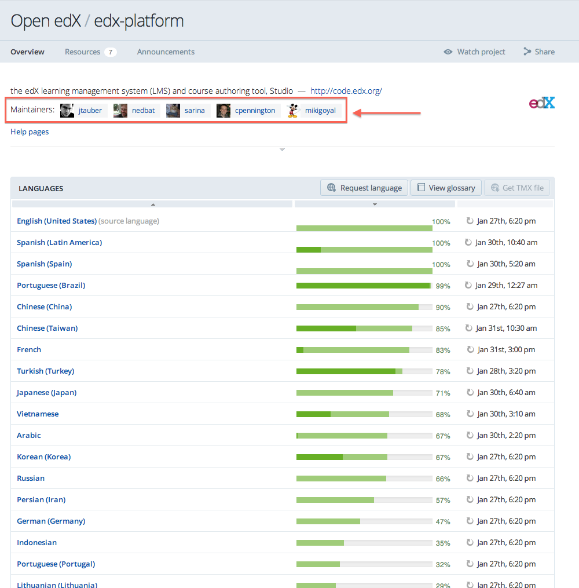
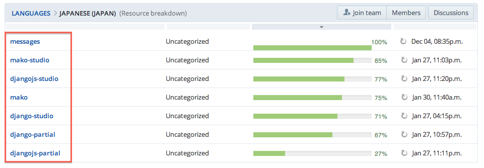
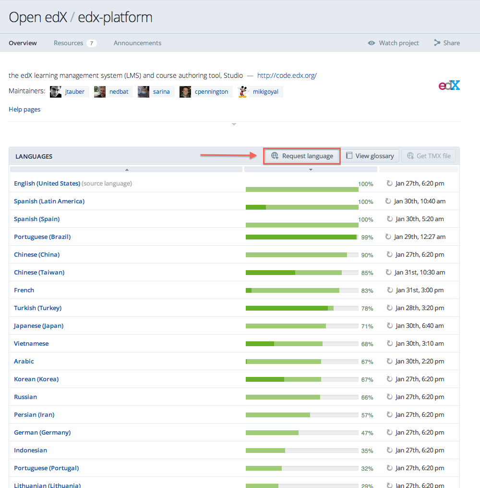

##############################
Guidelines for Translating edX
##############################

Open edX uses **Transifex**, an open source translation platform, to power
the translation of edX software into different languages. All translations
are hosted at `Transifex.com <https://www.transifex.com/>`_, which provides
a web application allowing translators to write, submit, and manage their
translations.

This page explains how to get started with Transifex and provides guidelines
for translators to follow when executing translations. For further discussion,
we welcome you to join the `openedx-translation <https://groups.google.com/forum/#!forum/openedx-translation>`_
mailing list.

For information on the Transifex process, see the following sections:

* `Getting Started with Transifex`_
* `Guidelines for Translators`_

See also documentation on
`public translation sandboxes <public_sandboxes.rst#language-sandboxes>`_.

Getting Started with Transifex
******************************

Contributors wishing to help translate edx-platform and
associated projects can find edX translation projects on 
`Transifex <https://www.transifex.com/organization/open-edx/dashboard>`_.
Note: All strings must be both translated **and reviewed** before
we will publish them on the edx.org website.

You should become a translator only if you feel very confident
in both your language in English. Open edX is written in English, so all
translations will be done from English to your language.

This guide shows images from the Transifex website in English. Depending
on your browser settings, you may see the site in a different language. The
button locations will be the same.

This section contains the following subsections:

* `Signing Up For An Account`_
* `Joining A Translation Team`_
* `Joining A Review Team`_
* `How To Translate With Transifex`_
* `Requesting A New Language`_

Signing Up For An Account
=========================
Go to `https://www.transifex.com/signup/ <https://www.transifex.com/signup/>`_
and fill out the form to create your free Transifex account, if you don't already
have one.

Joining A Translation Team
==========================

1. Once you've set up your account, visit the `edx-platform project <https://www.transifex.com/projects/p/edx-platform/>`_
   to become a translator for your language.

2. When you visit the project page, it looks like this.  If your language is listed, click
   on the name of the language to go to the language's page. Here is an example of choosing
   the Japanese translation project:

   .. image:: images/edx-platform-transifex-project.png

3. Once you're on the language's page, click "Join team" to become part of the translation team
   for that language:

   .. image:: images/join-language-team.png

   Once you've joined a translation team, you can begin translating strings immediately! See the
   section `Using Transifex`_.

Joining A Review Team
=====================

Optionally, you can request to become a `reviewer <http://support.transifex.com/customer/portal/articles/1167280>`_
for a language. Review teams are incredibly important, because
all strings must be both translated **and reviewed** before
we will publish them on the edx.org website.

You should join a review team only if you feel very confident in both your language
and in English. To join a review team, request permission from the project coordinator(s).

1. Click on the "Members" tab of your language:

   .. image:: images/view-team-members.png
	   
   You'll see a list of all the members of your translation team.

2. Click on one of the Coordinators for the language to be brought to their profile page,
   where you can click the "Send message" button to email them and ask for Reviewer access:

   .. image:: images/send-message-button.png

If the coordinator don't respond, try messaging another coordinator, or message one of the edX project maintainers.
You can find the project maintainers at the top of the main project page:

If you are willing to become a coordinator for your language, let us know in your message.

How To Translate With Transifex
===============================

Once you are a member of a translation or review team, you can click on any of the resources in
the project to begin translating it. For help documentation on Transifex, see the `Transifex translators
help desk <http://support.transifex.com/customer/portal/topics/414107-translators/articles>`_.
Before you begin, be sure you've reviewed the `Guidelines for Translators`_.

When visiting a language page, you will see a list of ten distinct resources to translate:

Focus on translating the non-Studio resources first. That is, please first
translate and review these resources, in this order, before anything else:

  * messages
  * mako
  * django-partial
  * djangojs-partial
  * wiki
  * notifier-django
  * comments-service

*Only after* the above resources are 100% translated and reviewed, move on to the Studio resources:

  * mako-studio
  * djangojs-studio
  * django-studio

Requesting A New Language
=========================

If your language is **not** listed, click the "Request language" button on the main project page
to start a new translation project for your language:

Before requesting a new language, please first make sure your language is not listed! Keep in
mind that variants of your language may exist ("Chinese" versus "Chinese-China") and these
variants may meet your needs.

An edX translation team member will respond to your request within a few days. If your
language is approved, you will be the coordinator of the project. You can add additional
coordinators, reviewers, and translators as you wish.

If you request a new language, we ask that you commit to the success of your language's
translation project. Particularly, we expect you to be an active translator and work to
recruit other translators and reviewers so your language project advances to completion,
with all strings translated and reviewed, so that we can publish your work on the edx.org website.

Guidelines for Translators
**************************

Before you dive into translation work, please familiarize yourself with the following
3 guidelines:

* `Ask for Clarification`_
* `Working With HTML`_
* `Working With Placeholders`_

Ask for Clarification
=====================
First and foremost, if you are uncertain of how to translate a string, we strongly
encourage you to reach out to us and ask for clarification! Please join the
`openedx-translation <https://groups.google.com/forum/#!forum/openedx-translation>`_
mailing list and make a post. We can help clarify the string, and even add a note
clarifying the string, which will help translators working on other language projects.

Working With HTML
=================

Translating strings for a website like edX is more complicated than simply translating sentences
from one language to another. Sometimes, sentences (or "strings") will contain
`HTML markup tags <https://developer.mozilla.org/en-US/docs/Web/Guide/HTML/Introduction>`_. It
is very important to understand how to deal with HTML markup.

Do **not** alter or translate any HTML markup tags.
You should translate the text that is between the tags. HTML markup tags begin and end with ``<``
and ``>`` characters.

Spacing is especially important. Adding spaces in an HTML tag (eg changing ``</a>`` to ``</ a>``)
will break the website.

Examples::

   String: "If you have a general question about {platform_name} please email 
   <a href="mailto:{contact_email}">{contact_email}</a>."

   Good translation: "{platform_name}에 대해 일반적인 질문이 있으면 
     <a href="mailto:{contact_email}">{contact_email}</a>로 이메일 주십시요."

   Bad translation: "{platform_name}에 대해 일반적인 질문이 있으면 
     {contact_email}로 이메일 주십시요."

     Please do not remove the HTML tags.

   Bad translation: "{platform_name}에 대해 일반적인 질문이 있으면 
     <a href="흔한:{contact_email}">{contact_email}</a>로 이메일 주십시요."

     Do not translate the HTML tags. Please use the given HTML tags.

   Bad translation: "{platform_name}에 대해 일반적인 질문이 있으면 
     <b>{contact_email}</b>로 이메일 주십시요."

     Do not change the HTML tags to something new. Please use the given HTML tags.

   Bad translation: "{platform_name}에 대해 일반적인 질문이 있으면 
     < a href = " mailto : {contact_email} " > {contact_email} < / a >로 이메일 주십시요."

     Do not add additional spacing to the HTML tags. Please use the given HTML tags.

Working With Placeholders
=========================

Strings in programs sometimes need to have data inserted into them
before being displayed to the user. Data placeholders label the places in the string where the
data will go. Strings can also have markup like HTML included. It's very important to preserve
the placeholders and markup so that the web site will work properly.

Placeholders come in a few different forms. Often, they are named so that data will be placed into
the proper placeholder. Please familiarize yourself with all the different forms to make your
translation successful.

Summary Of Placeholders
-----------------------

+-------------------------+
| Placeholder Forms       |
+=========================+
| ``{student_name}``      |
+-------------------------+
| ``%(student_name)s``    |
+-------------------------+
| ``<%= student_name %>`` |
+-------------------------+

When dealing with placeholders, you must follow these rules:

* **Do not** translate the placeholder (for example, changing ``{day}`` to ``{día}``).
* **Do not** alter or remove the punctuation of the placeholder string (for example, changing a ``_`` to a ``-``).
* **Do not** alter the capitalization of the placeholder string (for example, changing ``{day}`` to ``{Day}``).
* **Do not** alter the spacing of the placeholder string (for example, changing ``{day}`` to ``{ day }``).

Please continue reading for examples of each type of placeholder form inside a string.

1. Do **not** alter or translate placeholder strings in between curly braces (``{ }``). Strings
   inside curly braces will be replaced with different strings while the code
   is executing. Changing the content of the curly braces will cause code to break.

   The placeholder string inside of the braces will give you clues as to what type of data will
   be presented in the final string. For example, ``{student_name}`` will be replaced with the name
   of a student, whereas ``{contact_email}`` will be replaced with an email address that users can
   use to contact us. This will give you some context when you are translating sentences with
   placeholders.

   Altering the strings includes: changing, removing, or adding punctuation, changing
   the capitalization, or adding or removing given spacing. So if the placeholder string
   looks like ``{placeholder_string}``, you should not change it at all, eg ``{Placeholder_String}``,
   ``{placeholder-string}``, ``{ placeholder_string }``, ``{placeholder string}``. All of
   these changes have the potential to break the software.

   Examples::

     String: "Welcome back {student_name}!"

     Good translation: "¡Bienvenido {student_name}!"

     Bad translation: "¡Bienvenido {nombre de estudiente}!"
       Do not translate placeholder string - You must use {student_name} exactly as-is.

     Bad translation: "¡Bienvenido {student-name}!"
       Do not alter the placeholder string punctuation - you must use {student_name} exactly as-is.

     Bad translation: "¡Bienvenido {Student_Name}!"
       Do not alter the placeholder string capitalization - you must use {student_name} exactly as-is.

     Bad translation: "¡Bienvenido { student_name }!"
       Do not add additional spacing inside the {} - you must use {student_name} exactly as-is.

   You may rearrange the order of these strings, depending on the requirements of your language.
   For example, in English the name of the month precedes the day (January 23), wheras in Spanish,
   the day precedes the month (23 de enero).

   Example::

     String: "Today is {month} {day}."

     Good translation: "Hoy es {day} de {month}."

2. Do **not** alter or translate placeholder strings that begin with a ``%``, then have a string
   inside parenthesis, and then conclude with an 's' or 'd'. You must preserve the whole form.

   As in the previous example, you must not add, change, or remove punctuation, change capitalization,
   or add in new spacing.

   Examples::

     String: "Welcome back %(student_name)s!"

     Good translation: "¡Bienvenido %(student_name)s!"

     Bad translation: "¡Bienvenido %(nombre de estudiente)s!"
       Do not translate placeholder strings - You must use %(student_name)s exactly as-is.

     Bad translation: "¡Bienvenido %(student-name)s!"
       Do not alter the placeholder string punctuation - you must use %(student_name)s exactly as-is.

     Bad translation: "¡Bienvenido %(Student_Name)s!"
       Do not alter the placeholder string capitalization - you must use %(student_name)s exactly as-is.

     Bad translation: "¡Bienvenido %( student_name )s!"
       Do not add additional spacing inside the () - you must use %(student_name)s exactly as-is.

     Bad translation: "¡Bienvenido (student_name)!"
       Do not remove the '%' or 's' - you must use %(student_name)s exactly as-is.

   You may rearrange the order of these strings, depending on the requirements of your language.
   For example, in English the name of the month precedes the day (January 23), wheras in Spanish,
   the day precedes the month (23 de enero).

   Example::

     String: "Today is %(month)s %(day)d."

     Good translation: "Hoy es %(day)d de %(month)s."

3. Do **not** alter or translate placeholder strings that appear within a ``<%= %>`` block. Placeholder
   strings in this format look like this: ``<%= student_name %>``.

   As in the previous examples, you must not add, change, or remove punctuation, change capitalization,
   or add in new spacing.

   Examples::

     String: "Welcome back <%= student_name %>!"

     Good translation: "¡Bienvenido <%= student_name %>!"

     Bad translation: "¡Bienvenido <%= nombre de estudiente %>!"
       Do not translate placeholder strings - You must use <%= student_name %> exactly as-is.

     Bad translation: "¡Bienvenido <%= student-name %>!"
       Do not alter the placeholder string punctuation - you must use <%= student_name %> exactly as-is.

     Bad translation: "¡Bienvenido <%= Student_Name %>!"
       Do not alter the placeholder string capitalization - you must use <%= student_name %> exactly as-is.

     Bad translation: "¡Bienvenido < % =  student_name % >!"
       Do not add additional spacing inside the <%= %> - you must use <%= student_name %> exactly as-is.

     Bad translation: "¡Bienvenido <student_name>!"
       Do not remove or change the '<%=' or '%>' - you must use <%= student_name %> exactly as-is
