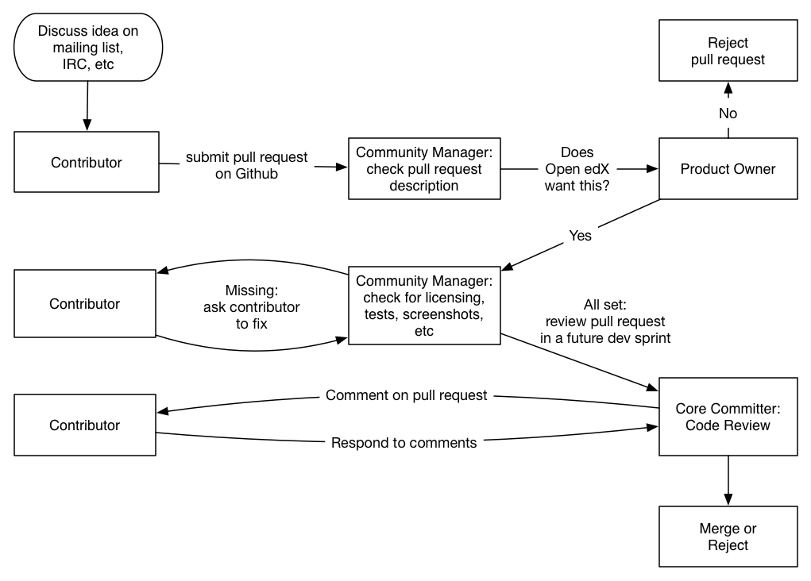

*****************************
Process for Contributing Code
*****************************

Open edX is a massive project, and we would love you to help us build
the best online education system in the world -- we can’t do it alone!
However, the core committers on the project are also developing features
and creating pull requests, so we need to balance reviewing time with
development time. To help manage our time and keep everyone as happy as
possible, we’ve developed this document that explains what core committers
and other contributors can expect from each other. The goals are:

* Keep pull requests unblocked and flowing as much as possible,
  while respecting developer time and product owner prioritization.
* Maintain a high standard for code quality, while avoiding hurt feelings
  as much as possible.

Roles
-----

People play different roles in the pull-request review process.  Each role has
different jobs and responsibilities:

:doc:`core-committer`
    Can commit changes to an Open edX repository.  Core committers are
    responsible for the quality of the code, and for supporting the code in the
    future.  Core committers are also developers in their own right.

:doc:`product-owner`
    Prioritizes the work of core committers.

:doc:`community-manager`
    Helps keep the community healthy and working smoothly.

:doc:`contributor`
    Submits pull requests for eventual committing to an Open edX repository.

.. note::
  At the moment, developers who work for edX are core committers, and other
  developers are contributors. This may change in the future.

Overview
--------

If you are a :doc:`contributor <contributor>` submitting a pull request, expect that it will
take a few weeks before it can be merged. The earlier you can start talking
with the rest of the Open edX community about the changes you want to make,
before you even start changing code, the better the whole process
will go.  Follow the guidelines in this document for a high-quality pull
request: include a detailed description of your pull request when you open it on Github,
keep the code clear and readable, make sure the tests pass, be responsive to code review comments.
Small pull requests are easier to review than large pull requests, so
split up your changes into several small pull requests when possible --
it will make everything go faster.  See the full :doc:`contributor guidelines <contributor>`
for details of what to do and what to expect.

If you are a :doc:`product owner <product-owner>`, treat pull requests
from contributors like feature requests from a customer.
Keep the lines of communication open -- if there are delays or unexpected
problems, add a comment to the pull request informing the author of the
pull request of what’s going on. No one likes to feel like they’re being ignored!
More details are in the :doc:`product owner guidelines <product-owner>`.

If you are a :doc:`core committer <core-committer>`, allocate some time
in every two-week sprint to review pull requests from other contributors.
The community managers will make sure that these pull requests meet a
basic standard for quality before asking you spend time reviewing them.
More details are in the :doc:`core committer guidelines <code-committer>`.

Feel free to read the other documentation specific to each individual role in the
process, but you don’t need to read everything to get started! If you're not
sure where to start, check out the :doc:`contributor <contributor>` documentation. Thanks
for helping us grow the project smoothly! :)
