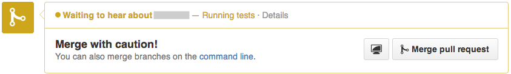
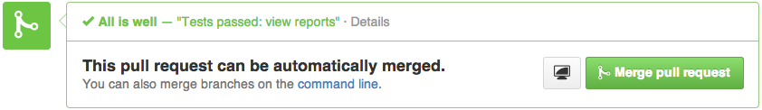
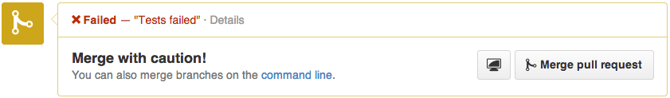
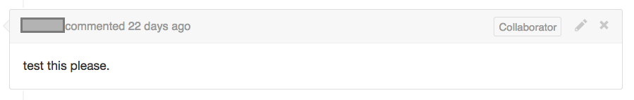

## Starting and checking the status of builds
There are three ways that builds start in our jenkins testing infastructure for edx-platform.  

##### 1) Automatically started builds for Pull Requests
* Permissions Required: You must be on a whitelist. If you are a _public_ member of the [edx organization on    github](https://github.com/orgs/edx/people), then you are already on the whitelist.
  If you are not, someone will assist you during the pull request review process. You will still be able to
  view the build results as described below.

* How it gets started  
  
  >* When you submit a pull request to the edx-platform repository, a jenkins build will
  >  automatically start and run unit and acceptance tests at the most recent commit.
  >* When you add a new commit to the PR, a new build will be run for those changes.
  >* Sometimes it may take a little while for the build to start. That usually just means that
  >  jenkins is pretty busy.

* How it is reported  
  
  >* You will know a build is started if you see this:  
  >
  >  
  >
  >* When it is finished you will see either a green checkmark or a red X, indicating that the
  >  build either passed or failed respectively.  
  >
  >   
  >
  >    
  >* You can click on 'details' to take you to the jenkins build report.
    

##### 2) Manually started builds for pull requests
* The permissions for this are the same as for automatically triggered pull request builds. (See above.)

* How it gets started
  
  >* To start a new build, add the comment "test this please." to an open pull request.
  >
  >  
  > 
  >* This will trigger a build on the most recent commit in the pull request.

* These builds are reported in the same way as automatically triggered pull request builds are. (See above.)

* TIP: Add an email filter to ignore emails from github for comments of this type.

##### 3) Manually started builds for commits without an open pull request
* Note that this is on the old jenkins instance still, and may be moved or disabled at some point in the future.
* Permissions Required: You must be a _public_ member of the [edx organization on github](https://github.com/orgs/edx/people).

* How it gets started
  
  >1. Go to [https://jenkins.testeng.edx.org/job/edx-all-tests-manual-commit/build](https://jenkins.testeng.edx.org/job/edx-all-tests-manual-commit/build)
  >2. Make sure you are __logged in__. If you are already logged in, your username and a 'log out' link will be in the
  >   upper right corner of the page. Else, the 'log in' link will be there.
  >4. Enter the commit hash that you want to test.
  >5. Click 'Build'.
  
* How it is reported
  
  >* When you start the build, it will redirect you to the log page.  You can watch this page for
  >  results. 
  >* The results __will not__ be posted to github.
 
##### 4) Automatically started builds for new commits to the 'master' branch
* A build is started whenever there is a new commit on the 'master' branch.
* To see recent builds of 'master' look at the [edx-platform-all-tests-master](https://build.testeng.edx.org/job/edx-platform-all-tests-master/) job
