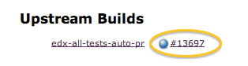
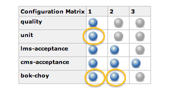
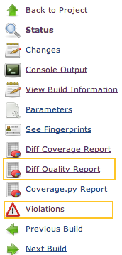
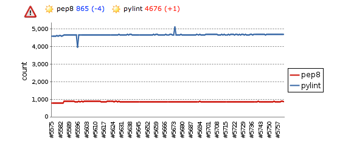
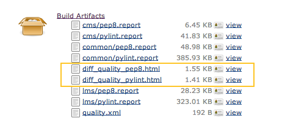
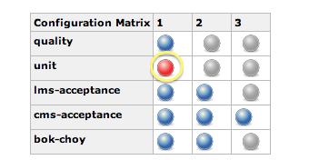
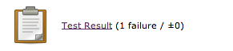
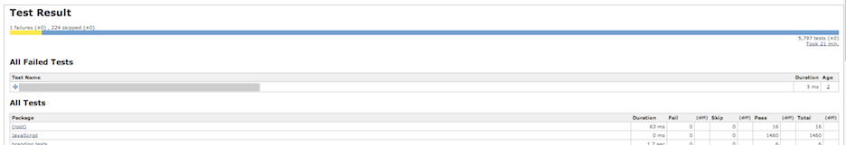
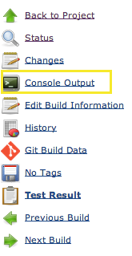

# Looking at build results
_build log_ will refer to something from the following urls:

```
https://jenkins.testeng.edx.org/job/edx-all-tests-auto-pr/[NUMBER]/
https://jenkins.testeng.edx.org/job/edx-all-tests-manual-pr/[NUMBER]/
https://jenkins.testeng.edx.org/job/edx-all-tests-manual-commit/[NUMBER]/ 
```

_build report_ will refer to something with the following urls:

```
https://jenkins.testeng.edx.org/job/edx-platform-report/[NUMBER]/
```

Note that navigating to a build via github (clicking 'details') while it is in a pending or failed state
will take you to a _build log_, but doing so after it has reported back as passed will bring you
to a _build report_.  To get to a _build log_ from a _build report_, click on the build number in
the 'Upstream Builds' section:

>  


## Coverage Reports

Note: Coverage reports are only generated when your tests pass.
  
* How to find:

  __From the build report__

    > On the left side you will see:  
    >
    > * 'Coverage.py Report' which shows the html reports produced by the coverage
    > package.
    > * 'Diff Coverage Report' which shows the coverage of _new_ lines of code  
    >
    >   

  __From the build log__ 

    >1. Click on one of the unit test or bok-choy shards.
    >
    >  
    >
    >2. Click on 'Build Artifacts'.
    >3. You can find the generated html in the reports folder.
    >    - For unit tests: 
    >      + reports/cms/cover
    >      + reports/common/lib/calc/cover
    >      + reports/common/lib/capa/cover
    >      + reports/common/lib/xmodule/cover
    >      + reports/lms/cover
    >    - For bok-choy: 
    >      + reports/bok_choy/cover

## Code Quality Reports  

These are generated regardless of test restults.
Note that a passing build does __not__ mean that you have not introduced new pep8/pylint violations.

* How to find:

  __From the build report__
  > On the left side you should see:
  >   * 'Diff Quality' which shows _new_ violations
  >   * 'Violations' which shows _all_ violations
  >
  >   
  >
  > There will also be a graph on the build report page showing trends of pep8 and pylint
  > violations.
  >
  >   

  __From the build log__

  > 1. Click on the quality shard to get to the report for the pep8 and pylint results.  
  >
  >   
  > 
  > 2. Under 'Build Artifacts', you should see the reports.  
  >
  >   
  >

    + "diff\_quality\_pep8.html" and "diff\_quality\_pylint.html" are probably the most 
      useful to look at. 
      - If don't see these here, click on 'Build Artifacts' and check in 
      'reports/diff_quality'
      - These show how many _new_ violations have been introduced in your changes.
    + You can also download the full reports (files ending in '.report')
      - These show _all_ of the found violations, not just newly introduced ones.


## Test Results

###### Finding results for individual tests

* If your build fails, the shards that had failures will have a red dot in the chart on the build log.
 
  > 

* Click on the failed shard, and at the bottom of the new page you should see something like this:
 
  > 
 
* The 'Test Result' link (above) will take you to a summary of the test results (below).
  
  > 
 
* From this page you can click through the test names to get to the console log for each test.

###### Console output for the shard

Examining the console output of a build can provide more information about the test results. For example,
sometimes a worker will have an error during setup for the tests. If this happens, you will see a red dot for the shard, but no
test failures reported (since the tests did not run).  In this case, checking the console log can be helful to determine the
reason for the build failure. It can sometimes be useful to review even if you can find the individual error message for a test.


To find it from the build log, click on the 'Console Output' link in the left navigation column.

> 

