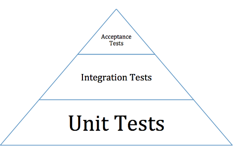

Testing
=======

Overview
--------

We maintain three kinds of tests: unit tests, integration tests, and
acceptance tests.

Overall, you want to write the tests that **maximize coverage** while
**minimizing maintenance**. In practice, this usually means investing
heavily in unit tests, which tend to be the most robust to changes in
the code base.

   Test Pyramid

The pyramid above shows the relative number of unit tests, integration
tests, and acceptance tests. Most of our tests are unit tests or
integration tests.

Unit Tests
~~~~~~~~~~

-  Each test case should be concise: setup, execute, check, and
   teardown. If you find yourself writing tests with many steps,
   consider refactoring the unit under tests into smaller units, and
   then testing those individually.

-  As a rule of thumb, your unit tests should cover every code branch.

-  Mock or patch external dependencies. We use voidspace
   `Mock Library <http://www.voidspace.org.uk/python/mock/>`__.

-  We unit test Python code (using
   `unittest <http://docs.python.org/2/library/unittest.html>`__) and
   Javascript (using `Jasmine <http://jasmine.github.io/>`__)

Integration Tests
~~~~~~~~~~~~~~~~~

-  Test several units at the same time. Note that you can still mock or
   patch dependencies that are not under test! For example, you might
   test that ``LoncapaProblem``, ``NumericalResponse``, and
   ``CorrectMap`` in the ``capa`` package work together, while still
   mocking out template rendering.

-  Use integration tests to ensure that units are hooked up correctly.
   You do not need to test every possible input--that's what unit tests
   are for. Instead, focus on testing the "happy path" to verify that
   the components work together correctly.

-  Many of our tests use the `Django test
   client <https://docs.djangoproject.com/en/dev/topics/testing/overview/>`__
   to simulate HTTP requests to the server.

UI Acceptance Tests
~~~~~~~~~~~~~~~~~~~

-  Use these to test that major program features are working correctly.

-  We use `lettuce <http://lettuce.it/>`__ to write BDD-style tests.
   Most of these tests simulate user interactions through the browser
   using `splinter <http://splinter.cobrateam.info/>`__.

-  We use `Bok
   Choy <http://bok-choy.readthedocs.org/en/latest/tutorial.html>`__ to
   write end-user acceptance tests directly in Python, using the
   framework to maximize reliability and maintainability.

Internationalization
~~~~~~~~~~~~~~~~~~~~

-  Any new text that is added should be internationalized and translated.

Test Locations
--------------

-  Python unit and integration tests: Located in subpackages called
   ``tests``. For example, the tests for the ``capa`` package are
   located in ``common/lib/capa/capa/tests``.

-  Javascript unit tests: Located in ``spec`` folders. For example,
   ``common/lib/xmodule/xmodule/js/spec`` and
   ``{cms,lms}/static/coffee/spec`` For consistency, you should use the
   same directory structure for implementation and test. For example,
   the test for ``src/views/module.coffee`` should be written in
   ``spec/views/module_spec.coffee``.

-  UI acceptance tests:

   -  Set up and helper methods, and stubs for external services:
      ``common/djangoapps/terrain``
   -  Lettuce Tests: located in ``features`` subpackage within a Django
      app. For example: ``lms/djangoapps/courseware/features``
   -  Bok Choy Acceptance Tests: located under ``openedx/tests/acceptance/tests``
   -  Bok Choy Accessibility Tests: located under ``openedx/tests/acceptance/tests`` and tagged with ``@attr("a11y")``
   -  Bok Choy PageObjects: located under ``openedx/tests/acceptance/pages``

Factories
---------

Many tests delegate set-up to a "factory" class. For example, there are
factories for creating courses, problems, and users. This encapsulates
set-up logic from tests.

Factories are often implemented using
`FactoryBoy <https://readthedocs.org/projects/factoryboy/>`__

In general, factories should be located close to the code they use. For
example, the factory for creating problem XML definitions is located in
``common/lib/capa/capa/tests/response_xml_factory.py`` because the
``capa`` package handles problem XML.

Running Tests
=============

You can run all of the unit-level tests using this command.

::

    paver test

This includes python, javascript, and documentation tests. It does not,
however, run any acceptance tests.

Note -
`paver` is a scripting tool. To get information about various options, you can run the this command.
::
	paver -h
Running Python Unit tests
-------------------------

We use `nose <https://nose.readthedocs.org/en/latest/>`__ through the
`django-nose plugin <https://pypi.python.org/pypi/django-nose>`__ to run
the test suite.

For example, this command runs all the python test scripts.

::

    paver test_python

It also runs ``collectstatic``, which prepares the
static files used by the site (for example, compiling CoffeeScript to
JavaScript).

You can re-run all failed python tests by running this command (see note at end of
section).

::

    paver test_python --failed

To test lms python tests use this command.

::

    paver test_system -s lms

To test cms python tests use this command.

::

    paver test_system -s cms

To run these tests without ``collectstatic``, which is faster, append the following argument.

::

    paver test_system -s lms --fasttest

For even more speed, use the ``--disable-migrations`` option to run tests without applying migrations and instead create tables directly from apps' models.

::

    paver test_system -s lms --disable-migrations

To run cms python tests without ``collectstatic`` use this command.

::

    paver test_system -s cms --fasttest

To run a single django test class use this command.

::

    paver test_system -t lms/djangoapps/courseware/tests/tests.py:ActivateLoginTest

When developing tests, it is often helpful to be able to really just run
one single test without the overhead of PIP installs, UX builds, etc. In
this case, it is helpful to look at the output of paver, and run just
the specific command (optionally, stripping away coverage metrics). At
the time of this writing, the command is the following.

::

    python ./manage.py lms test --verbosity=1 lms/djangoapps/courseware/tests/test_courses.py   --traceback --settings=test

To run a single test format the command like this.

::

    paver test_system -t lms/djangoapps/courseware/tests/tests.py:ActivateLoginTest.test_activate_login

The ``lms`` suite of tests runs with randomized order, by default.
You can override these by using ``--no-randomize`` to disable randomization.

You can also enable test concurrency with the ``--processes=N`` flag (where ``N``
is the number of processes to run tests with, and ``-1`` means one process per
available core). Note, however, that when running concurrently, breakpoints may
not work correctly, and you will not be able to run single test methods (only
single test classes).

For example:

::
    # This will run all tests in the order that they appear in their files, serially
    paver test_system -s lms --no-randomize --processes=0

    # This will run using only 2 processes for tests
    paver test_system -s lms --processes=2

To re-run all failing django tests from lms or cms, use the
``--failed``,\ ``-f`` flag (see note at end of section).

::

    paver test_system -s lms --failed
    paver test_system -s cms --failed

There is also a ``--fail_fast``, ``-x`` option that will stop nosetests
after the first failure.

common/lib tests are tested with the ``test_lib`` task, which also
accepts the ``--failed`` and ``--fail_fast`` options.

::

    paver test_lib -l common/lib/calc
    paver test_lib -l common/lib/xmodule --failed

For example, this command runs a single nose test file.

::

    nosetests common/lib/xmodule/xmodule/tests/test_stringify.py

This command runs a single nose test within a specified file.

::

    nosetests common/lib/xmodule/xmodule/tests/test_stringify.py:test_stringify

This is an example of how to run a single test and get stdout, with proper env config.

::

    python manage.py cms --settings test test contentstore.tests.test_import_nostatic -s

These are examples of how to run a single test and get stdout and get coverage.

::

    python -m coverage run which ./manage.py cms --settings test test --traceback --logging-clear-handlers --liveserver=localhost:8000-9000 contentstore.tests.test_import_nostatic -s # cms example
    python -m coverage run which ./manage.py lms --settings test test --traceback --logging-clear-handlers --liveserver=localhost:8000-9000  courseware.tests.test_module_render -s # lms example

Use this command to generate coverage report.

::

    coverage report

Use this command to generate an HTML report.

::

    coverage html

The report is then saved in reports/common/lib/xmodule/cover/index.html

To run tests for stub servers, for example for `YouTube stub
server <https://github.com/edx/edx-platform/blob/master/common/djangoapps/terrain/stubs/tests/test_youtube_stub.py>`__,
you can run one of these commands.

::

    paver test_system -s cms -t common/djangoapps/terrain/stubs/tests/test_youtube_stub.py
    python -m coverage run `which ./manage.py` cms --settings test test --traceback common/djangoapps/terrain/stubs/tests/test_youtube_stub.py

Very handy: if you pass the ``--pdb`` flag to a paver test function, or
uncomment the ``pdb=1`` line in ``setup.cfg``, the test runner
will drop you into pdb on error. This lets you go up and down the stack
and see what the values of the variables are. Check out `the pdb
documentation <http://docs.python.org/library/pdb.html>`__

Use this command to put a temporary debugging breakpoint in a test.
If you check this in, your tests will hang on jenkins.

::

    from nose.tools import set_trace; set_trace()

Note: More on the ``--failed`` functionality

* In order to use this, you must run the tests first. If you haven't already
  run the tests, or if no tests failed in the previous run, then using the
  ``--failed`` switch will result in **all** of the tests being run. See more
  about this in the `nose documentation
  <http://nose.readthedocs.org/en/latest/plugins/testid.html#looping-over-failed-tests>`__.

* Note that ``paver test_python`` calls nosetests separately for cms and lms.
  This means that if tests failed only in lms on the previous run, then calling
  ``paver test_python --failed`` will run **all of the tests for cms** in
  addition to the previously failing lms tests. If you want it to run only the
  failing tests for lms or cms, use the ``paver test_system -s lms --failed``
  or ``paver test_system -s cms --failed`` commands.

Running Javascript Unit Tests
~~~~~~~~~~~~~~~~~~~~~~~~~~~~~

We use Jasmine to run JavaScript unit tests. To run all the JavaScript
tests::

    paver test_js

To run a specific set of JavaScript tests and print the results to the
console, run these commands.

::

    paver test_js_run -s lms
    paver test_js_run -s lms-coffee
    paver test_js_run -s cms
    paver test_js_run -s cms-squire
    paver test_js_run -s xmodule
    paver test_js_run -s common
    paver test_js_run -s common-requirejs

To run JavaScript tests in a browser, run these commands.

::

    paver test_js_dev -s lms
    paver test_js_dev -s lms-coffee
    paver test_js_dev -s cms
    paver test_js_dev -s cms-squire
    paver test_js_dev -s xmodule
    paver test_js_dev -s common
    paver test_js_dev -s common-requirejs

To debug these tests on devstack in a local browser:

 * first run the appropriate test_js_dev command from above which will open a browser using XQuartz
 * open http://192.168.33.10:9876/debug.html in your host system's browser of choice
 * this will run all the tests and show you the results including details of any failures
 * you can click on an individually failing test and/or suite to re-run it by itself
 * you can now use the browser's developer tools to debug as you would any other JavaScript code

Note: the port is also output to the console that you ran the tests from if you find that easier.

These paver commands call through to Karma. For more
info, see `karma-runner.github.io <https://karma-runner.github.io/>`__.

Running Bok Choy Acceptance Tests
~~~~~~~~~~~~~~~~~~~~~~~~~~~~~~~~~

We use `Bok
Choy <http://bok-choy.readthedocs.org/en/latest/tutorial.html>`__ for
acceptance testing. Bok Choy is a UI-level acceptance test framework for
writing robust `Selenium <http://docs.seleniumhq.org/>`__ tests in
`Python <https://www.python.org/>`__. Bok Choy makes your acceptance
tests reliable and maintainable by utilizing the Page Object and Promise
design patterns.

**Prerequisites**:

These prerequisites are all automatically installed and available in `Devstack
<https://github.com/edx/configuration/wiki/edX-Developer-Stack>`__, the
supported development enviornment for the edX Platform.

* Chromedriver and Chrome (see Running Lettuce Acceptance Tests below for
  the latest tested versions)

* Mongo

* Memcache

* mySQL

To run all the bok choy acceptance tests run this command.

::

    paver test_bokchoy

Once the database has been set up and the static files collected, you
can use the 'fast' option to skip those tasks. This option can also be
used with any of the test specs below.

::

    paver test_bokchoy --fasttest

For example to run a single test, specify the name of the test file.

::

    paver test_bokchoy -t lms/test_lms.py

Notice the test file location is relative to
openedx/tests/acceptance/tests. This is another example.

::

    paver test_bokchoy -t studio/test_studio_bad_data.py

To run a single test faster by not repeating setup tasks use the ``--fasttest`` option.

::

    paver test_bokchoy -t studio/test_studio_bad_data.py --fasttest

To test only a certain feature, specify the file and the testcase class.

::

    paver test_bokchoy -t studio/test_studio_bad_data.py:BadComponentTest

To execute only a certain test case, specify the file name, class, and
test case method.

::

    paver test_bokchoy -t lms/test_lms.py:RegistrationTest.test_register

During acceptance test execution, log files and also screenshots of
failed tests are captured in test\_root/log.

Use this command to put a temporary debugging breakpoint in a test.
If you check this in, your tests will hang on jenkins.

::

    from nose.tools import set_trace; set_trace()

By default, all bokchoy tests are run with the 'split' ModuleStore. To
override the modulestore that is used, use the default\_store option.
The currently supported stores are: 'split'
(xmodule.modulestore.split\_mongo.split\_draft.DraftVersioningModuleStore)
and 'draft' (xmodule.modulestore.mongo.DraftMongoModuleStore). This is an example
for the 'draft' store.

::

    paver test_bokchoy --default_store='draft'

Running Bok Choy Accessibility Tests
~~~~~~~~~~~~~~~~~~~~~~~~~~~~~~~~~~~~

We use Bok
Choy for `automated accessibility testing
<http://bok-choy.readthedocs.org/en/latest/accessibility.html>`__.
Bok Choy, a UI-level acceptance test framework for writing robust
`Selenium <http://docs.seleniumhq.org/>`__
tests in `Python <https://www.python.org/>`__, includes the ability to perform
accessibility audits on web pages using `Google Accessibility Developer Tools
<https://github.com/GoogleChrome/accessibility-developer-tools/>`__ or
`Deque's aXe Core <https://github.com/dequelabs/axe-core/>`__.
For more details about how to write accessibility tests, please read
the `Bok Choy documentation <http://bok-choy.readthedocs.org/en/latest/accessibility.html>`__
and the Automated Accessibility Tests `openedx Confluence page
<https://openedx.atlassian.net/wiki/display/TE/Automated+Accessibility+Tests>`__.

**Prerequisites**:

These prerequisites are all automatically installed and available in `Devstack
<https://github.com/edx/configuration/wiki/edX-Developer-Stack>`__ (since the Cypress release), the supported development enviornment for the edX Platform.

* Mongo

* Memcache

* mySQL

To run all the bok choy accessibility tests use this command.

::

    paver test_a11y

To run specific tests, use the ``-t`` flag to specify a nose-style test spec
relative to the ``openedx/tests/acceptance/tests`` directory. This is an example for it.

::

    paver test_a11y -t test_lms_dashboard.py:LmsDashboardA11yTest.test_dashboard_course_listings_a11y

**Coverage**:

To generate the coverage report for the views run during accessibility tests::

    paver a11y_coverage

Note that this coverage report is just a guideline to find areas that
are missing tests.  If the view isn't 'covered', there definitely
isn't a test for it.  If it is 'covered', we are loading that page
during the tests but not necessarily calling ``page.a11y_audit.check_for_accessibility_errors`` on it.

Options for Faster Development Cycles in Bok-Choy Tests
~~~~~~~~~~~~~~~~~~~~~~~~~~~~~~~~~~~~~~~~~~~~~~~~~~~~~~~

The following are ways in which a developer could shorten the development
cycle for faster feedback. The options below can often be used together.

**Multiprocessing Mode**

Bok-choy tests can be threaded using the `-n` switch.  Using 2 threads generally
reduces test cycles by 33%.  The recommendation is to make sure the
number of threads is no more than the number of processors available. For
example, the Cypress release of devstack is provisioned by default with 2
processors. In that case, to run tests in multiprocess mode::

    paver test_bokchoy -n 2

*Caveat*: Not all tests have been designed with multiprocessing in mind; some
testcases (approx 10%) will fail in multiprocess mode for various reasons
(e.g., shared fixtures, unexpected state, etc). If you have tests that fail
in multiprocessing mode, it may be worthwhile to run them in single-stream mode
to understand if you are encountering such a failure. With that noted, this
can speed development for most test classes.

**Leave Your Servers Running**

There are two additional switches available in the `paver test_bokchoy` task.
Used together, they can shorten the cycle between test runs. Similar to above,
there are a handful of tests that won't work with this approach, due to insufficient
teardown and other unmanaged state.

1. Start your servers in one terminal/ssh session::

    paver test_bokchoy --serversonly

Note if setup has already been done, you can run::

    paver test_bokchoy --serversonly --fasttest

2. Run your tests only in another terminal/ssh session::

    paver test_bokchoy --testsonly --fasttest

You must run BOTH `--testsonly` and `--fasttest`.

3. When done, you can kill your servers in the first terminal/ssh session with
Control-C. *Warning*: Only hit Control-C one time so the nose test framework can
properly clean up.

Running Lettuce Acceptance Tests
~~~~~~~~~~~~~~~~~~~~~~~~~~~~~~~~

We use `Lettuce <http://lettuce.it/>`__ for acceptance testing. Most of
our tests use `Splinter <http://splinter.cobrateam.info/>`__ to simulate
UI browser interactions. Splinter, in turn, uses
`Selenium <http://docs.seleniumhq.org/>`__ to control the Chrome
browser.

**Prerequisite**: You must have
`ChromeDriver <https://code.google.com/p/selenium/wiki/ChromeDriver>`__
installed to run the tests in Chrome. The tests are confirmed to run
with Chrome (not Chromium) version 34.0.1847.116 with ChromeDriver
version 2.6.232917.

To run all the acceptance tests, run this command.

::

    paver test_acceptance

To run only for lms or cms, run one of these commands.

::

    paver test_acceptance -s lms
    paver test_acceptance -s cms

For example, this command tests only a specific feature.

::

    paver test_acceptance -s lms --extra_args="lms/djangoapps/courseware/features/problems.feature"

A command like this tests only a specific scenario.

::

    paver test_acceptance -s lms --extra_args="lms/djangoapps/courseware/features/problems.feature -s 3"

To start the debugger on failure, pass the ``--pdb`` option to the paver command like this.

::

    paver test_acceptance -s lms --pdb --extra_args="lms/djangoapps/courseware/features/problems.feature"

To run tests faster by not collecting static files or compiling sass, you can use
``paver test_acceptance -s lms --fasttest`` and
``paver test_acceptance -s cms --fasttest``.

By default, all acceptance tests are run with the 'draft' ModuleStore.
To override the modulestore that is used, use the default\_store option.
Currently, the possible stores for acceptance tests are: 'split'
(xmodule.modulestore.split\_mongo.split\_draft.DraftVersioningModuleStore)
and 'draft' (xmodule.modulestore.mongo.DraftMongoModuleStore). For
example: paver test\_acceptance --default\_store='draft' Note, however,
all acceptance tests currently do not pass with 'split'.

Acceptance tests will run on a randomized port and can be run in the
background of paver cms and lms or unit tests. To specify the port,
change the LETTUCE\_SERVER\_PORT constant in cms/envs/acceptance.py and
lms/envs/acceptance.py as well as the port listed in
cms/djangoapps/contentstore/feature/upload.py

During acceptance test execution, Django log files are written to
``test_root/log/lms_acceptance.log`` and
``test_root/log/cms_acceptance.log``.

**Note**: The acceptance tests can *not* currently run in parallel.

Running Tests on Paver Scripts
~~~~~~~~~~~~~~~~~~~~~~~~~~~~~

To run tests on the scripts that power the various Paver commands, use the following command::

  nosetests paver

Testing internationalization with dummy translations
~~~~~~~~~~~~~~~~~~~~~~~~~~~~~~~~~~~~~~~~~~~~~~~~~~~~

Any text you add to the platform should be internationalized. To generate
translations for your new strings, run the following command.

::

    paver i18n_dummy

This command generates dummy translations for each dummy language in the
platform and puts the dummy strings in the appropriate language files.
You can then preview the dummy languages on your local machine and also in
your sandbox, if and when you create one.

The dummy language files that are generated during this process can be
found in the following locations.

::

    conf/locale/{LANG_CODE}

There are a few JavaScript files that are generated from this process. You
can find those in the following locations.

::

    lms/static/js/i18n/{LANG_CODE}
    cms/static/js/i18n/{LANG_CODE}

Do not commit the ``.po``, ``.mo``, ``.js`` files that are generated
in the above locations during the dummy translation process!

Debugging Acceptance Tests on Vagrant
~~~~~~~~~~~~~~~~~~~~~~~~~~~~~~~~~~~~~

If you are using a local Vagrant dev environment to run acceptance
tests, then you will only get console text output. To actually see what
is happening, you can turn on automatic screenshots. For each step two
screenshots will be taken - before, and after. To do this, simply add
the step::

    Given I enable capturing of screenshots before and after each step

to your scenario. This step can be added anywhere, and will enable
automatic screenshots for all following steps for that scenario only.
You can also use the step

::

    Given I disable capturing of screenshots before and after each step

to turn off auto screenshots for all steps following it.

Screenshots will be placed in the folder
``{TEST_ROOT}/log/auto_screenshots``. Each time you launch acceptance
tests, this folder will be cleaned. Each screenshot will be named
according to the template string
``{scenario_number}__{step_number}__{step_function_name}__{"1_before"|"2_after"}``.

If you don't want to have screenshots be captured for all steps, but
rather want fine grained control, you can use this decorator before any Python function in ``feature_name.py`` file.

::

    @capture_screenshot_before_after

The decorator will capture two screenshots: one before the decorated function runs,
and one after. Also, this function is available, and can be inserted at any point in code to capture a
screenshot specifically in that place.

::

    from lettuce import world; world.capture_screenshot("image_name")

In both cases the captured screenshots will go to the same folder as when using the step method: ``{TEST_ROOT}/log/auto_screenshot``.

A totally different approach to visually seeing acceptance tests run in
Vagrant is to redirect Vagrant X11 session to your local machine. Please
see https://github.com/edx/edx-platform/wiki/Test-engineering-FAQ for
instruction on how to achieve this.

Viewing Test Coverage
---------------------

We currently collect test coverage information for Python
unit/integration tests.

To view test coverage:

1. Run the test suite with this command.

::

       paver test

2. Generate reports with this command.

::

       paver coverage

3. Reports are located in the ``reports`` folder. The command generates
   HTML and XML (Cobertura format) reports.

Python Code Style Quality
-------------------------

To view Python code style quality (including pep8 and pylint violations) run this command.

::

    paver run_quality

More specific options are below.

-  These commands run a particular quality report.

::

       paver run_pep8
       paver run_pylint

-  This command runs a report, and sets it to fail if it exceeds a given number
   of violations.

::

       paver run_pep8 --limit=800

-  The ``run_quality`` uses the underlying diff-quality tool (which is
   packaged with
   `diff-cover <https://github.com/Bachmann1234/diff-cover>`__). With
   that, the command can be set to fail if a certain diff threshold is
   not met. For example, to cause the process to fail if quality
   expectations are less than 100% when compared to master (or in other
   words, if style quality is worse than what is already on master).

::

       paver run_quality --percentage=100

-  Note that 'fixme' violations are not counted with run\_quality. To
   see all 'TODO' lines, use this command.

::

       paver find_fixme --system=lms

   ``system`` is an optional argument here. It defaults to
   ``cms,lms,common``.

JavaScript Code Style Quality
------------------

To view JavaScript code style quality run this command.

::

    paver run_eslint

-  This command also comes with a ``--limit`` switch, this is an example of that switch.

::

	paver run_eslint --limit=50000

Code Complexity Tools
----------------------

Two tools are available for evaluating complexity of edx-platform code:

- `radon <https://radon.readthedocs.org/en/latest/>`__ for Python code complexity.
   * To obtain complexity, run

::

       paver run_complexity

- `plato <https://github.com/es-analysis/plato>`__ for JavaScript code complexity. Several options are available on the command line; see documentation.
    * Below, the following command will produce an html report in a subdirectory called "jscomplexity"

::

       plato -q -x common/static/js/vendor/ -t common -e .eslintrc.json -r -d jscomplexity common/static/js/

Testing using queue servers
---------------------------

When testing problems that use a queue server on AWS (e.g.
sandbox-xqueue.edx.org), you'll need to run your server on your public
IP, like so.

``./manage.py lms runserver 0.0.0.0:8000``

When you connect to the LMS, you need to use the public ip. Use
``ifconfig`` to figure out the number, and connect e.g. to
``http://18.3.4.5:8000/``

Acceptance Test Techniques
--------------------------

1. **Element existence on the page**: Do not use splinter's built-in browser
   methods directly for determining if elements exist. Use the
   world.is\_css\_present and world.is\_css\_not\_present wrapper
   functions instead. Otherwise errors can arise if checks for the css
   are performed before the page finishes loading. Also these wrapper
   functions are optimized for the amount of wait time spent in both
   cases of positive and negative expectation.

2. **Dealing with alerts**: Chrome can hang on javascripts alerts. If a
   javascript alert/prompt/confirmation is expected, use the step 'I
   will confirm all alerts', 'I will cancel all alerts' or 'I will anser
   all prompts with "(.\*)"' before the step that causes the alert in
   order to properly deal with it.

3. **Dealing with stale element reference exceptions**: These exceptions
   happen if any part of the page is refreshed in between finding an
   element and accessing the element. When possible, use any of the css
   functions in common/djangoapps/terrain/ui\_helpers.py as they will
   retry the action in case of this exception. If the functionality is
   not there, wrap the function with world.retry\_on\_exception. This
   function takes in a function and will retry and return the result of
   the function if there was an exception.

4. **Scenario Level Constants**: If you want an object to be available for
   the entire scenario, it can be stored in world.scenario\_dict. This
   object is a dictionary that gets refreshed at the beginning on the
   scenario. Currently, the current logged in user and the current
   created course are stored under 'COURSE' and 'USER'. This will help
   prevent strings from being hard coded so the acceptance tests can
   become more flexible.

5. **Internal edX Jenkins considerations**: Acceptance tests are run in
   Jenkins as part of the edX development workflow. They are broken into
   shards and split across workers. Therefore if you add a new .feature
   file, you need to define what shard they should be run in or else
   they will not get executed. See someone from TestEng to help you
   determine where they should go.

   Also, the test results are rolled up in Jenkins for ease of
   understanding, with the acceptance tests under the top level of "CMS"
   and "LMS" when they follow this convention: name your feature in the
   .feature file CMS or LMS with a single period and then no other
   periods in the name. The name can contain spaces. E.g. "CMS.Sign Up"
