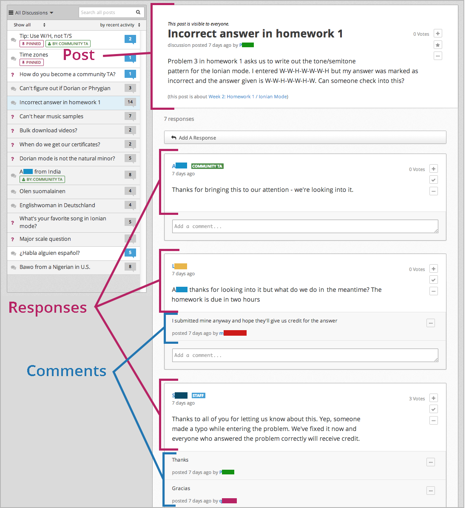

.. _Anatomy of edX Course Discussions:

#######################################
Anatomy of edX Course Discussions 
#######################################

********************************************************************
Basic Elements: Posts, Responses, and Comments
********************************************************************

Discussions are made up of *posts*, *responses*, and *comments*. 

* *Posts* initiate a conversation by asking a question or making a statement for
  students to consider.

* *Responses* reply directly to the post.

* *Comments*, in turn, reply to specific responses.

The following conversation shows each of these elements:

::

  Post: "Please introduce yourself."
    - Reponse: "My name is Lee and I teach secondary school maths in Canberra,
      Australia."
    - Reponse: "Hello everyone, I am Sumei from Hong Kong, China."
      - Comment: "Hi Sumei, I am taking this course in Hong Kong too. Maybe we
        should make a study group!"
      - Comment: "I'd like to join the Hong Kong study group too, I think it
        will help me keep up with the homework."
    - Response: "Hi from Johannesburg! I am taking the course to prepare for my
      matric exams."

You can see posts, comments, and responses, as well as other information about 
the course discussions and individual posts, on the **Discussion** page.

**********************************
The Discussion Page
**********************************

When you go to the **Discussion** page in your course, you'll see a page that
looks like the following. You can click the image below to enlarge it.

.. image:: /Images/DiscussionHomeCallouts.png
   :width: 800 
   :alt: Discussion home page with a topics pane on the left side and "How to use edX discussions" pane on the right

==========
Left Pane
==========

The left pane lists titles and information for all the individual posts in the
course. The left pane also has filters that you can use to sort discussions by
topic, status, and activity. 

The left pane includes the following elements.

1. The topic filter for course discussions. When you click this list, you can
   see all of the topics in the course discussions. For more information about discussion topics, see :ref:`Discussion Topics`.

2. The status filter. You can filter discussions that you haven't read or that
   contain unanswered questions. For more information, see :ref:`Answer
   Questions`.

3. Specific status flags. If an instructor has pinned a post, if you're
   following a post, or if the person who created the post is a community TA,
   moderator, or other staff member, you'll see a colored flag with this
   information.

4. The title of the post. The title lets you know what the post is about.

5. The post type. A post can be a question or a discussion. For more
   information, see :ref:`Add a Post`.

6. The post search box. You can search all posts, responses, and comments for
   individual words or phrases. For more information, see :ref:`Search Discussions`.

7. The activity filter. You can filter discussions by recent activity, most
   activity, or most votes.

8. Status indicators. These indicators show whether you've read a post and the
   responses and comments for that post. For more information, see :ref:`Read New or Updated Posts`.

===========
Right Pane
===========

When you click the **Discussion** tab, the right pane opens to a home page that
lists ways that you can interact with posts. Each of these interactions is
covered later in this topic.

After you click the title of a post, the right pane shows the original post,
responses to the post, and comments on responses. The page is formatted to help
distinguish between posts, responses, and comments:

* The post and its title appear at the top of the page.
* Responses appear in white below the original post.
* Comments on a response appear in gray below the response.

These elements appear in the image below. You can click the image to enlarge it.

       post, responses, and comments in the right pane

You can also see privacy information about the post as well as several options:

#. Privacy information. You can see whether the post is visible to everyone, or
   only to you and course staff.
#. The number of votes the post or response has received and a plus sign (+)
   button that you can click to vote for the post or response. For more
   information, see :ref:`Vote for Posts or Responses`.
#. A star button. Click this button if you want to follow the post. For more
   information, see :ref:`Follow Posts`.
#. An ellipsis, or "more", button (...). When you click this button, you see a
   **Report** option. You can use this option to report an inappropriate post,
   response, or comment. For more information, see :ref:`Report Discussion
   Misuse`.

