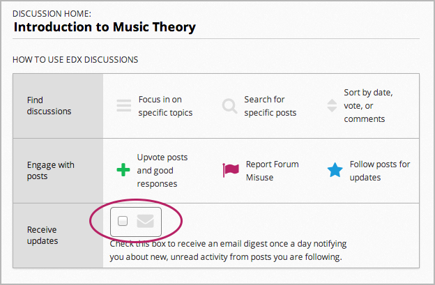
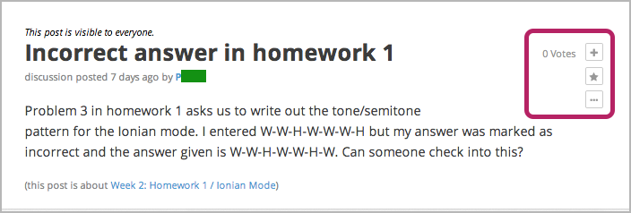

.. _Anatomy of edX Course Discussions:

#######################################
Anatomy of edX Course Discussions 
#######################################

********************************************************************
Basic Elements: Posts, Responses, and Comments
********************************************************************

Discussions are made up of *posts*, *responses*, and *comments*. Together,
posts, responses, and comments are known as *contributions*, and a post together
with its responses and comments is an *exchange*.

* *Posts* initiate a conversation by asking a question or making a statement for
  students to consider.

* *Responses* reply directly to the post.

* *Comments*, in turn, reply to specific responses.

The following conversation shows each of these contributions:

::

  Post: "Please introduce yourself."
    - Response: "My name is Lee and I teach secondary school maths in Canberra,
      Australia."
    - Response: "Hello everyone, I am Sumei from Hong Kong, China."
      - Comment: "Hi Sumei, I am taking this course in Hong Kong too. Maybe we
        should make a study group!"
      - Comment: "I'd like to join the Hong Kong study group too, I think it
        will help me keep up with the homework."
    - Response: "Hi from Johannesburg! I am taking the course to prepare for my
      matric exams."

You can see posts, comments, and responses, as well as other information about 
the course discussions and individual posts, on the **Discussion** page.

**********************************
The Discussion Page
**********************************

When you go to the **Discussion** page in your course, you'll see a page that
looks like the following image. You can click the image to enlarge it.

.. image:: /Images/DiscussionHomeCallouts.png
   :width: 800 
   :alt: Discussion home page with a topics pane on the left side and "How to use edX discussions" pane on the right

=============
List of Posts
=============

The list of posts in the left pane lists titles and information for all the
individual posts in the course. The list of posts also has filters that you can
use to sort discussions by topic, status, and activity.

The list of posts includes the following elements.

1. The drop-down Discussion list. When you click this list, you can
   see all of the topics in the course discussions, or you can view only the posts that you're currently following. For more information about discussion topics, see :ref:`Discussion Topics`. For more information about following posts, see :ref:`Follow Posts`.

2. The status filter. You can filter discussions that you haven't read or that
   contain unanswered questions. For more information, see :ref:`Answer
   Questions`.

3. Specific identifiers. If an instructor has pinned a post, if you're
   following a post, or if the person who created the post is a community TA,
   moderator, or administrator, you'll see a colored identifier with this
   information.

4. The title of the post. The title lets you know what the post is about.

5. The post type. A post can be a question or a discussion. For more
   information, see :ref:`Determine Post Type`.

6. A "correct answer" status indicator. The green check mark indicates that one
   of the responses to the post correctly answers the question that the post
   asks.

7. The post search box. You can search all posts, responses, and comments for
   individual words or phrases. For more information, see :ref:`Search Discussions`.

8. The activity sorting control. You can sort discussions by recent activity,
   most activity, or most votes. For more information, see :ref:`Keep Up with
   New Activity`.

9. Status indicators. These indicators show whether you've read a post and the
   responses and comments for that post. For more information, see :ref:`Keep Up
   with New Activity`.

===========
Right Pane
===========

When you click the **Discussion** tab, the right pane opens to a home page that
lists ways that you can interact with posts. Each of these interactions is
covered later in this topic. For more information, see the following sections:

* :ref:`Explore Posts`
* :ref:`Follow Posts`
* :ref:`Provide Feedback`

On the home page, you can also specify that you want to receive an email message
each day that summarizes discussion activity for the posts you are following. To
receive this daily digest, select the **Receive updates** check box.

After you click the title of a post, the right pane shows the original post,
responses to the post, and comments on responses. The page is formatted to help
distinguish between posts, responses, and comments:

* The post and its title appear at the top of the page.
* Responses appear indented and with a white background below the original post.
* Comments on a response appear with a gray background below the response. The
  font size for comments is smaller than the font size for responses.

These elements appear in the image below. You can click the image to enlarge it.

.. image:: ../Images/Disc_PostsEtc.png
   :width: 600
   :alt: Discussion page with a specific post selected in the left pane and the
       post, responses, and comments in the right pane

Additionally, in the upper-right corner of every post, response, and comment, you can see several option icons. The icons that you see depend on the type of contribution. (For more information, see :ref:`Provide Feedback`.)

The icons that you see may include the following:

* A plus sign (+), together with the number of votes the post has received.
  Click this icon to vote for the post or response. For more information, see
  :ref:`Vote for Posts or Responses`.
* A star (posts only). Click this icon if you want to follow the post. For more
  information, see :ref:`Follow Posts`. 
* A check mark (responses only). For questions, the student who posted the
  question, or discussion staff, can use this icon to indicate that the response is
  correct. For more information, see :ref:`Answer Questions`.
* An ellipsis, or "more", icon (...). When you click this icon, you may see several additional options:

  * **Edit**. This option is only visible if you are the author of the post,
    response, or comment. You can change the text of your contribution, or, for
    posts, you can change the type of post. For more information, see :ref:`Edit or Delete`.
  * **Delete**. This option is only visible if you are the author of the post,
    response, or comment. For more information, see :ref:`Edit or Delete`.
  * **Report**. You can use this option to report an inappropriate post,
    response, or comment. For more information, see :ref:`Report Discussion
    Misuse`.

