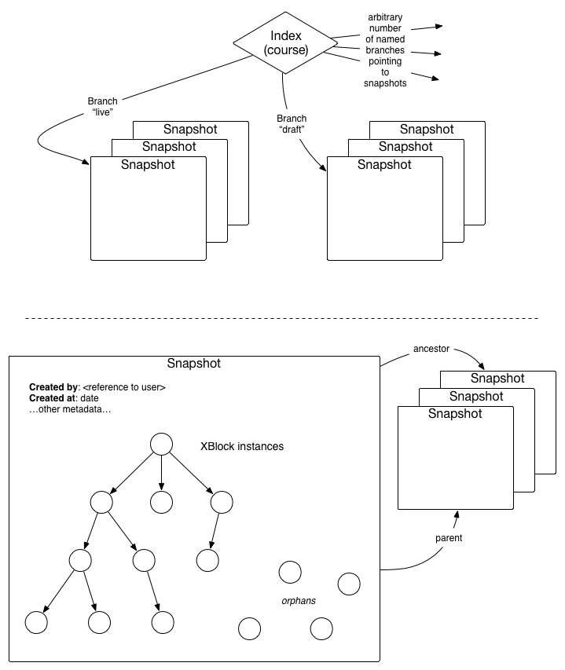

# edX RESTful API
This document is [copied from Apiary](http://docs.edxapi.apiary.io/),
and the canonical version lives there. This API is designed to allow clients
to introspect and manipulate XBlocks and their related models.

# Group XBlocks
Conceptually, an XBlock is any component that knows how to render itself, at least
in a certain context. XBlocks can contain other XBlocks. XBlocks can define their
own schema for storing data, which must consist only of primitive types
(string, int, list, mapping)

The "title" and "description" strings are meant to be displayed in a UI, and as such
should be translated into the language specified by the `Accept-Language` header
in the request. If the server is unable to translate the strings into the requested
language, they will be returned untranslated.

*Note:* This API is read-only. XBlock types cannot be created, modified, or deleted
through this API; available XBlock types are solely controlled by the server
administrator(s). Other XBlock types may exist on other servers, but these API
responses will only contain information about the XBlock types that this server
supports.

## XBlock Type Collection [/v1/xblock_types]
### Read [GET]
+ Response 200 (application/json)

        [{
          "id": "thumbs",
          "version": "1.0",
          "title": "Thumbs",
          "description": "a simple control to indicate thumbs-up or thumbs-down, and aggregate responses",
          "schema": {},
          "defaults": {}
        }, {
          "id": "randomize",
          "version": "0.1a",
          "title": "Randomize",
          "description": "randomize children",
          "schema": {},
          "defaults": {}
        }, {
          "id": "schema_ex",
          "version": "2.5.4",
          "title": "Schema Type Example",
          "description": "just demonstrates all the different schema types",
          "schema": {
            "name": "string",
            "age": "int",
            "my_dict": {
                "a": "string"
            },
            "list_of_strings": ["string"],
            "list_of_ints": ["int"]
          },
          "defaults": {
            "name": "Empty"
          }
        }]

## XBlock Type Detail [/v1/xblock_types/{id}]
+ Parameters
    + id (required, string, `schema_ex`)
        The ID of the XBlock type; usually a short lowercase string.

### Read [GET]
+ Response 200 (application/json)

        {
          "id": "schema_ex",
          "version": "2.5.4",
          "title": "Schema Type Example",
          "description": "just demonstrates all the different schema types",
          "schema": {
            "name": "string",
            "age": "int",
            "my_dict": {
                "a": "string"
            },
            "list_of_strings": ["string"],
            "list_of_ints": ["int"]
          },
          "defaults": {
            "name": "Empty"
          }
        }

# Group Indexes
Conceptually, an index is simply a mapping of branches
(such as "live", "draft", "honors", etc) to the latest snapshot
for that branch. Indexes also contain permission information
for who can read the index, and who can modify its contents
(or the contents of its child snapshots).

The "display" hash is meant to be displayed in a UI, and as such
should be translated into the language specified by the `Accept-Language` header
in the request. If the server is unable to translate the strings into the requested
language, they will be returned untranslated.

A Course is the definitive example of an index, but other
types of indexes could also exist.

## Indexes [/v1/indexes]

### Read [GET]
+ Response 200 (application/json)

        [{
          "id": "myu.compsci.db.sql.t1_2014",
          "status": "active",
          "created_by": 84,
          "created_on": "2013-05-18T07:20:51Z",
          "starts_on": "2013-06-18T07:20:51Z",
          "ends_on": "2013-05-18T07:20:51Z",
          "enrollment_starts_on": "2013-05-18T07:20:51Z",
          "enrollment_ends_on": "2013-05-18T07:20:51Z",
          "permissions": {
            "read": {
              "user": [84],
              "group": [],
              "world": false
            },
            "write": {
              "user": [84],
              "group": [],
              "world": false
            }
          },
          "branches": {
            "live": "1c82df57-6b6d-47a7-9f31-24c19d6c6236",
            "draft": "19450641-4f77-4646-a78e-6ee07a784fb3"
          },
          "display": {
            "name": "Intro to SQL",
            "organization": "My University",
            "number": "101X",
            "run": "Fall 2014",
            "image": "/v1/assets/845/raw",
            "summary": "A short description of the course",
            "description": "A longer description of the course"
          }
        }, {
          "id": "myu.compsci.db.sql.t1_2015",
          "status": "development",
          "created_by": 83,
          "created_on": "2013-05-16T17:10:31Z",
          "starts_on": "2013-06-18T07:20:51Z",
          "ends_on": "2013-05-18T07:20:51Z",
          "enrollment_starts_on": "2013-05-18T07:20:51Z",
          "enrollment_ends_on": "2013-05-18T07:20:51Z",
          "permissions": {
            "read": {
              "user": [83],
              "group": [],
              "world": false
            },
            "write": {
              "user": [83],
              "group": [],
              "world": false
            }
          },
          "branches": {
            "live": "6173b78b-cc3e-440a-b84f-aed720f320e6",
            "draft": "cca0d370-37be-4168-90c3-7fc4a818e8fc",
            "honors": "29210e12-66c0-4dba-ac61-a74c35cbdc4e"
          },
          "display": {
            "name": "Intro to SQL",
            "organization": "My University",
            "number": "101X",
            "run": "Fall 2015",
            "image": "/v1/assets/847/raw",
            "summary": "A short description of the course",
            "description": "A longer description of the course"
          }
        }, {
          "id": "anotheru.english.shakespeare.Spring2012",
          "status": "finished",
          "created_by": 56,
          "created_on": "2013-11-10T09:20:20Z",
          "starts_on": "2013-06-18T07:20:51Z",
          "ends_on": "2013-05-18T07:20:51Z",
          "enrollment_starts_on": "2013-05-18T07:20:51Z",
          "enrollment_ends_on": "2013-05-18T07:20:51Z",
          "permissions": {
            "read": {
              "user": [56],
              "group": [],
              "world": false
            },
            "write": {
              "user": [56],
              "group": [],
              "world": false
            }
          },
          "branches": {
            "live": "da8e5827-0fd0-4fb3-8ce4-a163598130e0",
            "reading_group": "624133f6-3a7a-43e7-afc9-d30824f24b28"
          },
          "display": {
            "name": "Intro to Shakespeare",
            "organization": "Another University",
            "number": "101X",
            "run": "Spring 2012",
            "image": "/v1/assets/102/raw",
            "summary": "A short description of the course",
            "description": "A longer description of the course"
          }
        }]

## Active Indexes [/v1/indexes/active]

### Read [GET]
This API response only returns information about indexes with the status "active".
Other indexes (for example, completed courses, courses still under development,
etc) will not be returned by this endpoint.
+ Response 200 (application/json)

        [{
          "id": "myu.compsci.db.sql.t1_2014",
          "status": "active",
          "created_by": 84,
          "created_on": "2013-05-18T07:20:51Z",
          "starts_on": "2013-06-18T07:20:51Z",
          "ends_on": "2013-05-18T07:20:51Z",
          "enrollment_starts_on": "2013-05-18T07:20:51Z",
          "enrollment_ends_on": "2013-05-18T07:20:51Z",
          "permissions": {
            "read": {
              "user": [],
              "group": [],
              "world": false
            },
            "write": {
              "user": [],
              "group": [],
              "world": false
            }
          },
          "branches": {
            "live": "1c82df57-6b6d-47a7-9f31-24c19d6c6236",
            "draft": "19450641-4f77-4646-a78e-6ee07a784fb3"
          },
          "display": {
            "name": "Intro to SQL",
            "organization": "My University",
            "number": "101X",
            "run": "Fall 2014",
            "image": "/v1/assets/102/raw",
            "summary": "A short description of the course",
            "description": "A longer description of the course"
          }
        }]

## Indexes by Organization [/v1/indexes?qualifier={partial_id}]
Returns a qualified list of indexes as specified by a partial ID. This allows
API clients to filter API responses based on organization, department, etc.
This is a simple string prefix match, but the match must be followed either
by a dot or by the end of the string. For example, if the `partial_id` is "mit.eecs",
then "mit.eecs.7001X" and "mit.eecs.8910X.Dec2014" would match, but
"mit.eecs7001X" would not match, nor would "harvard.mit.eecs"
+ Parameters
    + partial_id (optional, string, `myu.compsci`)

### Read [GET]
+ Response 200 (application/json)

        [{
          "id": "myu.compsci.db.sql.t1_2014",
          "status": "active",
          "created_by": 84,
          "created_on": "2013-05-18T07:20:51Z",
          "starts_on": "2013-06-18T07:20:51Z",
          "ends_on": "2013-05-18T07:20:51Z",
          "enrollment_starts_on": "2013-05-18T07:20:51Z",
          "enrollment_ends_on": "2013-05-18T07:20:51Z",
          "permissions": {
            "read": {
              "user": [],
              "group": [],
              "world": false
            },
            "write": {
              "user": [],
              "group": [],
              "world": false
            }
          },
          "branches": {
            "live": "1c82df57-6b6d-47a7-9f31-24c19d6c6236",
            "draft": "19450641-4f77-4646-a78e-6ee07a784fb3"
          },
          "display": {
            "name": "Intro to SQL",
            "organization": "My University",
            "number": "101X",
            "run": "Fall 2014",
            "image": "/v1/assets/102/raw",
            "summary": "A short description of the course",
            "description": "A longer description of the course"
          }
        }, {
          "id": "myu.compsci.db.sql.t1_2015",
          "status": "development",
          "created_by": 84,
          "created_on": "2013-05-18T07:20:51Z",
          "starts_on": "2013-06-18T07:20:51Z",
          "ends_on": "2013-05-18T07:20:51Z",
          "enrollment_starts_on": "2013-05-18T07:20:51Z",
          "enrollment_ends_on": "2013-05-18T07:20:51Z",
          "permissions": {
            "read": {
              "user": [],
              "group": [],
              "world": false
            },
            "write": {
              "user": [],
              "group": [],
              "world": false
            }
          },
          "branches": {
            "live": "6173b78b-cc3e-440a-b84f-aed720f320e6",
            "draft": "cca0d370-37be-4168-90c3-7fc4a818e8fc",
            "honors": "29210e12-66c0-4dba-ac61-a74c35cbdc4e"
          },
          "display": {
            "name": "Intro to SQL",
            "organization": "My University",
            "number": "101X",
            "run": "Fall 2015",
            "image": "/v1/assets/987/raw",
            "summary": "A short description of the course",
            "description": "A longer description of the course"
          }
        }]

## Index Details [/v1/indexes/{id}]
+ Parameters
    + id (required, locator string, `arizona.latin.spring-2014`)

### Create [POST]
Create a new index with the information provided. An index can only
be created at the given ID if the user sending the API request has
permission to administer the fully-qualified identifier. For example,
a user could not create a course under the `mit` namespace unless
the user has permission to modify that namespace. New namespaces
can be arbitrarily created by anyone.

The "id" parameter in the request is optional; if specified, it
must match the id in the URL for this request.
The "branches" and "permissions" maps are both optional.
If the "branches" is not included in the request; it will
be populated by the server with one branch named "draft". If the
"permissions" map is not included in the request, the default
permissions are read and write access for the user that created
the index, and no other permissions for anyone.

+ Request (application/json)

        {
          "id": "arizona.latin.spring-2014",
          "status": "development"
        }

+ Response 201 (application/json)

        {
          "id": "arizona.latin.spring-2014",
          "status": "development",
          "created_by": 89,
          "created_on": "2013-11-20T14:15:16Z",
          "starts_on": null,
          "ends_on": null,
          "enrollment_starts_on": null,
          "enrollment_ends_on": null,
          "permissions": {
            "read": {
              "user": [89],
              "group": [],
              "world": false
            },
            "write": {
              "user": [89],
              "group": [],
              "world": false
            }
          },
          "branches": {
            "draft": "0d72a223-8b56-417d-9f5d-dfacc5955f2d"
          },
          "display": {}
        }

### Read [GET]
+ Response 200 (application/json)

        {
          "id": "arizona.latin.spring-2014",
          "status": "development",
          "created_by": 89,
          "created_on": "2013-11-20T14:15:16Z",
          "starts_on": null,
          "ends_on": null,
          "enrollment_starts_on": null,
          "enrollment_ends_on": null,
          "permissions": {
            "read": {
              "user": [89],
              "group": [],
              "world": false
            },
            "write": {
              "user": [89],
              "group": [],
              "world": false
            }
          },
          "branches": {
            "live": "6173b78b-cc3e-440a-b84f-aed720f320e6",
            "draft": "cca0d370-37be-4168-90c3-7fc4a818e8fc",
            "honors": "29210e12-66c0-4dba-ac61-a74c35cbdc4e"
          }
        }

### Partial update [PUT]
+ Request (application/json)

        {
          "status": "cancelled"
        }

+ Response 200 (application/json)

        {
          "id": "arizona.latin.spring-2014",
          "status": "cancelled",
          "created_by": 89,
          "created_on": "2013-11-20T14:15:16Z",
          "starts_on": null,
          "ends_on": null,
          "enrollment_starts_on": null,
          "enrollment_ends_on": null,
          "permissions": {
            "read": {
              "user": [89],
              "group": [],
              "world": false
            },
            "write": {
              "user": [89],
              "group": [],
              "world": false
            }
          },
          "branches": {
            "live": "6173b78b-cc3e-440a-b84f-aed720f320e6",
            "draft": "cca0d370-37be-4168-90c3-7fc4a818e8fc",
            "honors": "29210e12-66c0-4dba-ac61-a74c35cbdc4e"
          }
        }

### Delete [DELETE]
Note that a DELETE request to an index will not change its `status`
attribute to "deleted" -- it will really, truly delete the index.
Subsequent GET requests to the index's former ID will return an
HTTP 404 status code. To update the `status` attribute, use a PUT
request to partially update the index.

+ Response 200

        {"message": "deleted"}

## Index Branches [/v1/indexes/{id}/branches]
+ Parameters
    + id (required, string, `myu.compsci.db.sql.t1_2014`)

### Read [GET]
+ Response 200 (application/json)

        {
          "live": "6173b78b-cc3e-440a-b84f-aed720f320e6",
          "draft": "cca0d370-37be-4168-90c3-7fc4a818e8fc",
          "honors": "29210e12-66c0-4dba-ac61-a74c35cbdc4e"
        }

### Update [PUT]
+ Request (application/json)

        {
          "live": "cca0d370-37be-4168-90c3-7fc4a818e8fc"
        }

+ Response 200 (application/json)

        {
          "live": "cca0d370-37be-4168-90c3-7fc4a818e8fc",
          "draft": "cca0d370-37be-4168-90c3-7fc4a818e8fc",
          "honors": "29210e12-66c0-4dba-ac61-a74c35cbdc4e"
        }

## Index Branch Pointer [/v1/indexes/{id}/branches/{name}]
+ Parameters
    + id (required, string, `myu.compsci.db.sql.t1_2014`)
    + name (required, string, `live`)

### Redirect to Snapshot [GET]
+ Response 302
    + Headers

            Location: /v1/snapshots/cca0d370-37be-4168-90c3-7fc4a818e8fc

    + Body

            {"id": "cca0d370-37be-4168-90c3-7fc4a818e8fc"}

### Create or Reset Snapshot on Branch [POST]
Creates an empty snapshot identified by the branch name. The
created snapshot has no parent snapshot, and no content.
If this API endpoint is called on a branch that already has an
existing snapshot, a new snapshot is still created, and
the course's branch pointer is updated to point to this new
snapshot.
+ Response 201 (application/json)
    + Headers

            Location: /v1/snapshots/0298b9f7-b8ef-4bcb-ab33-8f712aa520bd

    + Body

            {
              "message": "created",
              "id": "0298b9f7-b8ef-4bcb-ab33-8f712aa520bd"
            }

### Update Branch Pointer [PUT]
Point the branch at a new snapshot identified by the given ID.
If the given ID does not refer to an existing snapshot, this
will fail with a 400 status code.

+ Request (text/plain)

        29210e12-66c0-4dba-ac61-a74c35cbdc4e

+ Response 200 (application/json)

        {"message": "updated"}

### Delete Branch [DELETE]
An index must have at least one branch in it. If an API request
attempts to delete the last branch in an index, the request will
fail with an HTTP 400 status code.

+ Response 200

        {"message": "deleted"}

# Group Snapshots
A snapshot provides a versioned dictionary of all blocks directly included in a
courseware subtree with their settings, children references, and edit info.
It also includes pointers to the parent snapshot, the ancestor snapshot,
the index that owns it, the user who created this snapshot.

Snapshots are immutable -- any operation to "modify" an existing snapshot
will create a new snapshot instead. When a snapshot is created, it copies
the permissions mapping from the index that owns it at the moment of its
creation. Indexes may have their permissions change, but the permissions
on a particular snapshot are set at its creation and may never change.

## Snapshot [/v1/snapshots/{id}]
+ Parameters
    + id (required, UUID, `5884ec28-f2a8-4735-a9f9-d54158405af5`)

### Read [GET]
+ Response 200 (application/json)

        {
          "id": "b20693ac-0dbd-4d4f-8740-e29bfb965409",
          "parent": "5d566816-e5db-4506-9ab3-5cba6ff972ef",
          "ancestor": "560dbc35-de74-4801-83bd-73b4bddc7594",
          "index": "myu.compsci.db.sql.t1_2014",
          "created_by": 89,
          "created_on": "2013-10-24T16:14:53Z",
          "permissions": {
            "read": {
              "user": [89],
              "group": [],
              "world": false
            },
            "write": {
              "user": [89],
              "group": [],
              "world": false
            }
          },
          "root_xblock": "head12345",
          "xblocks": {
            "head12345": {
              "name": "Root Node",
              "children": ["chapter1", "chapter2"]
            },
            "chapter1": {
              "name": "Chapter One",
              "children": ["chapter3"]
            }
            "chapter2": {
              "name": "Chapter Two",
              "children": []
            },
            "chapter3": {
              "name": "Chapter Three",
              "children": []
            }
          }
        }

### Create new child snapshot [PUT]
+ Request (application/json)

        {
          "xblocks": {
            "chapter3: {
              "name": "the REAL chapter three"
            }
          }
        }

+ Response 201 (application/json)
    + Headers

            Location: /v1/snapshot/91d7000c-2685-4e20-a2f0-ab9e5d1428ec

    + Body

            {
              "message": "created",
              "location": "/v1/snapshot/91d7000c-2685-4e20-a2f0-ab9e5d1428ec"
            }

## Snapshot Assets [/v1/snapshots/{id}/assets]
A list of the assets that are referenced in this snapshot. If the user
is authenticated and a part of the index, this list will contain
locked (private) assets, as well.

### Read [GET]
+ Response 200 (application/json)

        [{
          "id": 1,
          "filename": "edx-logo.png",
          "type": "image/pdf"
        }, {
          "id": 18,
          "filename": "edx101-intro.mov",
          "type": "video/quicktime"
        }]

## XBlock Metadata in Snapshot [/v1/snapshots/{id}/xblocks]
+ Parameters
    + id (required, UUID, `5884ec28-f2a8-4735-a9f9-d54158405af5`)

### Read [GET]
+ Response 200 (application/json)

        {
          "head12345": {
            "name": "Root Node",
            "children": ["chapter1", "chapter2"]
          },
          "chapter1": {
            "name": "Chapter One",
            "children": ["chapter3"]
          }
          "chapter2": {
            "name": "Chapter Two",
            "children": []
          },
          "chapter3": {
            "name": "Chapter Three",
            "children": []
          }
        }

## XBlock Metadata in Snapshot Filtered by Type [/v1/snapshots/{id}/xblocks?type={type_id}]
+ Parameters
    + id (required, UUID, `5884ec28-f2a8-4735-a9f9-d54158405af5`)
    + type_id (optional, string, `video`)

        The type_id must match one of the XBlock Type IDs.

### Read [GET]
+ Response 200 (application/json)

        {
          "chapter1": {
            "name": "Chapter One",
            "children": ["chapter3"]
          }
          "chapter3": {
            "name": "Chapter Three",
            "children": []
          }
        }

## XBlock Instance [/v1/snapshots/{id}/xblocks/{name}]
Like snapshots, XBlock instances are immutable. Any operation that would
modify an existing XBlock instance instead creates a new instance, and
returns a reference to that newly-created instance.

`type` refers to the ID of an XBlock Type, and`type_version` is refers
to the version of the XBlock Type. If `type_version` is null or is
unspecified, it is assumed that the instance is an instance of the latest
version of this XBlock Type that the server supports.

+ Parameters
    + id (required, UUID, `a7e3233a-c19d-40d4-b450-2046bd099501`)
        The ID of the snapshot that contains this xblock, usually a UUID.
    + name (required, string, `chapter7`)
        The name of the xblock instance contained in the snapshot

### Read [GET]
Note that the `id` and `parent` fields are IDs and not URLs, even though they
may resemble URLs. That's why they do not start with `/v1`.

+ Response 200 (application/json)

        {
          "id": "/snapshots/a7e3233a-c19d-40d4-b450-2046bd099501/xblocks/chapter7",
          "type": "schema_ex",
          "type_version": "2.5.4",
          "parent": "/snapshots/e78ff15e-da0b-4d77-845e-30a30d265106/xblocks/chapter7",
          "children": [],
          "name": "my_name",
          "age": 30,
          "my_dict": {
            "a": "b"
          },
          "list_of_strings": ["foo", "bar", "baz"],
          "list_of_ints": [1, 2, 3, 4, 5]
        }

### Create empty XBlock instance [POST]
This will create a new snapshot based on this snapshot, with an empty
XBlock instance with name provided in the URL. The request must
specify a `type` in the request body, which is the ID of an XBlock
type that this server supports. The "parent" attribute on the
newly-created XBlock instance will be `null`.

In addition to the `type` attribute, this request *may* contain other
attributes to set for the newly-created XBlock instance, based on
the schema of the XBlock type. Those attributes will be set on the
newly-created XBlock instance. Unspecified attributes will be set
based on the defaults of the XBlock type.

If this API endpoint is called on an existing XBlock, the
newly-created snapshot will contain an empty XBlock instance
instead, effectively resetting the XBlock instance. This
is also the way to change the type of an XBlock instance.

+ Request (application/json)

        {"type": "randomize"}

+ Response 201 (application/json)
    + Headers

            Location: /v1/snapshots/b6bbab4a-3a21-485e-ab41-094488ae0847/xblocks/chapter7

    + Body

            {
              "message": "created",
              "location": "/v1/snapshots/b6bbab4a-3a21-485e-ab41-094488ae0847/xblocks/chapter7"
            }

### Create new XBlock instance based on partially updating this instance [PUT]
Note that this will create a new snapshot based on this snapshot, and a new
XBlock instance based on this XBlock instance. The response is simply a
pointer to the newly-created XBlock instance under the newly-created snapshot.

The `type` of an XBlock instance cannot be updated using this API endpoint.
To change the `type` of an XBlock instance, replace it using the POST verb.

+ Request (application/json)

        {"name": "a_different_name"}

+ Response 201 (application/json)
    + Headers

            Location: /v1/snapshots/b6bbab4a-3a21-485e-ab41-094488ae0847/xblocks/chapter7

    + Body

            {
              "message": "created",
              "location": "/v1/snapshots/b6bbab4a-3a21-485e-ab41-094488ae0847/xblocks/chapter7"
            }

## Subset of XBlock Instance Fields [/v1/snapshots/{id}/xblocks/{name}?fields={field_list}]
An XBlock instance can contain a lot of information. To reduce the size
of the response, a client can specify that it is only interested in a subset
of the fields in the XBlock instance. The API response will then only return
those fields.

+ Parameters
    + id (required, UUID, `a7e3233a-c19d-40d4-b450-2046bd099501`)
        The ID of the snapshot that contains this xblock, usually a UUID.
    + name (required, string, `chapter7`)
        The name of the xblock instance contained in the snapshot
    + field_list (optional, comma-separated list of strings, `name,age`)
        A comma-separated list of field names to include in the response
        to this request. If the `field_list` attribute is specified,
        any fields not included in the `field_list` will not be included
        in the response.

### Read [GET]
+ Response 200 (application/json)

        {
          "name": "my_name",
          "age": 30
        }

# Group Users
Anyone who uses edX: a learner, course-creator, content author, etc.

## List Users [/v1/users]
Note that the GET verb is not currently supported for this API; due
to privacy concerns, it is not possible to get a list of all users
in the system.

### Create [POST]
+ Request (application/json)

        {
          "first_name": "Cookie",
          "last_name": "Monster",
          "roles": ["learner"]
        }

+ Response 201 (application/json)
    + Headers

            Location: /v1/users/35

    + Body

            {
              "message": "created",
              "location": "/v1/users/35"
            }

    + Comment

        ### Read [GET]
        + Response 200 (application/json)

                [{
                  "id": 1,
                  "first_name": "Anant",
                  "last_name": "Agarwal",
                  "roles": ["admin"]
                }, {
                  "id": 2,
                  "first_name": "Joe",
                  "last_name": "Learner",
                  "roles": ["learner"]
                }, {
                  "id": 3,
                  "first_name": "Sarah",
                  "last_name": "Staff",
                  "roles": ["course_creator", "learner"],
                }]

## Detail User [/v1/users/{id}]
+ Parameters
    + id (required, int, `1`)

### Read [GET]
+ Response 200 (application/json)

        {
          "id": 1,
          "first_name": "Anant",
          "last_name": "Agarwal",
          "roles": ["admin"]
        }

### Partial update [PUT]
+ Request (application/json)

        {"first_name": "Bigshot"}

+ Response 200 (application/json)

        {
          "id": 1,
          "first_name": "Bigshot",
          "last_name": "Agarwal",
          "roles": ["admin"]
        }

### Delete [DELETE]
+ Response 200 (application/json)

        {"message": "deleted"}

# Group Groups
Groups of users

## List Groups [/v1/groups]
### Read [GET]
List existing groups
+ Response 200 (application/json)

        [{
          "id": 1,
          "users": [1,2,3]
        }, {
          "id": 2,
          "users": [5, 10, 1]
        }]

### Create [POST]
Create a new group.
+ Request (application/json)

        {"users": [100, 4, 59, 3]}

+ Response 201 (application/json)
    + Headers

            Location: /v1/groups/7

    + Body

            {
              "message": "created",
              "location": "/v1/groups/7"
            }

## Detail Group [/v1/groups/{id}]
+ Parameters
    + id (required, int, `7`)

### Read [GET]
+ Response 200 (application/json)

        {
          "id": 7,
          "users": [100, 4, 59, 3]
        }

### Overwrite Membership [POST]
+ Request (application/json)

        {"users": [100, 4, 59]}

+ Response 200 (application/json)

        {
          "id": 7,
          "users": [100, 4, 59]
        }

### Delete [DELETE]
+ Response 200 (application/json)

        {"message": "deleted"}

# Group Assets
Images, video, audio, etc

## List Public Assets [/v1/assets]
Note that there is no API to get a list of private assets

### Create [POST]
This creates a placeholder entry, with size 0.

+ Request (application/json)

        {
          "filename": "hypnotoad.gif",
          "type": "image/gif"
        }

+ Response 201 (application/json)
    + Headers

            Location: /v1/assets/7463

    + Body

            {
              "message": "created",
              "location": "/v1/assets/7463"
            }

### Read [GET]
Size is in bytes.

+ Response 200 (application/json)

        [{
          "id": 1,
          "filename": "edx-logo.png",
          "type": "image/png",
          "size": 2045,
          "locked": false
        }, {
          "id": 2,
          "filename": "edx-docs.pdf",
          "type": "application/pdf"
          "size": 573892,
          "locked": false
        }, {
          "id": 7463m
          "filename": "hypnotoad.gif",
          "type": "image/gif",
          "size": 0,
          "locked": false
        }]

## Detail Asset [/v1/assets/{id}]
+ Parameters
    + id (required, int, `1`)

### Read [GET]
+ Response 200 (application/json)

        {
          "id": 1,
          "filename": "edx-logo.png",
          "type": "image/png",
          "size": 2045,
          "locked": false
        }

### Update [PUT]
Note that you cannot update the "size" attribute using this API,
only by uploading a new file content.

+ Request (application/json)

        {"locked": "true"}

+ Response 200 (application/json)

        {
          "id": 1,
          "filename": "edx-logo.png",
          "type": "image/png",
          "size": 2045,
          "locked": true
        }

### Delete [DELETE]
+ Response 200 (application/json)

        {"message": "deleted"}

## Raw asset content [/v1/assets/{id}/raw]
+ Parameters
    + id (required, int, `1`)

### Download [GET]
+ Response 200 (image/png)

        PNG content goes here

### Upload [POST]
+ Request (image/png)

        PNG content goes here

+ Response 200 (application/json)

        {"message": "uploaded"}

### Erase content [DELETE]
+ Response 200 (application/json)

        {"message": "erased"}
