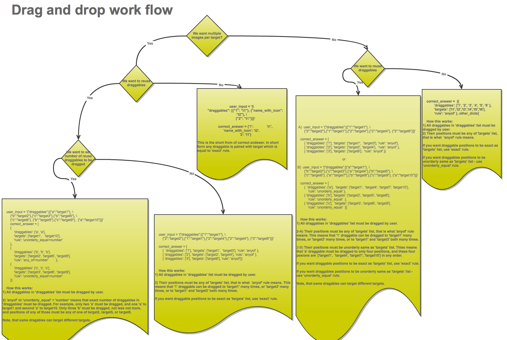

**********************************************
Xml format of drag and drop input [inputtypes]
**********************************************

.. module:: drag_and_drop_input

Format description
==================

The main tag of Drag and Drop (DnD) input is::

    <drag_and_drop_input> ... </drag_and_drop_input>

``drag_and_drop_input`` can include any number of the following 2 tags:
``draggable`` and ``target``.

drag_and_drop_input tag
-----------------------

The main container for a single instance of DnD. The following attributes can
be specified for this tag::

    img - Relative path to an image that will be the base image. All draggables
          can be dragged onto it.
    target_outline - Specify whether an outline (gray dashed line) should be
          drawn around targets (if they are specified). It can be either
          'true' or 'false'. If not specified, the default value is
          'false'.
    one_per_target - Specify whether to allow more than one draggable to be
          placed onto a single target. It can be either 'true' or 'false'. If
          not specified, the default value is 'true'.
    no_labels - default is false, in default behaviour if label is not set, label
          is obtained from id. If no_labels is true, labels are not automatically
          populated from id, and one can not set labels and obtain only icons.

draggable tag
-------------

Draggable tag specifies a single draggable object which has the following
attributes::

    id - Unique identifier of the draggable object.
    label - Human readable label that will be shown to the user.
    icon - Relative path to an image that will be shown to the user.
    can_reuse - true or false, default is false. If true, same draggable can be
    used multiple times.

A draggable is what the user must drag out of the slider and place onto the
base image. After a drag operation, if the center of the draggable ends up
outside the rectangular dimensions of the image, it will be returned back
to the slider.

In order for the grader to work, it is essential that a unique ID
is provided. Otherwise, there will be no way to tell which draggable is at what
coordinate, or over what target. Label and icon attributes are optional. If
they are provided they will be used, otherwise, you can have an empty
draggable. The path is relative to 'course_folder' folder, for example,
/static/images/img1.png.

target tag
----------

Target tag specifies a single target object which has the following required
attributes::

    id - Unique identifier of the target object.
    x - X-coordinate on the base image where the top left corner of the target
        will be positioned.
    y - Y-coordinate on the base image where the top left corner of the target
        will be positioned.
    w - Width of the target.
    h - Height of the target.

A target specifies a place on the base image where a draggable can be
positioned. By design, if the center of a draggable lies within the target
(i.e. in the rectangle defined by [[x, y], [x + w, y + h]], then it is within
the target. Otherwise, it is outside.

If at lest one target is provided, the behavior of the client side logic
changes. If a draggable is not dragged on to a target, it is returned back to
the slider.

If no targets are provided, then a draggable can be dragged and placed anywhere
on the base image.

correct answer format
---------------------

There are two correct answer formats: short and long
If short from correct answer is mapping of 'draggable_id' to 'target_id'::

    correct_answer = {'grass':     [[300, 200], 200], 'ant': [[500, 0], 200]}
    correct_answer = {'name4': 't1', '7': 't2'}

In long form correct answer is list of dicts. Every dict has 3 keys:
draggables, targets and rule. For example::

    correct_answer = [
    {
    'draggables':   ['7', '8'],
    'targets':  ['t5_c', 't6_c'],
    'rule': 'anyof'
    },
    {
    'draggables': ['1', '2'],
    'targets': ['t2_h', 't3_h', 't4_h', 't7_h', 't8_h', 't10_h'],
    'rule': 'anyof'
    }]

Draggables is list of draggables id. Target is list of targets id, draggables
must be dragged to with considering rule. Rule is string.

Draggables in dicts inside correct_answer list must not intersect!!!

Wrong (for draggable id 7)::

    correct_answer = [
    {
    'draggables':   ['7', '8'],
    'targets':  ['t5_c', 't6_c'],
    'rule': 'anyof'
    },
    {
    'draggables': ['7', '2'],
    'targets': ['t2_h', 't3_h', 't4_h', 't7_h', 't8_h', 't10_h'],
    'rule': 'anyof'
    }]

Rules are: exact, anyof, unordered_equal, anyof+number, unordered_equal+number

- Exact rule means that targets for draggable id's in user_answer are the same
that targets from correct answer. For example, for draggables 7 and 8 user must
drag 7 to target1 and 8 to target2 if correct_answer is::

    correct_answer = [
    {
    'draggables':   ['7', '8'],
    'targets':  ['tartget1', 'target2'],
    'rule': 'exact'
    }]

- unordered_equal rule allows draggables be dragged to targets unordered. If one
want to allow for student to drag 7 to target1 or target2 and 8 to target2 or
target 1 and 7 and 8 must be in different targets, then correct answer must be::

    correct_answer = [
    {
    'draggables':   ['7', '8'],
    'targets':  ['tartget1', 'target2'],
    'rule': 'unordered_equal'
    }]

- Anyof rule allows draggables to be dragged to any of targets. If one want to
allow for student to drag 7 and 8 to target1 or target2, which means that if 7
is on target1 and 8 is on target1 or 7 on target2 and 8 on target2 or 7 on
target1 and 8 on target2. Any of theese are correct which anyof rule::

    correct_answer = [
    {
    'draggables':   ['7', '8'],
    'targets':  ['tartget1', 'target2'],
    'rule': 'anyof'
    }]

- If you have can_reuse true, then you, for example, have draggables a,b,c and 10
targets. These will allow you to drag 4 'a' draggables to
['target1',  'target4', 'target7', 'target10'] , you do not need to write 'a'
four times. Also this will allow you to drag 'b' draggable to target2 or target5
or target5 and target2 etc..::

    correct_answer = [
        {
            'draggables': ['a'],
            'targets': ['target1',  'target4', 'target7', 'target10'],
            'rule': 'unordered_equal'
        },
        {
            'draggables': ['b'],
            'targets': ['target2', 'target5', 'target8'],
            'rule': 'anyof'
        },
        {
            'draggables': ['c'],
            'targets': ['target3', 'target6', 'target9'],
            'rule': 'unordered_equal'
        }]

And sometimes you want to allow drag only two 'b' draggables, in these case
you sould use 'anyof+number' of 'unordered_equal+number' rule::

    correct_answer = [
        {
            'draggables': ['a', 'a', 'a'],
            'targets': ['target1',  'target4', 'target7'],
            'rule': 'unordered_equal+numbers'
        },
        {
            'draggables': ['b', 'b'],
            'targets': ['target2', 'target5', 'target8'],
            'rule': 'anyof+numbers'
        },
        {
            'draggables': ['c'],
            'targets': ['target3', 'target6', 'target9'],
            'rule': 'unordered_equal'
        }]

In case if we have no multiple draggables per targets (one_per_target="true"),
for same number of draggables, anyof is equal to unordered_equal

If we have can_reuse=true, than one must use only long form of correct answer.

Logic flow
----------

(Click on image to see full size version.)

Example
=======

Various configuration of DnD on one page
----------------------------------------

.. literalinclude:: drag-n-drop-demo.xml
