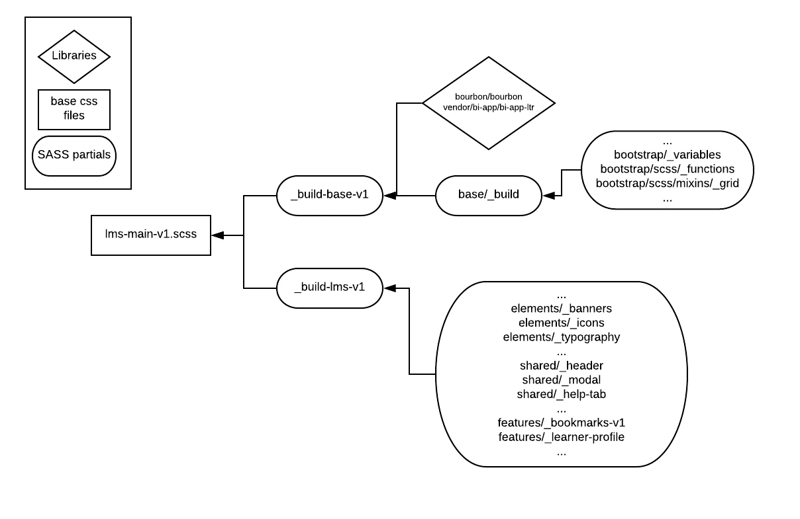

#######################
Styling in edx-platform
#######################

Over time, our Sass styling has become a little convoluted, with three major
reworkings often leading to confusion when a developer needs to style in
multiple locations across edx-platform. The main endeavors were v1, v2 (or
pattern library) and Bootstrap. We are trying to move away from using v2, as the
pattern library is deprecated, but there may still be locations in the code that
reference those styles (please remove them as you see fit).

Our platform uses a system of Sass partials that combine to compile into a
single large css file to be rendered on the page. From the Sass docs:

    You can create partial Sass files that contain little snippets of CSS
    that you can include in other Sass files. This is a great way to
    modularize your CSS and help keep things easier to maintain. A partial
    is simply a Sass file named with a leading underscore. You might name it
    something like _partial.scss. The underscore lets Sass know that the
    file is only a partial file and that it should not be generated into a
    CSS file. Sass partials are used with the ``@import`` directive.

This structure allows us to break up our styling into small pieces, making
readability and maintenance easier, while often at the expense of structural
complexity as a code base grows. Here is an example, directly from edx-platform,
for how the partials flow to a single scss file that compiles into CSS for the
page to use. This is a page that uses v1 styling.

   Sass Compilation for v1 CSS

Note that this only shows an example, there are far more partials that come
together to make the ``lms-main-v1.css`` final file.

As you can see, the ``lms-main-v1.scss`` file does not have a leading
underscore, telling the compilation to turn that scss file into an actual css
file to be rendered on the page. If you were to use the Chrome Inspector tool
and look at the styling, you will see that there is one unified ``lms-
main-v1.css`` file that contains all the element styles.

The ``lms-main-v1.scss`` file uses the ``@import`` statement to pull in the
``_build- base-v1.scss`` and ``build-lms-v1.scss`` files which in turn import
more partials down the road. It is critical to recognize that this tree works in
a depth-first, first-come-first-serve manner. That means that styles that are
imported early in the process cannot reference Sass variables imported later in
the process (ie: ``bootstrap/variables`` cannot reference variables from
``shared/header``).

This diagram describes the process for the **v1 styles**, and there is a similar
setup for ``lms-main-v2.scss`` as well as ``bootstrap/lms-main.scss``. Each
individual HTML page on the edx-platform specifies which of the three that page
wants to use for styling. Please note that as an organization, we are slowly
trying to 1) move everything over to the bootstrap/lms-main.scss file and 2)
deprecate and stop using any v2 files. ``lms-main-v1.scss`` can still be used,
but a migration over to ``bootstrap/lms-main.scss``, and a migration of any
relevant partials from the v1 structure, would be a valuable endeavor.

Please note that as you add partials, make sure that they are not already being
imported in another file (ie: you add a node to the tree above that already
exists on the tree).

What theming does, and how to do it
***********************************

By thinking about the styling as a tree, theming becomes a lot simpler. All
theming means is that you can override one of the partials above by matching
the exact path in the ``edx-platform/themes`` directory. So, for example, to
override the shared header file (located at ``lms/static/sass/shared/_header``),
you would simply go into the ``edx-platform/themes/[theme you want to
override]/lms/static/shared`` folder and add a _header.scss file. When django
compiles the assets, it will use this file as a replacement to the main
edx-platform implementation.

If you look at the actual code base, you will see that we have a standard of
using the partials directory for these overrides files. This keeps the specific
components isolated from the core styling to reduce errors when people override
files and forget to import other files that are needed elsewhere on the site.
This is a good practice that future development should adhere to.

Final Note: When dealing with front end changes, it is a good idea to also check
the edx-themes repo, that works exactly like our themes folder, but also
includes html templates that can further confuse things.

Bootstrap and edx-platform
**************************

In a month and a half endeavor in the Fall, Andy and I worked on integrating
Bootstrap into the platform for three main reasons.

1. **To unify our styling:** By specifying colors and variables that can be used
universally, reducing the '50 shades of grey' issue and inconsistencies in the
ways that we style components.

2. **To add a widely used component library:** Bootstrap has a robust community
of developers that contribute to their open source component library, allowing
for easier prototyping and create of front end experiences.

3. **To simplify theming:** Since we now have a single unified source of truth
for our variables, openedx instances and alternative themes can simply override
those files to customly style their sites.

Relating to the above styling conversation, we have pulled in the entire
bootstrap styling library into ``lms-main.scss``, but only partially pulled it
into the v1 and v2 implementations due to naming conflicts. For example, we
could not pull in the bootstrap modal, due to conflicts with our own modal
styling (both use the generic ``.modal`` class). We were, however, able **to
pull in the entire bootstrap javascript file**, since that file overrides jQuery
in ways that our current application does not (meaning no conflicts).

Therefore, any pages that use lms-main.scss can use any bootstrap component out
of the box. **To use bootstrap components in older, v1, v2 pages** we have to
manually specify the exact Sass partial from the ``edx-
platform/node_modules/bootstrap`` that we want. For example, to add an alert to
a v1 page, you would add to ``base/build`` the partial ``bootstrap/scss/alert``.
Steps outlined below.

1. Determine from the ``node_modules/bootstrap/scss`` directory which component
you want to import.

2. Add that import (i.e: ``bootstrap/scss/alert``) somewhere in the Sass tree,
most likely to ``base/build.scss``

3. NOTE: Run ``paver compile_sass`` to make sure it works, if not, there is
likely a bootstrap mixin that you are missing. If so, search for the mixin in
``node_modules/bootstrap/scss/mixins`` and import it (i.e:
``bootstrap/scss/mixins/alert``)

4. You are done. Add the component using HTML or Javascript. Use the Bootstrap
Component Docs for examples.

FAQ
***

I want to add a new scss file for a feature on a particular page, how do I add it?
##################################################################################

First, you want to check which root file the page uses, whether it is
lms-main-v1, lms-main-v2 or lms-main. Then, go to that file and trace down the
tree to find a good spot for the new scss file to live. So, for example, if you
are adding an LMS feature and the page uses lms-main-v1, you can trace down lms-
main-v1 > _build_lms_v1 and see that there are plenty of standalone imports that
look like features. Simply add your file to the lms/static/sass directory in a
similar manner and add it as an @import to that page.

Why isn't my bootstrap component styling like in the bootstrap docs?
####################################################################

In any pages that use the lms-main.css compiled file, the bootstrap component
will render. This case only arises when we are working with a legacy v1 or v2
page. As outlined earlier in this document, we cannot import the entire
bootstrap repository due to conflicts with old styling. For v1 and v2, we are
gradually pulling in styles for components, so this must mean that you are
building a component that has not yet been used in the LMS/Studio.

To add the styles, you first need to find them in the bootstrap package. To do
so, search at edx-platform/node_modules/bootstrap/scss for the file that you
need. Then add this to the v1 or v2 tree, most likely to the build/base.scss
file. Note that you may hit issues with mixins when you try to compile the SASS.
In this case, check the edx-platform/node_modules/bootstrap/scss/mixins folder
and import that into the lms or studio before trying to import the component
styling.
