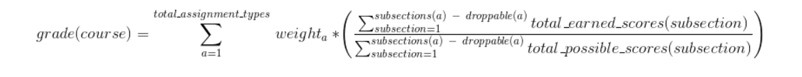
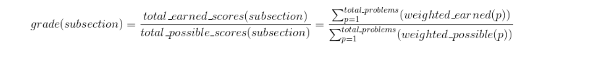
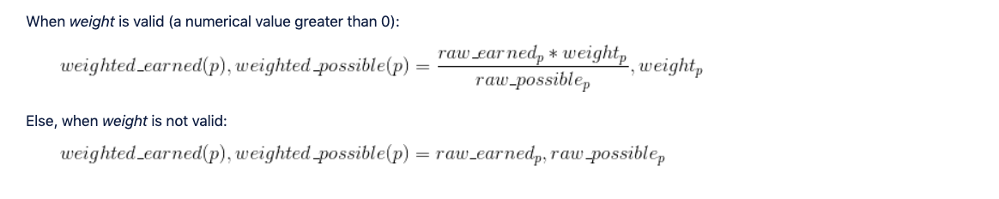

Grades Background
=================

.. contents::

Introduction
------------
Analogous to traditional on-campus collegiate courses, online edX learners also have numerical grades associated with their interactions in edX courses.  Currently, learners are graded for their responses to problems in different assignments, such as homeworks, labs, and exams.  Assignments in the current edX platform are at the Subsection level of a course.  Whenever a learner submits an answer to a problem, an asynchronous task is launched to update the learner's grade of the containing Subsection and of the containing Course.

In the future, we may extend this model to assess other MOOC interactions, such as participation in forums and other social engagements.

Terminology
-----------

+-------------------------------------------------------------+------------------------------------------------------------------------------------------------------------------------------------------------------------------------------------------------------------------------------------------------------------------------------------------------------------------------------------------------------------------------------------------------------------------------------------------------------------------------------------------------------------------------------------------------------------------------------------------------------------------------------------------------------------------------------------------------------------------------------------------------------------------------------------------------------------------------------------------------------------------------------------------------------------------------------------------------------------------------------------------------------------------------------------------------------------------------------------------------+
| Term                                                        | Definition                                                                                                                                                                                                                                                                                                                                                                                                                                                                                                                                                                                                                                                                                                                                                                                                                                                                                                                                                                                                                                                                                     |
+-------------------------------------------------------------+------------------------------------------------------------------------------------------------------------------------------------------------------------------------------------------------------------------------------------------------------------------------------------------------------------------------------------------------------------------------------------------------------------------------------------------------------------------------------------------------------------------------------------------------------------------------------------------------------------------------------------------------------------------------------------------------------------------------------------------------------------------------------------------------------------------------------------------------------------------------------------------------------------------------------------------------------------------------------------------------------------------------------------------------------------------------------------------------+
| Raw Score                                                   | Unweighted (earned, possible) points tuple. For a CapaModule (our most common problem type), each response entry is a point. So a single CapaModule problem with two multiple choice responses has a possible raw score of 2.                                                                                                                                                                                                                                                                                                                                                                                                                                                                                                                                                                                                                                                                                                                                                                                                                                                                  |
+-------------------------------------------------------------+------------------------------------------------------------------------------------------------------------------------------------------------------------------------------------------------------------------------------------------------------------------------------------------------------------------------------------------------------------------------------------------------------------------------------------------------------------------------------------------------------------------------------------------------------------------------------------------------------------------------------------------------------------------------------------------------------------------------------------------------------------------------------------------------------------------------------------------------------------------------------------------------------------------------------------------------------------------------------------------------------------------------------------------------------------------------------------------------+
| Weighted Score                                              | The result of applying the weight settings-scoped XBlock attribute to the raw score. The weight is an indication of how much the total problem should be worth, so the weighted score tuple looks like ((earned / possible) * weight, weight). So if someone has a raw score of 1/2 and the problem weight is 10, then 5/10 is what will show up on the progress page as the weighted score. Problem weights are attributes that are placed on the XBlock/XModuleDescriptor and can be manipulated via Studio.                                                                                                                                                                                                                                                                                                                                                                                                                                                                                                                                                                                 |
+-------------------------------------------------------------+------------------------------------------------------------------------------------------------------------------------------------------------------------------------------------------------------------------------------------------------------------------------------------------------------------------------------------------------------------------------------------------------------------------------------------------------------------------------------------------------------------------------------------------------------------------------------------------------------------------------------------------------------------------------------------------------------------------------------------------------------------------------------------------------------------------------------------------------------------------------------------------------------------------------------------------------------------------------------------------------------------------------------------------------------------------------------------------------+
| Grade                                                       | Grades are the result of aggregating multiple scores.                                                                                                                                                                                                                                                                                                                                                                                                                                                                                                                                                                                                                                                                                                                                                                                                                                                                                                                                                                                                                                          |
+-------------------------------------------------------------+------------------------------------------------------------------------------------------------------------------------------------------------------------------------------------------------------------------------------------------------------------------------------------------------------------------------------------------------------------------------------------------------------------------------------------------------------------------------------------------------------------------------------------------------------------------------------------------------------------------------------------------------------------------------------------------------------------------------------------------------------------------------------------------------------------------------------------------------------------------------------------------------------------------------------------------------------------------------------------------------------------------------------------------------------------------------------------------------+
| Assignment Grade                                            | Aggregated grade for a particular assignment, such as HW1. This is determined by adding the weighted scores of all problems in the assignment.                                                                                                                                                                                                                                                                                                                                                                                                                                                                                                                                                                                                                                                                                                                                                                                                                                                                                                                                                 |
+-------------------------------------------------------------+------------------------------------------------------------------------------------------------------------------------------------------------------------------------------------------------------------------------------------------------------------------------------------------------------------------------------------------------------------------------------------------------------------------------------------------------------------------------------------------------------------------------------------------------------------------------------------------------------------------------------------------------------------------------------------------------------------------------------------------------------------------------------------------------------------------------------------------------------------------------------------------------------------------------------------------------------------------------------------------------------------------------------------------------------------------------------------------------+
| Assignment-Type Grade                                       | Aggregated grade for an assignment category, like Homework or Final. Grading can be configured to drop the lowest n assignments when calculating an assignment-type grade - otherwise all assignments count equally (i.e. there is no weighting of assignments within an assignment category). The course grading policy specifies the minimum number of assignments expected for each category in advance.                                                                                                                                                                                                                                                                                                                                                                                                                                                                                                                                                                                                                                                                                    |
+-------------------------------------------------------------+------------------------------------------------------------------------------------------------------------------------------------------------------------------------------------------------------------------------------------------------------------------------------------------------------------------------------------------------------------------------------------------------------------------------------------------------------------------------------------------------------------------------------------------------------------------------------------------------------------------------------------------------------------------------------------------------------------------------------------------------------------------------------------------------------------------------------------------------------------------------------------------------------------------------------------------------------------------------------------------------------------------------------------------------------------------------------------------------+
| Overall Percentage                                          | Float value between 0 and 1 that marks the student's percentage for the course. This is calculated by weighing each assignment-type according to the rules specified in CourseDescriptor.grader. The grader is an `extensible interface <https://github.com/edx/edx-platform/blob/master/common/lib/xmodule/xmodule/graders.py#L109>`_, but the only rules currently used in practice are simple weight by assignment-type (e.g. 30% Final, 40% HW, etc.). The grader will return the actual percentage as a value between 0 and 1. The overall grade calculation process will then take this number and do a small bit of rounding up: round(actual_percent * 100 + 0.05) / 100. This is so that someone who has been scoring an 89.5% and has been seeing their average rounded to 90% on the progress page is not suddenly surprised at the end of the course. The denominator for this is based on the total possible at the end of the course, and does not adjust for unreleased assignments – getting a perfect score on your first homework may only give you a 4% overall percentage. |
+-------------------------------------------------------------+------------------------------------------------------------------------------------------------------------------------------------------------------------------------------------------------------------------------------------------------------------------------------------------------------------------------------------------------------------------------------------------------------------------------------------------------------------------------------------------------------------------------------------------------------------------------------------------------------------------------------------------------------------------------------------------------------------------------------------------------------------------------------------------------------------------------------------------------------------------------------------------------------------------------------------------------------------------------------------------------------------------------------------------------------------------------------------------------+
| Overall Grade                                               | Letter grade based on CourseDescriptor.grade_cutoffs and the Overall Percentage (so after rounding up).                                                                                                                                                                                                                                                                                                                                                                                                                                                                                                                                                                                                                                                                                                                                                                                                                                                                                                                                                                                        |
+-------------------------------------------------------------+------------------------------------------------------------------------------------------------------------------------------------------------------------------------------------------------------------------------------------------------------------------------------------------------------------------------------------------------------------------------------------------------------------------------------------------------------------------------------------------------------------------------------------------------------------------------------------------------------------------------------------------------------------------------------------------------------------------------------------------------------------------------------------------------------------------------------------------------------------------------------------------------------------------------------------------------------------------------------------------------------------------------------------------------------------------------------------------------+
| XBlock                                                      | The fundamental building block of edX course content. Everything that shows up in the courseware tab is some subclass of XBlock: a chapter, a video, a problem, etc. The entire course is a tree of XBlocks, which act like mini web-applications that can cooperatively build a web page together. They define their own views and can define state in multiple scopes like content (e.g. problem definition) and student state (e.g. a student's answer). XBlocks in edx-platform store their student state as a JSON text field in the StudentModule model.                                                                                                                                                                                                                                                                                                                                                                                                                                                                                                                                 |
+-------------------------------------------------------------+------------------------------------------------------------------------------------------------------------------------------------------------------------------------------------------------------------------------------------------------------------------------------------------------------------------------------------------------------------------------------------------------------------------------------------------------------------------------------------------------------------------------------------------------------------------------------------------------------------------------------------------------------------------------------------------------------------------------------------------------------------------------------------------------------------------------------------------------------------------------------------------------------------------------------------------------------------------------------------------------------------------------------------------------------------------------------------------------+
| Courseware                                                  | The Django model that XBlocks use to store their student state. Raw scores are also stored here. There are many legacy artifacts in this model, so please read the `documentation <http://edx.readthedocs.org/projects/devdata/en/latest/internal_data_formats/sql_schema.html#courseware-progress-data>`_ if you're going to work with it. The vast majority of scores in the system are stored here.                                                                                                                                                                                                                                                                                                                                                                                                                                                                                                                                                                                                                                                                                         |
| StudentModule                                               |                                                                                                                                                                                                                                                                                                                                                                                                                                                                                                                                                                                                                                                                                                                                                                                                                                                                                                                                                                                                                                                                                                |
+-------------------------------------------------------------+------------------------------------------------------------------------------------------------------------------------------------------------------------------------------------------------------------------------------------------------------------------------------------------------------------------------------------------------------------------------------------------------------------------------------------------------------------------------------------------------------------------------------------------------------------------------------------------------------------------------------------------------------------------------------------------------------------------------------------------------------------------------------------------------------------------------------------------------------------------------------------------------------------------------------------------------------------------------------------------------------------------------------------------------------------------------------------------------+
| `Submissions API <https://github.com/edx/edx-submissions>`_ | A newer API created to store submissions and scores separately from XBlock state. The long term goals were to make a more auditable, performant, and flexible scoring system. Scores and submissions are immutable (you never edit old entries, just create new ones). Because it is not derived from XBlock state, it is also possible to later record scores for more abstract things like "class participation", though that functionality is not presently used. This API is relatively new and few things use it.                                                                                                                                                                                                                                                                                                                                                                                                                                                                                                                                                                         |
+-------------------------------------------------------------+------------------------------------------------------------------------------------------------------------------------------------------------------------------------------------------------------------------------------------------------------------------------------------------------------------------------------------------------------------------------------------------------------------------------------------------------------------------------------------------------------------------------------------------------------------------------------------------------------------------------------------------------------------------------------------------------------------------------------------------------------------------------------------------------------------------------------------------------------------------------------------------------------------------------------------------------------------------------------------------------------------------------------------------------------------------------------------------------+
| Modulestore                                                 | The interface that we use to instantiate XBlocks in edx-platform. Content is loaded from MongoDB as part of this process.                                                                                                                                                                                                                                                                                                                                                                                                                                                                                                                                                                                                                                                                                                                                                                                                                                                                                                                                                                      |
+-------------------------------------------------------------+------------------------------------------------------------------------------------------------------------------------------------------------------------------------------------------------------------------------------------------------------------------------------------------------------------------------------------------------------------------------------------------------------------------------------------------------------------------------------------------------------------------------------------------------------------------------------------------------------------------------------------------------------------------------------------------------------------------------------------------------------------------------------------------------------------------------------------------------------------------------------------------------------------------------------------------------------------------------------------------------------------------------------------------------------------------------------------------------+
| Block Structures                                            | An extensible framework for caching xBlock data from the modulestore and storing it in a denormalized read-optimized form.  See the `BlockStructure Readme <https://github.com/edx/edx-platform/blob/master/openedx/core/djangoapps/content/block_structure/__init__.py>`_ for more information.                                                                                                                                                                                                                                                                                                                                                                                                                                                                                                                                                                                                                                                                                                                                                                                               |
+-------------------------------------------------------------+------------------------------------------------------------------------------------------------------------------------------------------------------------------------------------------------------------------------------------------------------------------------------------------------------------------------------------------------------------------------------------------------------------------------------------------------------------------------------------------------------------------------------------------------------------------------------------------------------------------------------------------------------------------------------------------------------------------------------------------------------------------------------------------------------------------------------------------------------------------------------------------------------------------------------------------------------------------------------------------------------------------------------------------------------------------------------------------------+

Course Structure in context of Grading
--------------------------------------

xBlocks
^^^^^^^
The edX course is built as a hierarchical structure of `xBlocks <https://open.edx.org/xblocks>`_ as recursive compositional building blocks.  In the context of grading, the following xBlocks are of particular interest:

* All scorable "xblocks" (optionally using `Scorable xBlock Mixin <https://github.com/edx/XBlock/blob/master/xblock/scorable.py>`_)

  - with has_score=True, as designated by the xBlock developer

  - with max_score values, as computed from the xBlock content

  - with weight values, as designated by the course author
 
*  All "subsections" with a graded value of True or False, as designated by the course author

* The containing "course" with its grading policy, as designated by the course author

Live Editing and Content Versioning
^^^^^^^^^^^^^^^^^^^^^^^^^^^^^^^^^^^
Content in edX courses are managed as live mutable data.  So it is quite possible for course authors to modify any course content or course setting during the live management of a course.  Such live editing is supported in both self-paced courses (courses without constrained start-end dates) as well as instructor-paced courses (seasonal courses supervised by a set of instructors).

Modulestores  are the underlying storage infrastructure for course content.  The newest modulestore, Split Mongo, released in the fall of 2014, has support for versioning of content.  It treats all content as immutable and versions each change that is stored.  Each block is immutable and whenever its data is changed, an entire new copy is stored, while retaining a copy of the older version.  The version number of the containing course structure is updated whenever any of its block content is changed.

When Grades are persisted, the course's version number and edit timestamp are kept along with the grade - for debugging/auditing purposes.

Grade Computation
-----------------
Numerical grades/scores are computed at each of the following course levels.

Overall Course Grade
^^^^^^^^^^^^^^^^^^^^

* Grade range and Passing cutoff

  - A learner's overall numerical grade in the course can range anywhere between 0% to 100%.
  
  - Course teams set the `grade range <http://edx.readthedocs.io/projects/edx-partner-course-staff/en/latest/grading/grade_range.html>`_ and specify the Pass / Fail threshold (for example, a minimum of 50/100 is required to Pass).
  
  - The Passing grade range can be further divided into letter grades, such as A, B, etc.
  
Assignment Weights

* Course teams set the `assignment types <http://edx.readthedocs.io/projects/edx-partner-course-staff/en/latest/grading/configure_assignment_type.html>`_ used in the course, along with their weights and the number of allowed drops (number of assignments with the lowest grades that can be discarded in the final grade computation).

Computation

* Although the platform provides support for custom `course graders <https://github.com/edx/edx-platform/blob/master/common/lib/xmodule/xmodule/graders.py#L115>`_, in practice, only the computation described here is used, as implemented by the `WeightedSubsectionsGrader <https://github.com/edx/edx-platform/blob/master/common/lib/xmodule/xmodule/graders.py#L164>`_.
* The overall grade is the weighted sum of all assignment types in the course, allowing for droppable assignments.

  - Which subsections to drop are determined only after calculating each subsection's grade, as only the ones with the lowest grades are dropped.
  

Assignment Grades
^^^^^^^^^^^^^^^^^

* Subsections that are marked as graded by course teams must be designated with an "Assignment Type".
* Each assignment type has a "weight" associated with it, which is used in computing the overall grade.
* Each assignment type allows for a number of subsections of its type to be "dropped" from the overall grade computation

Problem Scores
^^^^^^^^^^^^^^

* *has_score*. An edX scorable problem is equivalent to an xBlock whose has_score property returns True.
* *weight*. Each problem can optionally have a course author defined numerical weight to be used in computing the final score for the problem.  Note: ORA problems do not expose a weight field.
* *raw_possible* (*a.k.a. max_score*). The total number of points that a learner can potentially earn on the problem, pre-weight-computation.  Its computation is defined by the xBlock developer.
* *raw_earned*. The number of points the learner earned on the problem out of the total raw_possible points.
* *weighted_possible* (*a.k.a. max_grade*).  The weighted_possible value is the maximum possible score that is achievable on the problem post-weight-computation.
* *weighted_earned* (*a.k.a. grade*). The weighted_earned value is the learner's score computed from the learner's response to the problem. The process for computing this score can be classified into the following types:

 - **automatically scored, synchronously** at the time of submission, such as for most Capa-based problems
 
 - **automatically scored, asynchronously** via an `external grader service <http://edx.readthedocs.io/projects/edx-partner-course-staff/en/latest/exercises_tools/external_graders.html>`_
 
 - **manually scored**, such as for `Open Response Assessments <http://edx.readthedocs.io/projects/edx-partner-course-staff/en/latest/exercises_tools/open_response_assessments/OpenResponseAssessments.html>`_, where the calculation requires human input from either
 
   - a single course staff (staff assessment)
   - a number of peers (peer assessment)
   - the self learner (self assessment)
   

Grading Policy
--------------

As described above in the Grade Computation section, the grading policy is distributed across the configuration of the course and includes all of the following:

* Course level (adjusted in *Settings->Grading page in Studio*)

  - Grade Range policy: Pass cutoff and letter grade thresholds
  
  - Assignment Type policy: Weights and Allowable drops
  
* Subsection level (adjusted in *Content->Outline->Subsection->Settings* modal in Studio)

  - A subsection's designation to an assignment type
  
  - A subsection's setting of whether it is 'graded'
  
* Problem level (adjusted in *Content->Outline->Subsection->Unit->Problem->Edit* modal in Studio)

  - A problem's weight
  
  - A problem's external grader configuration
  
  - A problem's individual grading policy - as currently supported by `ORA's assessment configuration <http://edx.readthedocs.io/projects/edx-partner-course-staff/en/latest/exercises_tools/open_response_assessments/OpenResponseAssessments.html#how-scores-for-open-response-assessments-are-calculated>`_

Grade Overrides/Exceptions
--------------------------

Today, we support the following features to `adjust grades <https://edx.readthedocs.io/projects/open-edx-building-and-running-a-course/en/named-release-birch/running_course/course_grades.html#adjust-grades>`_, but don't have a general feature to override a grade for any xBlock:

* In `ORA Studio settings <http://edx.readthedocs.io/projects/edx-partner-course-staff/en/latest/exercises_tools/open_response_assessments/Manage_ORA_Assignment.html#override-a-learner-s-assessment-grade>`_:

  - override a learner's grade for an ORA2 block
  
* In LMS Instructor Dashboard or `Staff Debug Info <http://edx.readthedocs.io/projects/edx-partner-course-staff/en/latest/manage_live_course/staff_debug_info.html>`_:

  - reset the number of attempts a learner has made for a problem back to 0
  
  - force a rescore on a submission to update all stored scores
  
  - delete a student state for a problem

ORA2's Immutable Data
---------------------

It is relevant to note that ORA2 has its own immutable data model and thus, an inherent capability to retain previous submissions and grades when its rubrics/contents are changed:

* It tries to store immutable records wherever possible.

* A rubric has its own database model.

* An assessment has multiple parts, all of which are immutable, and keyed to the rubric.

* All scores and submissions are also immutable.

* So given a user's record, one can reliably determine the exact rubric it was evaluated against and its accurate score.