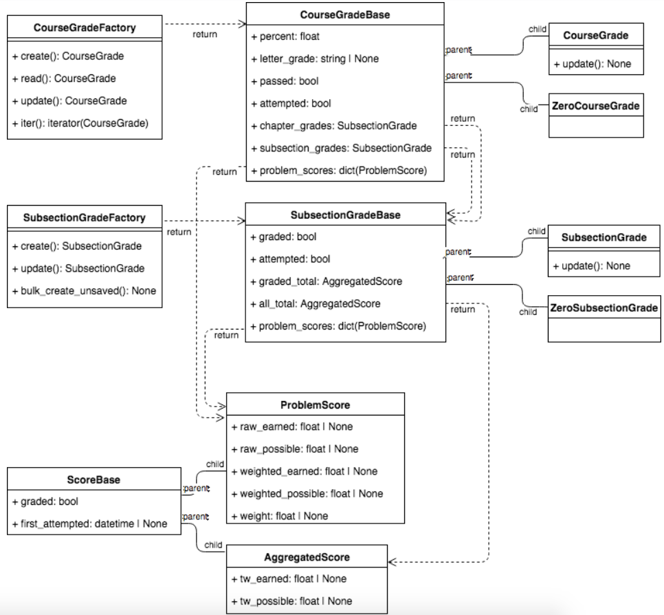

Code
----

The Grades code currently lives in a `django app within edx-platform. <https://github.com/openedx/edx-platform/tree/master/lms/djangoapps/grades>`_  Long-term, it's possible for the Grades project to be in its own repo.  However, currently, it depends on various other modules in the edX platform, including Enrollments, BlockStructures, Modulestore, Courseware Student Module, and Submissions.  Once those modules are extracted into their own repos, it would be possible to do the same for Grades.

Classes
-------

The Grades Python API was designed with simplicity and usability in mind.  It uses the Factory design pattern to (1) create a simple interface for the caller and (2) optimize the factory by caching data for subsequent calls.  A Class hierarchy is used to reduce code duplication and clarify separation of concerns between parent and child implementations.

Signals
-------

See `grades.signals.signals.py <https://github.com/openedx/edx-platform/blob/master/lms/djangoapps/grades/signals/signals.py>`_ for description on the following grades-related django signals:

* PROBLEM_RAW_SCORE_CHANGED

* PROBLEM_WEIGHTED_SCORE_CHANGED

* SCORE_PUBLISHED

* SUBSECTION_SCORE_CHANGED (includes **SubsectionGradeBase** object)

* SUBSECTION_OVERRIDE_CHANGED

See `core.djangoapps.signals.signals.py <https://github.com/openedx/edx-platform/blob/master/openedx/core/djangoapps/signals/signals.py>`_ for description on the following signal:

* COURSE_GRADE_CHANGED (includes **CourseGradeBase** object)

Block Transformer
-----------------

The `Grades Block Transformer <https://github.com/openedx/edx-platform/blob/master/lms/djangoapps/grades/transformer.py>`_ collects and stores denormalized and read-optimized grading information when the course is published.  Please see its docstring for further information.