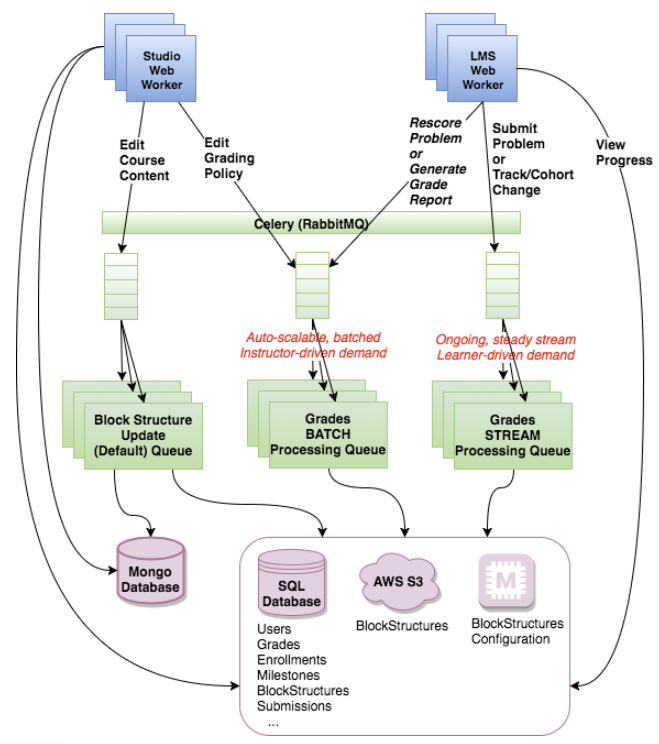
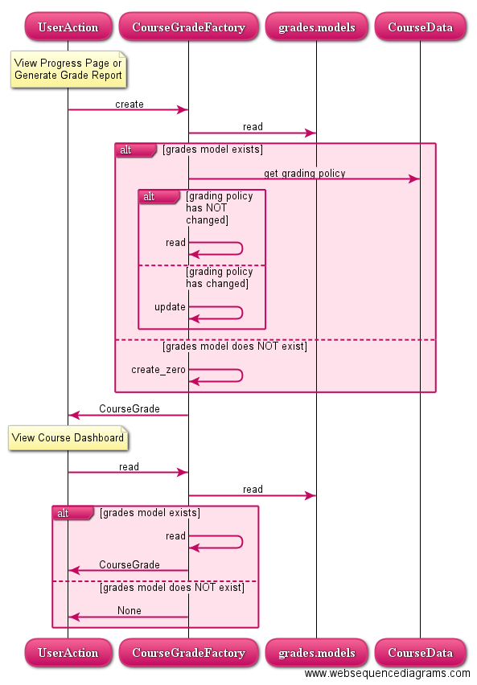
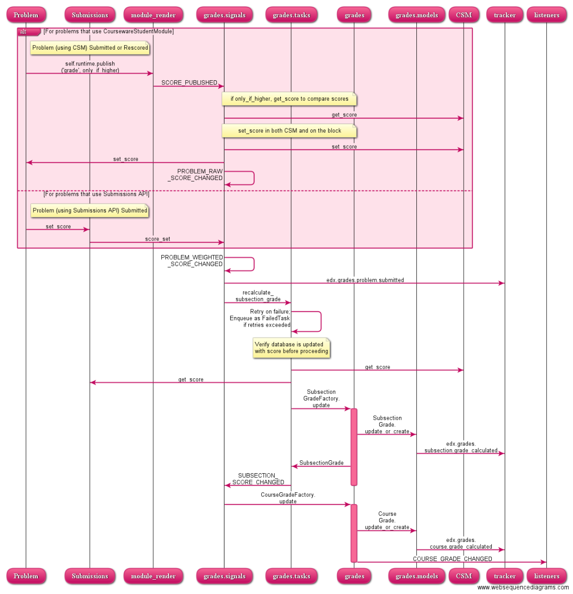

Component Diagram
-----------------

This high-level component diagram provides an at-a-glance view of the major dependents and dependencies of the Grades subsystem. 

**Note:** Some extraneous details in the present implementation are excluded due to current short-comings that should be addressed in the near future.  Specifically: (1) there's still a direct dependency on the course-module from the modulestore due to additional grading policy information that needs to be collected in the block structure and (2) there's an additional dependency on Users since django.User objects are passed into the Grading APIs - although no actual requirements other than User IDs are needed for grading.

.. image:: images/diagrams-component.png

Physical Diagram
----------------

The following diagram depicts the physical boxes that are in play for Grades.  Studio and LMS Web Workers enqueue asynchronous celery tasks to update or batch-read grades. 

The **grades batch processing** queue handles asynchronous requests for all learners in a course.  Studio enqueues a task for recomputing all grades in a course whenever a course-level or subsection-level grading policy changes.  LMS enqueues a task for reading all grades in a course whenever a grade report is requested.  Theoretically, this queue need not be active when no requests are pending and should auto-scale based on instructor demand.

The **grades stream processing** queue handles asynchronous requests for updating a single learner's grade whenever the learner submits a problem.  When processing the request, the celery task recomputes and updates the grade for the problem's containing subsection(s) and the problem's containing course.  This queue is regularly active on an on-going basis as learners continue to submit problems.  The operations team manually scales the queue as load normally doesn't change frequently.

Sequence Diagram for Grade Reads
--------------------------------

The **CourseGradeFactory** is a factory for creating **CourseGrade** objects.  The following diagram shows the time-based sequence for reading/creating a course grade for:

The learner's progress page or Course Grade report - this flow first ensures the grade is still valid (grading policy hadn't changed since the grade was last persisted) before returning the found grade.
The learner's dashboard - this flow optimizes for performance and does not verify whether the policy has since changed.

Sequence Diagram for Grade Writes
---------------------------------
The following time-based sequence diagram shows the flow for whenever (A) a learner submits a problem or (B) an instructor rescores a problem.  As part of the flow, external and internal modules are triggered using the various Grades signals.

