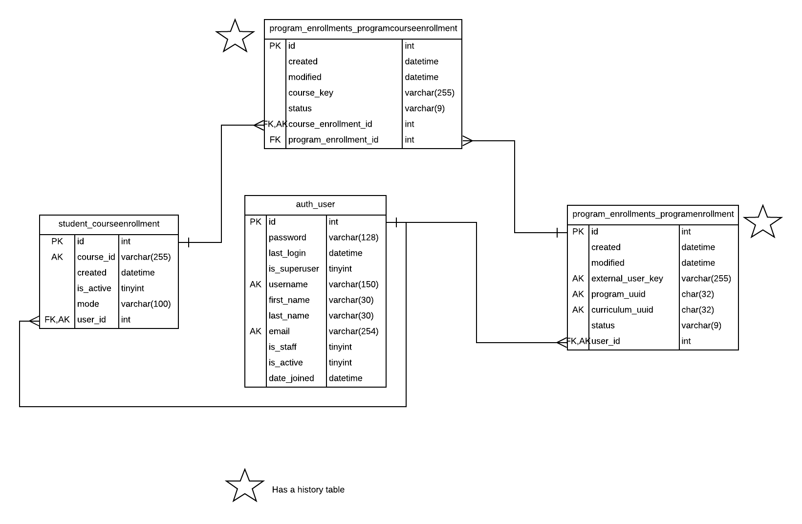

Program Enrollments
======================

This is the Program Enrollments plugin that allows university partners to
enroll their students in Master's courses on the edx platform. 

Considerations:
    - ProgramEnrollments
        - Must have either user_id or external_user_key or both.
        -  Valid values for the `status` field:
            - `enrolled`
            - `pending`
            - `suspended`
            - `canceled`
    - ProgramCourseEnrollments
        -  Valid values for the `status` field:
            - `enrolled`
            - `pending`
            - `suspended`
            - `canceled`