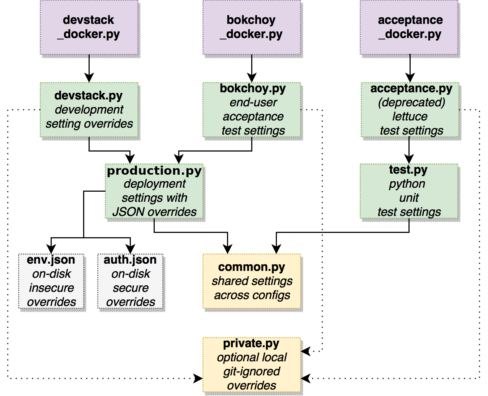

LMS Configuration Settings
==========================

The lms.envs module contains project-wide settings, defined in python modules
using the standard `Django Settings`_ mechanism.

.. _Django Settings: https://docs.djangoproject.com/en/2.2/topics/settings/

Different python modules are used for different setting configuration options.
To prevent duplication of settings, modules import values from other modules,
as shown in the diagram below.

YAML Configuration Files
------------------------

In addition, there is a mechanism for reading and overriding configuration settings from YAML files on-disk. The :file:`/lms/envs/production.py` module loads settings from a YAML file.  The location of the YAML file is pulled from the value of the ``LMS_CFG`` environment variable.  Except for a limited set of exceptions, if a key exists in the YAML file, it will be injected into the settings module as it is defined in the YAML file.

The YAML file allow open edX operators to configure the Django runtime
without needing to make any changes to source-controlled python files in
edx-platform. Therefore, they are not checked into the edx-platform repo.
Rather, they are generated from the `edxapp playbook in the configuration
repo`_ and available in the ``/edx/etc/`` folder on edX servers.

.. _edxapp playbook in the configuration repo: https://github.com/edx/configuration/tree/master/playbooks/roles/edxapp

Feature Flags and Settings Guidelines
-------------------------------------

For guidelines on using Django settings and feature flag mechanisms in the edX
platform, please see `Feature Flags and Settings`_.

.. _Feature Flags and Settings: https://openedx.atlassian.net/wiki/spaces/OpenDev/pages/40862688/Feature+Flags+and+Settings+on+edx-platform

Derived Settings
----------------
In cases where you need to define one or more settings relative to the value of
another setting, you can explicitly designate them as derived calculations.
This can let you override one setting (such as a path or a feature toggle) and
have it automatically propagate to other settings which are defined in terms of
that value, without needing to track down all potentially impacted settings and
explicitly override them as well.  This can be useful for test setting overrides
even if you don't anticipate end users customizing the value very often.

For example::

    def _make_locale_paths(settings):
        locale_paths = [settings.REPO_ROOT + '/conf/locale']  # edx-platform/conf/locale/
        if settings.ENABLE_COMPREHENSIVE_THEMING:
            # Add locale paths to settings for comprehensive theming.
            for locale_path in settings.COMPREHENSIVE_THEME_LOCALE_PATHS:
                locale_paths += (path(locale_path), )
        return locale_paths
    LOCALE_PATHS = _make_locale_paths
    derived('LOCALE_PATHS')

In this case, ``LOCALE_PATHS`` will be defined correctly at the end of the
settings module parsing no matter what ``REPO_ROOT``,
`ENABLE_COMPREHENSIVE_THEMING`, and ``COMPREHENSIVE_THEME_LOCALE_PATHS`` are
currently set to.  This is true even if the ``LOCALE_PATHS`` calculation was
defined in ``lms/envs/common.py`` and you're using ``lms/envs/production.py`` which
includes overrides both from that module and the JSON configuration files.

List entries and dictionary values can also be derived from other settings, even
when nested within each other::

    def _make_mako_template_dirs(settings):
        """
        Derives the final Mako template directories list from other settings.
        """
        if settings.ENABLE_COMPREHENSIVE_THEMING:
            themes_dirs = get_theme_base_dirs_from_settings(settings.COMPREHENSIVE_THEME_DIRS)
            for theme in get_themes_unchecked(themes_dirs, settings.PROJECT_ROOT):
                if theme.themes_base_dir not in settings.MAKO_TEMPLATE_DIRS_BASE:
                    settings.MAKO_TEMPLATE_DIRS_BASE.insert(0, theme.themes_base_dir)
        return settings.MAKO_TEMPLATE_DIRS_BASE

    TEMPLATES = [
        {
            'NAME': 'django',
            'BACKEND': 'django.template.backends.django.DjangoTemplates',
            ...
        },
        {
            'NAME': 'mako',
            'BACKEND': 'common.djangoapps.edxmako.backend.Mako',
            'APP_DIRS': False,
            'DIRS': _make_mako_template_dirs,
        },
    ]
    derived_collection_entry('TEMPLATES', 1, 'DIRS')
