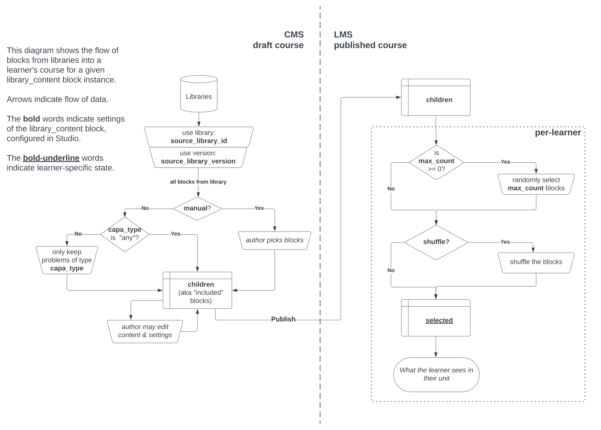

Evolving the library_content block schema
#########################################

Status
******

**Replaced** by the `Upstream-Downstream ADR`_.

.. _Upstream-Downstream ADR: https://docs/decisions/0020-upstream-block.rst

Context
*******

The library_content block is an existing block type which allows users to include a specified number of blocks into a course, randomly picked per-learner from a "V1" (modulestore-backed) content library, optionally filtered by the blocks' ``capa_type`` (only applicable to ``problem`` blocks). We are incrementally improving this feature:

* We are soon adding support for "V2" (blockstore-backed) content libraries to the library_content block. This will enable an improved library authoring experience and assist our transition away from modulestore and MongoDB. We need this not to break existing usages of the library_content block, and we need there to be a period of simultaneous V1/V2 support overlap to enable a reversible migration of libraries from modulestore to blockstore. Eventually, V1 support will be removed.

* Next, we want to add support for non-randomized, hand-picked reference of library blocks. This is is a highly requested feature across the community.

* In the future, we would like to support other modes: in particular, we want authors to eventually be able to hand-pick a set of blocks from a library, and *then* have the LMS randomly select a specified number of blokcs for each learner.

We need to choose how to evolve the schema of the library_content block to support all of these incremental improvements. This is the current schema:

.. list-table::
   :header-rows: 1

   * - Field
     - Scope, Type
     - Default
     - Example
     - Description

   * - source_library_id
     - settings, str|None
     - None
     - "library-v1:OEX+Lib1"
     - Key of V1 source library; None means no library has been chosen.

   * - source_library\_ version
     - settings, str|None
     - None
     - TBD
     - Version of V1 source library (a MongoID string). None means latest.

   * - mode
     - settings, str
     - "random"
     - "random"
     - How blocks should be selected. Only valid value is "random".

   * - capa_type
     - settings, str
     - "any"
     - "symbolicresponse"
     - Unless "any": Include only problems, and only problems of this response type.

   * - children
     - children, list of XBlocks
     - []
     - ``block-v1:...+type@problem+block@A``
       ``block-v1:...+type@problem+block@B``
       ``block-v1:...+type@problem+block@D``
       ``block-v1:...+type@problem+block@F``
     - Standard XBlock field that holds references to the child XBlocks. This field is only populated after the library content block is saved, at which time the matching XBlocks (e.g. filtered by capa_type) from the library are copied ("included") to become children of this block. Learners will often only see a subset of these children (up to max_count); see ``selected``. Course author may apply edits that are local to these included child blocks. Such edits to child blocks' Scope.settings fields will persist across library version upgrades, whereas edits to child blocks' Scope.content fields are wiped out when library version is upgraded.

   * - max_count
     - settings, int
     - 1
     - 2
     - Number of children that LMS will randomly select for each learner. -1 means all.

   * - selected
     - user_state, list of (block type, block id) tuples
     - []
     - [("problem", "A"), ("problem", "F")]
     - An ordered sub-list of the children, selected by the LMS to be shown to a given learner. At most max_count, unless max_count = -1. Once populated, this is kept stable for the learner, unless a the children or max_count are changed, in which case it will have blocks added or removed as necessary. If the list changes, it is re-shuffled.

Decision
********

We will introduce the support for a "manual selection mode", without explicitly making it *mode* as hinted at by the old block schema. This will lead to a cleaner and more flexible implementation. We will achieve this with two new boolean settings: **manual** and **shuffle**:

* When manual is *disabled* and shuffle is *enabled*, the block will behave as it did before. That is, it will import the entire library (filtered by capa_type) as its children, and present each user a random subset based on max_count. For backwards compatibility, these will be the default value of the settings.

* When manual is *enabled*, shuffle is *disabled*, and max_count is set to -1, the block will behave in the "static" mode. That is, the user will be prompted to select specific blocks in the library, and each user will be presented those blocks in order.

* When manual is *enabled*, any filter fields (currently just capa_type, but perhaps more in the future) will be ignored for the purposes of CMS deciding which blocks to import. That's because in the event that manually-picked children clash with the filters, we need to decide who would "win", and we are deciding here that the manually-picked children would win. However, we could choose to have the block-picker filter blocks based on filters.

We will also remove the **mode** field, as it is no longer needed, and it has only ever had one value.

The interaction between manual, shuffle, and max_count yields a matrix of 8 different behaviors:

.. list-table::

   * -
     - **manual = False**
     - **manual = True**

   * - **shuffle = True, max_count = -1**
     - Entire library included; LMS randomizes order per student *(V1's "random mode")*.
     - Author manually includes blocks; LMS randomizes order per student.

   * - **shuffle = True, max_count > 0**
     - Entire library included; LMS selects random subset in random order for each student *(V1's "random mode")*.
     - Author manually includes blocks; LMS selects random subset in random order for each student *(V2+'s desired "enhanced static" mode)*.

   * - **shuffle = False, max_count = -1**
     - Entire library included and shown to every learner in original order.
     - Author manually includes blocks; they are shown to every learner in original order. *(V2's "static" mode)*.

   * - **shuffle = False, max_count > 0**
     - Entire library included, LMS selects random subset in original order *(No known use cases)*.
     - Author manually includes blocks, LMS selects random subset in original order *(No known use cases)*.

At first, we will only aim to support the "random mode" behaviors plus the new "static mode" behavior. Validation will be used to ensure that the other modes are not available. In the future, we could expect to loosen this restriction.

The final library_content block schema, with all changes, will look like this:

.. list-table::
   :header-rows: 1

   * - Field Name
     - Scope, Type
     - Default
     - Example
     - Description

   * - source_library_id
     - settings, str|None
     - None
     - "lib:Open-edX:ExampleLib"
     - Key of V1 or V2 source library; None means unselected.

   * - source_library\_ version
     - settings, str|None
     - None
     - TBD
     - Version of V1 source library (MongoID string) or V2 source library (a stringified int). None means latest.

   * - manual
     - settings, bool
     - False
     - True
     - When False, all library blocks matching capa_type are copied as library_content children, including newly-added library blocks when upgrading source library version. When True, the course author is propmted to pick specific blocks from the library; these blocks become the library_content children. Studio respects these manual block choices (i.e., it won't auto-add new library blocks when the library version is updated).

   * - capa_type
     - settings, str
     - "any"
     - "symbolicresponse"
     - Unless "any": Include only problems, and only problems of this response type. Setting manual to True overrides this filter, however it could still be used for filtering in the block-picker UI. *Note: In future versions, we may want to have filters available that are not specific to Problem or any other block type.*

   * - children
     - children, list of XBlocks
     - []
     - ``block-v1:...+type@problem+block@A``
       ``block-v1:...+type@problem+block@B``
       ``block-v1:...+type@problem+block@D``
       ``block-v1:...+type@problem+block@F``
     - Standard XBlock field that holds references to the child XBlocks. This field is only populated after the library content block is saved, at which time the matching XBlocks (e.g. filtered by capa_type, or hand-picked by author when manual is True) from the library are copied ("included") to become children of this block. Learners will often only see a subset of these children (up to max_count); see ``selected``. Course author may apply edits that are local to these included child blocks. Such edits to child blocks' Scope.settings fields will persist across library version upgrades, whereas edits to child blocks' Scope.content fields are wiped out when library version is upgraded.

   * - max_count
     - settings, int
     - 1
     - 2
     - Number of children that LMS will randomly select for each learner. -1 means all.

   * - shuffle
     - settings, bool
     - True
     - False
     - If False, the order of each learner's selected blocks will match the order of children. If True, the order will be randomized for each learner.

   * - selected
     - user_state, list of (block type, block id) tuples
     - []
     - [("problem", "A"), ("problem", "F")]
     - An ordered sub-list of the children, selected by the LMS to be shown to a given learner. At most max_count, unless max_count = -1. Once populated, this is kept stable for the learner, unless a the children or max_count are changed, in which case it will have blocks added or removed as necessary. If the list changes, it is re-shuffled.

   The series of transformations library blocks go through, from the source libraries to the learner's unit view. Source `available on LucidChart`_; ask Axim if you need to edit it.

.. _available on LucidChart: https://lucid.app/lucidchart/4cfbb5d6-86f3-4cd6-98cf-c85c123a8cb7/edit?viewport_loc=-208%2C-540%2C2190%2C1564%2C0_0&invitationId=inv_7c5dea04-a713-4f45-b73e-e06e20fcfa9d

Consequences
************

We will implement the schema as described above, most likely in the following phases:

#. Add support for V2 library sources to the existing random-only library_content block (no field schema changes yet).

#. Add the manual and shuffle fields. Use validation to ensure that only the following permuations are allowed:

   * Existing "random mode" (shuffle = True, manual = False)

   * New "static" mode (shuffle = False, manual = True, max_count = -1)

#. Beta release of V2 library authoring on edX.org.

#. Migrate V1 libraries to V2 on edX.org for all users.

Future work, in no particular order:

  * If supported by product needs, then loosen restrictions on fields, potentially enabling the full matrix of eight "modes" described above.

  * `Remove support for V1 content libraries.`_

.. _Remove support for V1 content libraries: https://github.com/openedx/edx-platform/issues/32457

Rejected Alternatives
*********************

* **Utilize the "mode" field to distinguish between random, manual, and any future modes.** This suffers from a matrix problem: with any given block behavior, it is possible that combination of those behaviors is a desirable "mode". For example, combining random and manual modes into a "random-from-manual-selection" is a desired future feature, but that new mode overlaps in functionality with both random and manual modes; in fact, random and manual modes would most just be special-cases of random-from-manual-selection mode. If the block were ever to be extended to incorporate, for example, recommendations, that would further multiply the available modes. The resulting code and interface would be harder to reason about than the flat list of flags and features that we decide on here.

* **Implement V2 support in a separate block rather than the existing block.** This would make it harder to automatically migrate all modulestore libraries into blockstore, as all usages of the V1 library_content block would still exist. The ``library_sourced`` block was an implementation in this direction, but we deleted it.

* **Implement non-randomized modes in a separate block.** This would yield a less flexible user experience, as it would force authors to pick from two separate blocks in the Studio UI depending on whether they want random or non-randomized (which is still feasible with the ADR's direction, but is not mandatory). Furthermore, it would create duplicated logic between the two blocks on the backend, increasing bug surface area. The ``library_sourced`` block was an implementation in this direction, but we deleted it.

